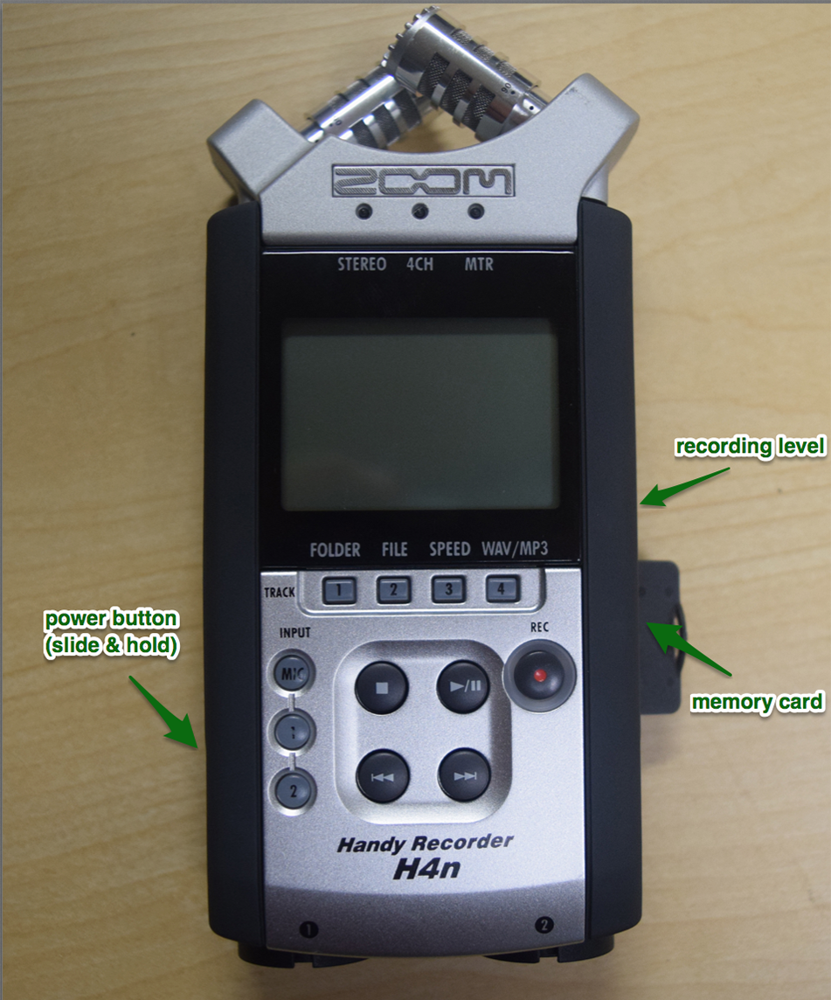
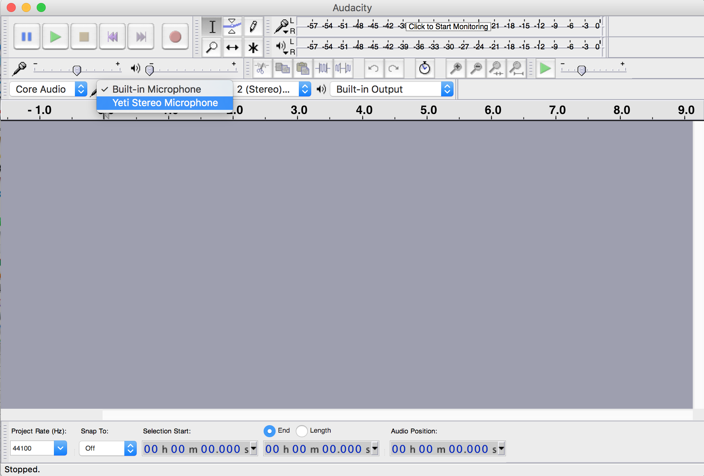

#Recording Audio

##Hn4 Zoom Handy Mic
The H4n Zoom Handy Recorder is a versatile and easy to use recorder for interviews, oral histories, or monologues. If you are interested in features or functions not mentioned in this brief introduction, please see the [H4n Operation Manual.](https://www.zoom-na.com/sites/default/files/products/downloads/pdfs/Zoom_H4nPro_English.pdf)

 

###Optional Accessories
* Windscreen
* Table stand
* Power cord
* Lapel mic (plugs into bottom of recorder)

###Setup
1. Confirm there is an SD memory card inserted on the right side of the recorder
1. Turn the mic on by sliding the power button (left side of the recorder) down and holding for a second.</li>
1. It will likely take a moment to load. If it says “NO DATA,” try removing the card and putting it back in.</li>
1. Press the record button (REC / ⚫) once to check the status. The recording indicator around the button will start flashing.</li>
1. Speak as you will during your recording and watch the sound level. Adjust the recording level using buttons on the right side to set the level to the middle of the range.

###Recording
1. Press the ‘REC/⚫’ button again to start recording. The indicator ring around the button should be red, and the time indicator on the screen should be counting up.
1. When you’re done, press ‘◼’. You can record as many clips as are necessary.

###Exporting Files
1. When you’re done recording, press in on the SD card to eject it, and put the card into a computer.
1. The SD card will have three folders on it: 4CH, MTR, STEREO. Your files will be in the folder that corresponds to the recording setting you used. STEREO is the default.
1. Each of these folders will have ‘FOLDER01-FOLDER10’ in them. Your files should be in ‘FOLDER01.’
1. Drag the files to your computer to save a copy of them. You can import these into the editing software you prefer.</li>

##Yeti Mic
Before you begin recording, plug in the Yeti Mic’s USB cable to a USB port on your computer.
**Note that if you open Audacity before plugging in the microphone, you will not be able to select the Yeti Mic as your audio source.**

Be sure to choose the right microphone pattern for the type of audio you will be recording. The “Cardioid” mode is best for almost all applications where only one person is speaking, while the “bidirectional” mode is best for a situation where you wish to record two speakers in conversation with one another. The “stereo” mode should never be used to record voice audio, but is the best choice for recording music. The “omnidirectional” mode is a good choice for ambient room sound, but similarly is not ideal for recording voice tracks.

Be sure that your microphone is positioned correctly. It should be about one foot away from the person speaking, and oriented so that the person is speaking toward the side rather than the top of the microphone as shown in the image to the left.

After your microphone is plugged into your USB port and you’ve selected the correct microphone pattern, open Audacity and change the audio source from the “Built-In Microphone” to the “Yeti Stereo Microphone.”   **Be sure that the microphone isn’t muted. When the microphone is muted, the button will flash red. When the microphone is not muted, the button will glow solid red.**

#Editing Audio in Audacity

Audacity is an accessible multi-track audio recording and editing software with a number of important features and effects, particularly for preparing podcasts. If you are interested in features or functions not mentioned in this brief introduction, please see the [Audacity Manual](http://manual.audacityteam.org/) for more tutorials or assistance.

**SETUP**: To  get started, you’ll need to download the Audacity app. First, head over to their site. Downloads are available for Mac, Windows, and Linux. If you are going to be recording audio with audacity, you’ll want to plug in your Yeti mic into the USB port before opening audacity. If Audacity is not registering the mic, quit the app and try again. You may also need to select the drop down menu next to the microphone icon (1) and select the Yeti mic.

**RECORDING & IMPORTING**: Once the Yeti mic is selected, you can begin recording. Start by pressing the record button (2). You will see the time in the bottom right corner start (3) and the sound waves will begin to appear in the editing pane (4). Good audio files have more full, longer waves. If the sound is too low, the waves will be smaller and shorter. To add another audio into audacity, you’ll need to go to File > Import > Audio. Audacity supports both WAV and MP3 files.

**EDITING**: There are a number of effects in Audacity, but two of the most useful are fade in and fade out. These can be used to blend two audio tracks together in a seamless manner. In order to do this, you’ll need to:
* Move one track so the two are aligned in a way that the use of a fade out/in makes sense. Select one of the audio tracks and then click the spot where in the timeline (5) you would like that track to be moved. In the menu bar, press Tracks >Align Tracks > Start To Cursor/Selection Start.
* Once your tracks are aligned, you can add in your effects. For fade outs, you only want to select the last 5 seconds or so the audio track. The opposite is true of fade ins, you’ll want to select the first 5 seconds or so. By holding your cursors down in the editing pane, scroll to select the amount of time you would like to add the effect to. To add the effect, select Effects in the menu bar > Fade In/Fade Out.

**SAVING & EXPORTING**: To export your file, go to File > Export Audio. You’ll want to select a WAV file type if you still plan on editing the audio some more. If your work is completely done, you can save it as an MP3. You should also fill in the metadata information for at least the artist and track name. This information will always stay with the MP3 file and can be useful when looking for information on it later.

**OTHER KEY POINTS:**
* Editing cannot be done while the tracks are playing, you’ll need to stop them completely to edit.
* If your Yeti mic doesn’t show up, go to System Preferences > Sound > Input > Stereo Mic. (For Macs)
* When recording, make sure to give yourself enough time on both ends. You can edit out any extra material later.
* When you first import a track into Audacity, it’ll give you the option to make a copy of the file or to work on the original. It is strongly suggested that you make a copy of whatever file you are importing. If you work on an original and make an undesirable change, the actual original cannot be retrieved later.

**ADVANCED OPTIONS:**
* Audio can also be recorded directly from your device without actually importing files into audacity. Skype interviews and audio from YouTube videos can be added into audacity this way. For a tutorial on how to do this with a Windows 10 operating system, watch this quick 5-minute video. To do this on a Mac, watch this tutorial. You will need to download a free program called Soundflower, which will allow you to reroute your internal audio to Audacity.
