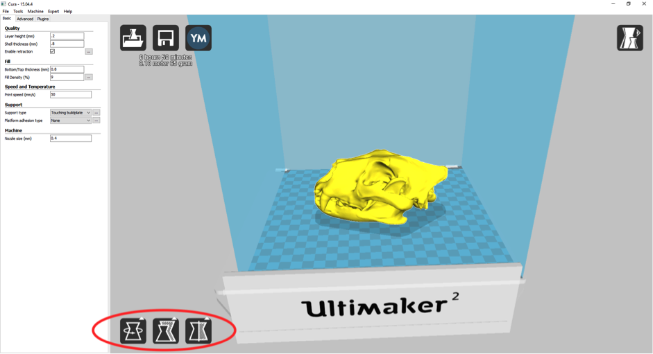
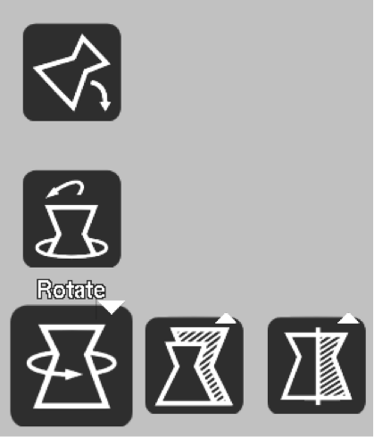
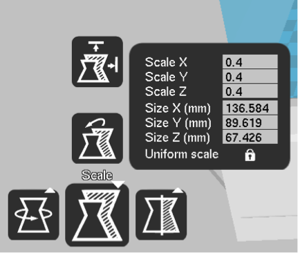
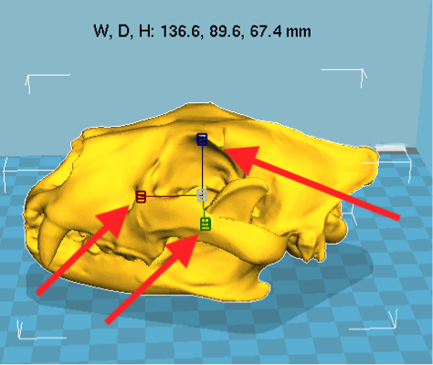
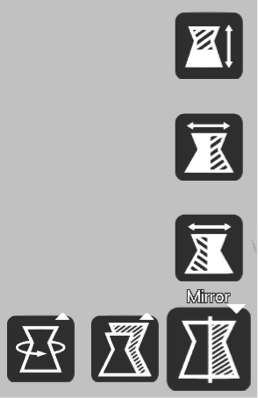
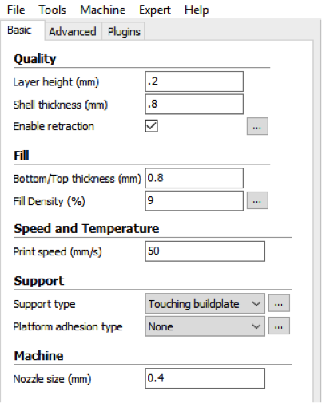
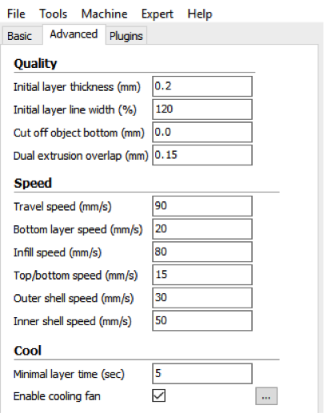
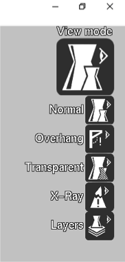
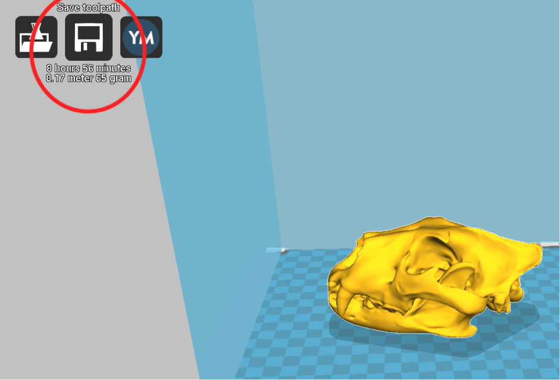

# 3D Printing Guide
Created by Autumn Painter and Brian Samuel Geyer
 *Maintained by [LEADR](http://leadr.msu.edu/) under the direction of Alice Lynn McMichael*

*Last Updated: 3/30/2018* - Needs Updating - Most Links are dead

## Open 'Cura'
This is where you will adjust the size and orientation of your model for printing.

First you need to load a .obj file (this is the finished model product). Your model should not have any gaps or holes that could cause issues with printing.

When you have your object selected, three icons in the bottom left corner will appear: Rotate, Scale, and Mirror

### Rotate
The bottom left icon is for rotate. The top option allows you to have ‘Cura’ automatically lay your object flat. This will assist in the printing process. You can also manually adjust the orientation of the object with the three adjustment circles that appear. Normally it allows you to adjust in 15 degree increments, but if you press ‘shift’ while rotating, you can rotate at 1 degree increments.

 

### Scale
The center bottom icon is for scaling your object. You can either adjust the size of your object based on millimeter measurements or by manualing dragging the scale bar axis (x, y, z) options. You also have the options to have ‘Cura’ scale your object to the largest maximum size to print.

 

### Mirror
This option will allow you to automatically flip your object (i.e. mirror) your object along either the X, Y, or Z axis.

## Adjusting the Print File
Within the toolbox on the left side of the screen, you are able to adjust many different options that will affect the print quality, fill, speed, and temperature.

 

### Quality:

#### Layer Height (mm)
This is the most important setting for determining the quality of your print. Normal quality prints are 0.1 mm, high quality prints are 0.06 mm. You can go up to 0.25 mm with the Ultimaker for a very fast print at a very low quality.

Note: some guides or publications report layer heights in microns. 1 mm is 1000 microns, so 0.1 mm is 100 microns and 0.06 mm is 60 microns. Ultimaker claims that our printer, using the 0.4 mm nozzle we leave installed in our printer, can achieve a 20-micron layer height resolution. For more information, see [Ultimaker's specifications for their 2+ line](https://ultimaker.com/en/products/ultimaker-2-plus/specifications).

#### Shell Thickness (mm)
This thickness is of the outside shell in the horizontal direction. This is used in combination with the nozzle size to define the number of perimeter lines and the thickness of those perimeter lines.

#### Enable Retraction
This allows for the filament to be retracted when the nozzle is moving over a ‘none-printed’ area. More details about the retraction can be configured in the advanced tab.

### Fill:

#### Bottom/Top Thickness (mm)
This controls the thickness of the bottom and top layers, the amount of solid layers put down is calculated by the layer thickness and this value. Having a value a multiple of the layer thickness make sense. And keep it near your wall thickness to make an evenly strong part.

#### Fill Density (%)
This controls how densely filled the insides of your print will be. For a solid part use 100%, for an empty part use 0%. A value around 20% is usually enough. This will not affect the outside of the print and only adjusts how strong the part becomes.

### Speed and Temperature:

#### Print speed (mm/s):
Speed at which the printing happens. A well adjusted Ultimaker can reach 150mm/s, but for a good quality print, you want it to print slower. Printing speed depends on a lot of factors. So this is one setting that you will experiment with.

### Support:

#### Support type
This is where you choose between no support type, support through touching the buildplate, or an ‘everywhere’ support type. Touching buildplate only creates support where the support structure will touch the build platform; everywhere support creates support even on top of parts of the model.

#### Platform adhesion type
This is where you will choose between no platform adhesion, a brim platform adhesion, or a raft adhesion. Each of these are different options which help in preventing corners from lifting due to warping. Brim adds a single layer thick flat area around your object which is easy to cut off afterwards, and it is the recommended option. Raft adds a thick raster below the object and a thin interface between this and your object.

## View Mode
You are able to view your model in a variety of ways including: normal, overhang, transparent, x-ray, and layers. To switch between these options click the icon located in the top right corner of the of the program (see image).

## Save Model
To save your model you can either go to File → Save GCode, or you can click the floppy disk save icon (Save toolpath option) in the top left corner of the screen (see image below). If you have the SD card plugged into the computer, the ‘save toolpath’ option will automatically save the model to that location.

## How to Print on Ultimaker:

### Printing:
1. Plug SD card with .gcode file of the object
1. Turn on Ulitmaker printer. Switch is on the back left corner.
1. Confirm that filament is inserted into the printer.
1. If you want to use glue on the glass plate, do that now.
1. To print, scroll using the round controller to the print option and press the controller. This will open a new screen that will list the .gcode files. Your most recent file will most likely be at the end of the list.

NOTE: It is possible to remove or add the SD card while the printer is on, as long as it isn't currently trying to access that card, such as by being currently printed or displaying the SD card contents.

#### Printer Display and Controller:
[https://ultimaker.com/en/resources/147-display-and-controller](https://ultimaker.com/en/resources/147-display-and-controller)

#### Inserting New Filament Material:
[https://ultimaker.com/en/resources/145-loading-filament](https://ultimaker.com/en/resources/145-loading-filament)

#### Changing Filament:
[https://ultimaker.com/en/resources/16955-changing-filament](https://ultimaker.com/en/resources/16955-changing-filament)

#### Using Glue:
[https://ultimaker.com/en/resources/16968-using-glue](https://ultimaker.com/en/resources/16968-using-glue)

#### Calibrating the Printer:
[https://ultimaker.com/en/resources/146-calibration](https://ultimaker.com/en/resources/146-calibration)

### Maintenance:

#### Cleaning the Glass Plate:
[https://ultimaker.com/en/resources/152-cleaning-the-glass-plate](https://ultimaker.com/en/resources/152-cleaning-the-glass-plate)

#### The Feeder:
[https://ultimaker.com/en/resources/151-the-feeder](https://ultimaker.com/en/resources/151-the-feeder)

#### Lubricating the Axles:
[https://ultimaker.com/en/resources/150-lubricating-the-axles](https://ultimaker.com/en/resources/150-lubricating-the-axles)

#### Unclogging Nozzle- Atomic Method:
[https://ultimaker.com/en/resources/149-atomic-method](https://ultimaker.com/en/resources/149-atomic-method)

### Troubleshooting:

#### Extrusion Problems:
[https://ultimaker.com/en/resources/11704-extrusion-problems](https://ultimaker.com/en/resources/11704-extrusion-problems)

#### Error Messages:
[https://ultimaker.com/en/resources/160-error-messages](https://ultimaker.com/en/resources/160-error-messages)

#### Can’t Update Firmware:
[https://ultimaker.com/en/resources/159-cant-update-firmware](https://ultimaker.com/en/resources/159-cant-update-firmware)

#### Print not sticking to build plate:
[https://ultimaker.com/en/resources/158-print-not-sticking-to-build-plate](https://ultimaker.com/en/resources/158-print-not-sticking-to-build-plate)

## Common Issues and Adjustment Suggestions:

### Raft vs. No Raft vs. Brim?
An issue that can arise when printing 3D models. How secure of a base does the model need? Depending on this, you can decide which base to print. If the print needs a lot of security/stability, choose the raft option. Additionally, a raft can make up for any unevenness in the buildplate’s level.

Jammed nozzle →  Refer to the Atomic Method

-----
### Return to [LEADR's Resources list](https://leadr-msu.github.io/)
