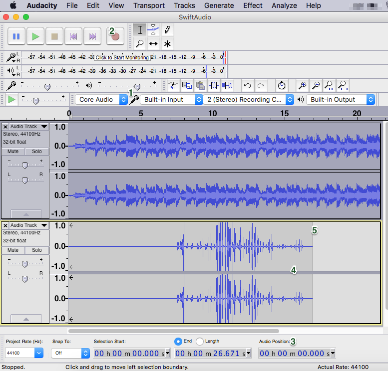
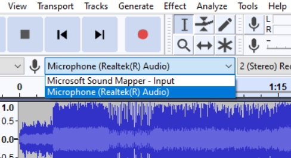
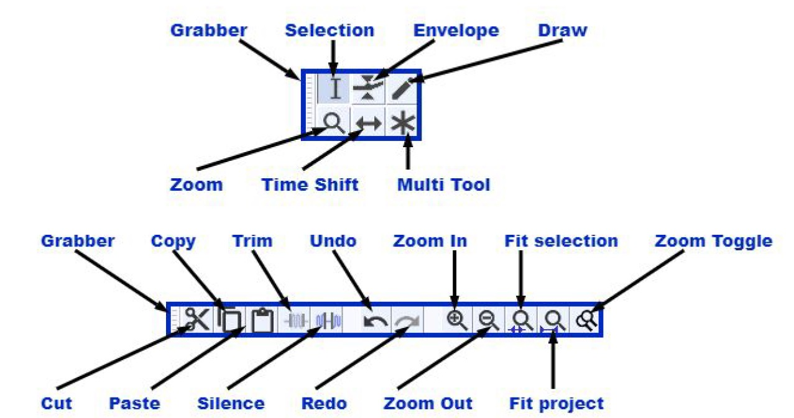
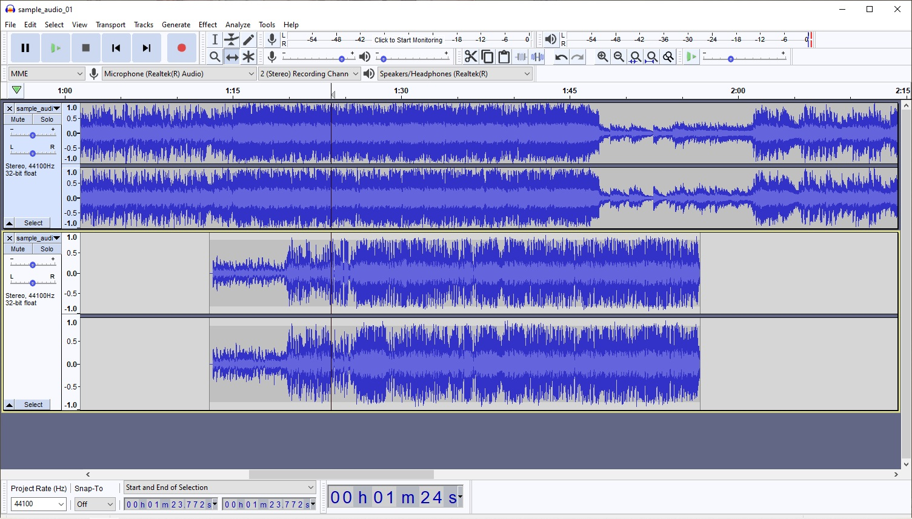
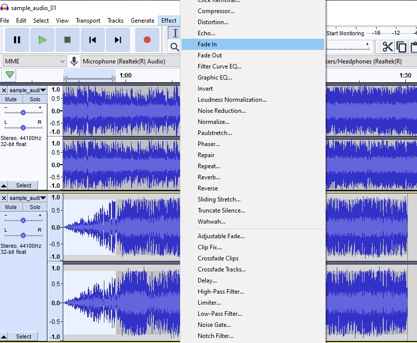

# Editing and Recording Audio with Audacity

This guide is prepared by Daniel Fandino with contributions by Sara Bijani and Alyssa Lopez, and is maintained by LEADR staff(http://leadr.msu.edu/)

*Last Updated: 1/24/2022*

## Editing Audio in Audacity
Audacity is an accessible, open-source, multi-track audio recording, and editing software with a number of important features and effects, particularly for preparing podcasts. If you are interested in features or functions not mentioned in this brief introduction, please see the [Audacity Manual](http://manual.audacityteam.org/) for more tutorials or assistance. You may also check out our guide on [microphones](https://leadr-msu.github.io/guides/microphones.html) to see how we record audio using LEADR equipment.

  

**Setup**

To get started, you’ll need to [download the Audacity app](https://www.audacityteam.org/download/). Downloads are available for Mac, Windows, and Linux. If you are going to be recording audio with audacity, you’ll want to plug your microphone into the USB port before opening audacity. If Audacity is not registering the mic, quit the app and try again. You may also need to select the drop down menu next to the microphone icon (1) and select your preferred microphone.

**Recording audio with Audacity**

Audacity can record from a built in computer microphone or an external microphone. If you wish to use an external microphone, connect it to the USB port before opening Audacity. If Audacity is not registering the mic, quit the app and try again. You may also need to select the drop down menu next to the microphone icon directly underneath the recording controls and select your microphone.

  

Start by pressing the red record button. You will see the time in the bottom right corner start counting upwards and sound waves will begin to appear in the editing pane. You may pause or stop recording at any time. 

When recording through Audacity or another device, record 5 to 10 seconds of the ambient room sound before starting. Audacity is able to filter out some background noise if it has a sample of the ambient room sound to work with by the use of a Noise Reduction feature. This feature is discussed later in this guide.
 
Always work from a backup of your original recording, In the Windows File Manager, right click your file and select Copy. Paste it into a new folder to serve as your working copy. Windows will automatically add ”-copy” at the end of the filename if it is pasted into the same folder as the original. It will give the file the same name if it is pasted into a new location.

**Opening Media in Audacity**

Audacity can use audio recorded via Audacity or from another device. If you recorded on a smartphone or other device, send the file to the computer running Audacity. To add the audio to Audacity, click File > Import > Audio. Audacity supports both WAV and MP3 files.

Once you have your podcast audio opened in Audacity, you can add additional tracks to your recording. Adding an additional track is a way to add music or effects to your audio. You may have multiple tracks added and Audacity will merge them into a single sound file.

Add a new track to your project by clicking File > Import > Audio. If you attempt to open a second file by clicking File then Open, it will open the file as a brand new project in a new window.

**Editing Audio with Audacity**

Once you have your project imported, Audacity has a selection of tools to assist in editing. Hovering over a tool will reveal its name.

  

  **SELECTION** allows you to highlight a section of a track.
  **ZOOM**, as the name implies, allows you to zoom into a track. This is useful for editing as it will allow you to make precise cuts and adjustments to your audio.
  **TIMESHIFT** allows you to slide different tracks
  **DELETE** removes a selected portion of the audio.
  **CUT** removes a selected section but saves the selection in the clipboard.
  **UNDO** reverts the last change.
  **COPY** duplicates the selected section.
  **PASTE** inserts a selection from the clipboard created by COPY or CUT.

Clicking on the sound wave visualization with SELECTION will create a vertical line. You may click and hold to drag the line to create a highlighted section of the file. Clicking play at this point will play from the start of the selected section, so you can fine tune the start and end points.

  

Selecting CUT from the EDIT menu will remove the selected section. Audacity will automatically merge the remaining sections.

If you have laid down two or more tracks, you can align them by use of the TIMESHIFT tool. For example, you may have uploaded a music or sound effect you wish to play at a certain point in your podcast. When tracks are imported into Audacity they are all aligned to start playing at the same time, 0.00 on the timelime. Once this tool is selected you may slide tracks around the timeline so they play at certain points. In the image below, the second track has been moved so it starts playing at one minute and twelve seconds into the first track. Using TIMESHIFT will allow you to add music and effects to any point in your recording. Note that the two tracks will play together.
  
  

If you want to add another file into the middle of another track, you can Copy a selection from another imported track and then Paste it directly into a track. This is helpful if you want to insert music into a point of your project without having two tracks playing together.

At any time you can delete a track by clicking the X on the upper left of the track.

**Audio Effects: Fade in and Fade Out**

There are a number of effects in Audacity, but two of the most useful are fade in and fade out. These can be used to blend two audio tracks together in a seamless manner. 

Move one track so the two are aligned in a way that the use of a fade out/in makes sense. Select the audio track you want to fade and select the section you want to fade with the SELECTION tool. In the menu bar, select EFFECT > FADE OUT or FADE IN. You will see the sound wave change as depicted below.
 
   

Editing cannot be done while the tracks are playing, you’ll need to stop them completely to edit.

**Mixing Tracks**

When you have completed working with different tracks you may merge them into a single track. This is useful if you are content with the mixing and editing completed so far but wish to continue editing and do not want to have too many tracks open.

**Reducing Background Noise**

If there is excess background noise on the recording, you can attempt to remove the noise using Audacity’s tools. Keep in mind it is always easier to adjust your recording environment to reduce noise than it is to use Audacity to remove unwanted background interference. However, at times background noise can be unavoidable

Select a portion of the audio that has only background noise. This is why recording a short clip of ambient sound at the beginning of a recording is useful
as it provides this baseline audio for Audacity to work with. 

  Click EFFECT > NOISE REDUCTION from the menu
  Click GET NOISE PROFILE and then OK.
  Select the entire audio track. Click EFFECT > NOISE REDUCTION. This time only click OK.
  The noise filter will be applied to the track. Listen and determine how well the process worked. You may undo the noise reduction and try again using the sliders on the       NOISE REDUCTION tool to fine tune the process.

Audacity noise reduction is limited and it may not be able to completely eliminate noise from your work.

**Saving your work**
Clicking SAVE PROJECT will save it as an Audacity project. This will let you continue to work on your project later. As an Audacity project, it cannot be played in other media. 

To create the final version of your project, you will need to export it as a new file type. To export your file in another format, go to File > Export Audio. Select WAV if you still plan on editing the audio. If your work is completely done, you can save it as an MP3. Fill in the metadata information as best as possible, but make sure to at least include the artist and track name (you should use your name and the project title). This information will always stay with the MP3 file and can be useful when looking for information on it later.

**Helpful Recording Tips**
When recording, make sure to record a few moments of silence at the beginning and end. You can edit out any extra material later.

Always record a short test clip to ensure your microphone is working properly.

If you make a mistake while recording, instead of stopping the recording, wait for 3-5 seconds and continue on. This is useful when recording an interview or in a group and you do not want to interrupt the flow of the discussion. You may then edit out the error.

When you first import a track into Audacity, it will give you the option to make a copy of the file or to work on the original. It is strongly suggested that you make a copy of whatever file you are importing. If you work on an original and make an undesirable change, the original version cannot be retrieved later.

Music and other audio samples may be under copyright. There are many resources for free sound effects and music. The most useful for a student podcast are those under a license that allows for completely free use. The BBC has an archive of sound effects free to use for personal and educational purposes under license: http://bbcsfx.acropolis.org.uk/

https://pixabay.com/music/ is one of many sites that provides free music under an open license.

**Other key points**
Editing cannot be done while the tracks are playing, you’ll need to stop them completely to edit.

If your mic doesn’t show up, go to System Preferences > Sound > Input > Stereo Mic. (For Macs)

When recording, make sure to give yourself enough time on both ends. You can edit out any extra material later.

When you first import a track into Audacity, it’ll give you the option to make a copy of the file or to work on the original. It is strongly suggested that you make a copy of whatever file you are importing. If you work on an original and make an undesirable change, the actual original cannot be retrieved later.

<!-- Seems like out of date advice, no actual URLs included either.

**ADVANCED OPTIONS:**
* Audio can also be recorded directly from your device without actually importing files into audacity. Skype interviews and audio from YouTube videos can be added into audacity this way. For a tutorial on how to do this with a Windows 10 operating system, watch this quick 5-minute video. To do this on a Mac, watch this tutorial. You will need to download a free program called Soundflower, which will allow you to reroute your internal audio to Audacity.
-->
-----
### Return to [LEADR's Resources list](https://leadr-msu.github.io/)
