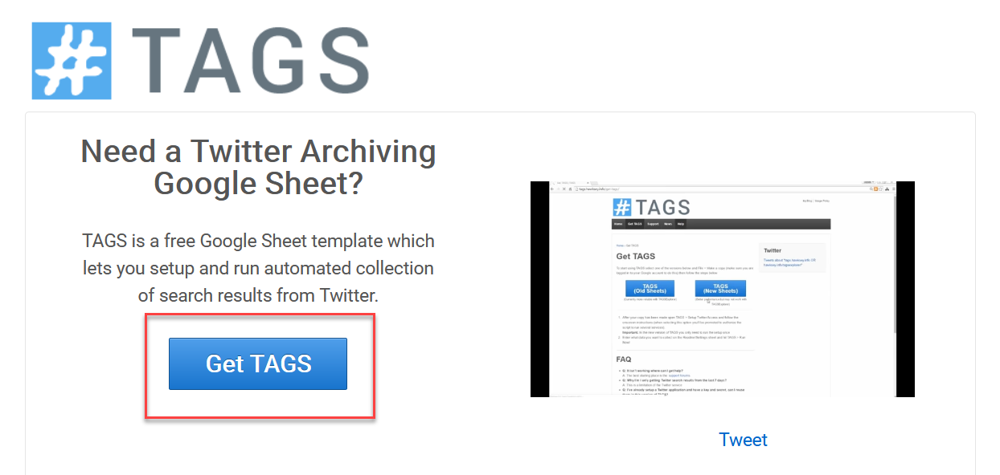
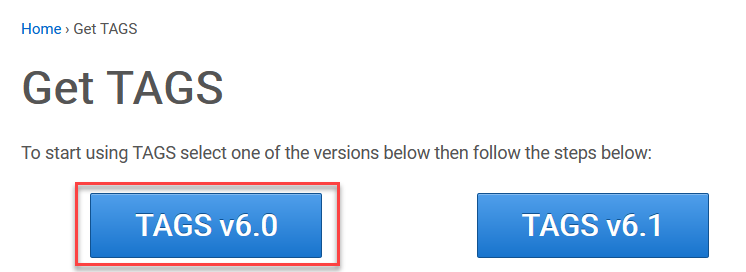
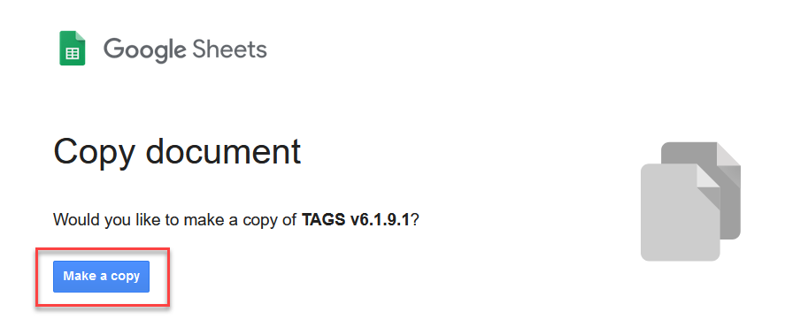
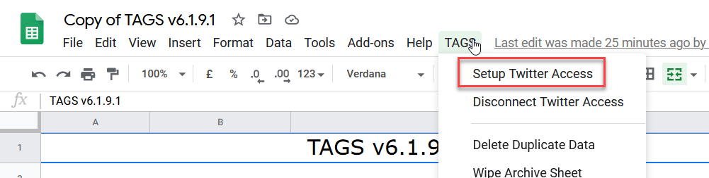
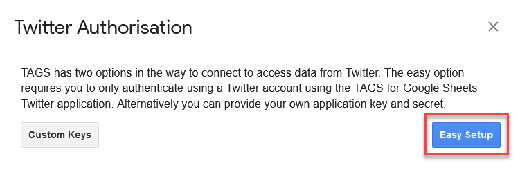
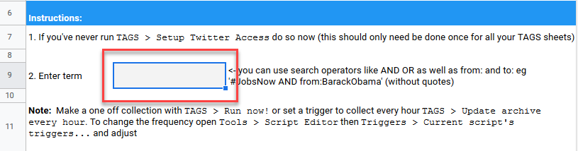
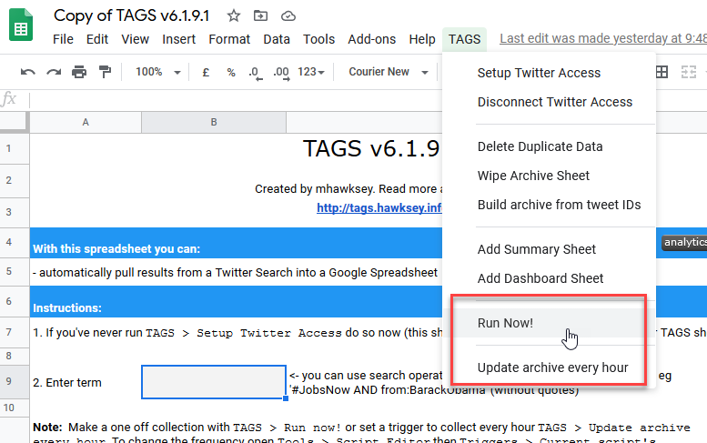
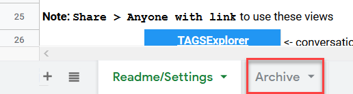
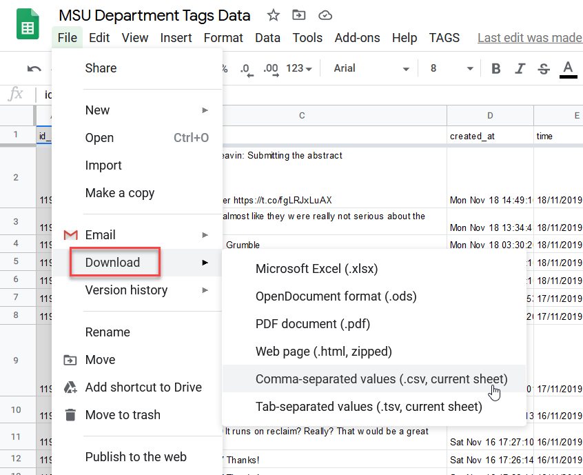

# EXAMPLE GUIDE MEANS NOTHING

Created by [Zach Francis](https://redfeather.dev/)

*Last Updated: 12/16/2020*

## Overview
TAGS stands for [Twitter Archiving Google Sheet](https://tags.hawksey.info/get-tags/). TAGS is a Twitter scraping tool which lets you automatically collect tweets into a google sheet. You can collect Tweets from specific people, a particular hashtag (#), or search terms.

## Getting TAGS Running
In order to get TAGS you will need to have a Google Account and a Twitter Account. Once you have those accounts, you will need to create a TAGS Google Sheet and set up access to Twitter.

#### *Necessary Accounts*
You will need a Google and Twitter Account. Your MSU account will likely give you trouble if you attempt to use it with TAGS. A separate, non-MSU Google account that you have access to is your best option. If you do not have a Twitter account, go to Twitter and follow the instructions needed to create an account.

#### *Creating your TAGS Google Sheet*
Once you have the necessary accounts, you can create your own TAGS Google Sheet. Follow these steps:
1. Navigate to the TAGS website and press the Get Tags button on the homepage.
2. You'll have the option to select between TAGS v6.0 and TAGS v6.1. Unless you are familiar with version 6.0 already, then we recommend clicking on version TAGS 6.1. 
3. Clicking TAGS v6.1  will push your google account to ask you if you want to make a copy of the TAGS Google sheet. Click the make a copy. This will create a copy of TAGS in your Google Account as a Google Sheet.

#### *Setting Up Twitter and Google Access*
In order to start collecting tweets, you will have to give your Google Sheet access to your Twitter. Here are the steps:
1. Select the the TAGS tab in your Menu bar and click Setup Twitter Access 
2. A pop-up will appear asking you how you would like to set up Twitter authorization. Press **Easy Setup** and follow the prompts. 
  - At some point you will likely be asked to sign into Twitter - do so.
  - Google will ask you if you want to allow TAGS and Twitter to have access to your account. Grant them that access.
    - If you have authorization problems and get a page saying “This app isn’t verified”, you can continue to use TAGS by clicking on Advanced Settings and authorizing TAGS anyways.
  - Once you have Twitter and Google access setup, you may now start using TAGS

## Using TAGS
Once you have given all of the proper permissions to TAGS, all you need to do is set up your search parameters and run the script. You may then download your data to begin your analysis.

#### *Entering Search Terms*
- In the 9th row of TAGS, you may enter search terms.
  - You may enter any search term into the search box, and any tweets containing that search term will appear.
  - You may scrape all tweets for a particular hashtag by typing in “#yoursearchterm”
  - You may scrape tweets from particular people or tweets sent to particular people using their username in the following formats: “from:username”; or “to:username” 
- Alternatively, you may scrape favorited tweets or statuses instead of tweets by using the advanced settings (see next section).

#### *Advanced Settings for Your Search*
There are several advanced setting options in row 13 to 17 of your TAGS sheet. These functions are summarized below:
- Period: This period allows you to specify how far back into the past you want to scrape tweets for (up to 7 days). Note that your search will automatically search 7 days into the past if left blank.
- Follower Count Filter: You may use this option to specify particular users who have a minimum number of followers.
- Number of Tweets: If you want to collect Tweets for a longer period of time, then you can increase this number. Experience has shown that TAGS usually meets the limit in less than a month if this is not changed.  
- Type: This specifies whether you want to use search terms to scrape tweets or if you want to scrap the favorite tweets or statuses of a particular user.

#### *Scrapping Tweets*
Once you have your search terms and settings in place, follow these steps to scrape Twitter for Tweets:
- Go to the TAGS tab and select either "Run Now!" Or "Update Archive every Hour".
  - If you want a one time dataset, select Run Now!
  - If you want to continually take data, say in preparation for some event, select Update Archive every Hour.
    - Twitter only allows you to scrape Tweets from the past 7 days. So, if you want to analyze tweets for an extended period of time, you will have to do some planning.
    - For instance, if you want to analyze tweets before and after a political event, you could set up TAGS to scrape tweets beforehand. But, be sure to keep an eye on whether or not your TAGS sheet has reached your tweet limit before the event is over. 
- After running TAGS, tweets that meet your criteria will be found in the Archive tab at the bottom of your Google Sheet. 

## Downloading Your Data
Once you’ve scrapped some tweets, TAGS will provide you with a Google Sheet containing the actual Tweets, their creator, creation date and other metadata in the Archives section. Follow these steps to download your data:
1. Go to the file tab
2. Select download
3. Choose the format that you want to download your data in and click on it.
  - Excel and .csv formats will work well in Voyant. 

## FAQ
*How does TAGS work?*
- TAGS works by making requests for tweets (that meet your criteria) to Twitter’s Application Program InterfaceI (API). The API essentially acts as an administrator who decides whether or not to give you the Tweets that you are asking for. This means that Twitter is policing which tweets are sent to you.

*How does Twitter’s API affect my dataset?*
- There are many conditions that the Twitter API will run your request through before getting you your dataset. It is important that you consider how your dataset is made before making analyses. The following two conditions are significant in this regard:
  - The Twitter API will automatically prefer Tweets from more popular and connected users.
  - Twitter only lets you scrape Tweets within the last 6-9 days.

*If TAGS and Twitter give me a curated dataset, why are we using them?*
- While it’s true you are not getting a perfect dataset, that was never a possibility. Certain populations do not use social media and it is up to you to take all these factors into account when explaining your analysis. That being said, TAGS does provide a way to collect HUGE amounts of data from people publicly giving their opinion on issues. Using this data responsibly and correctly is extremely valuable.

*How do I use this data?*
- There are as many purposes for your data as you can imagine. You can examine the actual tweets users have submitted it, where they are from, how the tweets changed over time and so on.
There are numerous resources for learning how to visualize data including Voyant, Excel, R, Python, and Flourish. Voyant is a good option and LEADR  provides a handout.

*How do I collect useful data?*
- Much of this will be trial and error. Different search terms, hashtags and users will all greatly affect what your dataset looks like. Try to think critically about what issue you are looking into and how best to examine it with TAGS.

*My TAGS is not working or I did not get any results and want to do a new search. How do I reset?*
- The easiest way to reset TAGS is to simply create a new sheet. You may have multiple instances of TAGS running, and setting up a new sheet is much easier once you have already gone through the process.

## Assessment
By the end of this tutorial, you should have TAGS and be able to scrape for tweets in a variety of ways. This should provide you tabulated datasets that can be very large. Visualizing this data will be the next step in your analysis.

Keep in mind that how you got the data, and how you choose to visualize it will greatly affect your analysis. There are a number of ways to visualize data, but one way to analyze and visualize the textual data of TAGS is through Voyant. Check out the LEADR tutorial on this subject to learn more.

-----
### Return to [LEADR's Resources list](https://leadr-msu.github.io/)
