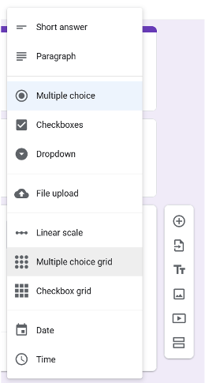
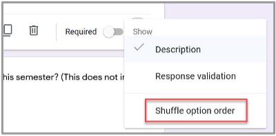

# Collecting Data with Google Forms
Created by [Zach Francis](https://redfeather.dev/)
 *Maintained by [LEADR](http://leadr.msu.edu/) under the direction of Gillian Macdonald*

*Last Updated: 3/2/2021*

## Overview
Google Forms provide a convenient way to collect data through online surveys. All you need is a Google account and a plan. Since Google has [thorough documentation](https://support.google.com/docs/answer/62818880) on how to create forms, this handout will focus on best practices for creating surveys and using those results.

## Creating a Google Form
1. To start creating google forms, go to [forms.google.com.](http://forms.google.com)
2. Google will ask you to sign into a google account, if you haven’t already.
3.  From the forms page, Click on the Google plus icon. This will take you to a new Google Form where you can begin making your survey.

## Basics of Working in Google Forms
Google Forms allows you to ask a variety of survey questions, embed images and video, and format the layout of your form. These tools provide a lot of flexibility for creating surveys.
- **To add a question** click on the **plus icon** located at the top of the tool-bar pictured to the right. [There are many types of questions to choose from.](https://support.google.com/docs/answer/7322334)
- This toolbar also allows you to **embed video and images** to help illustrate your questions.
- You may also **add titles** to sets of questions and **create new pages** of questions by adding sections. These options will affect the flow of your survey.
- To send the survey, click the **Send** button at the top-right of the page. You may either send the survey directly through email, or share a link to those you want to take the survey.
- For a more nuanced look at the tools and options that Google Forms provides, check out their [documentation.](https://support.google.com/docs/answer/6281888) The best way to learn the mechanics of Google Forms, however, may be creating your own surveys.
  

## Best Practices for Creating Surveys
When creating surveys in any setting, every researcher should think about their objectives and the best way to get data for those objectives. In that regard, there are some best practices to think about when creating surveys.

### *Inform Your Participants*
From the outset, it is important that you are transparent with your participants. Inform them about the purpose of your research, how their data will be used and the general background of the project. In Google Forms, you can provide information through an introductory section before participants take your survey. This will allow for their informed consent before filling out any data.

### *Establish Clear and Feasible Objectives*
Think about what you are trying to accomplish with this survey, and tailor your questions accordingly. Also be careful to scale your objective to something that’s manageable.
- **Example:** instead of asking the general question of how social media is used in education, ask how Instagram is used in classrooms.

### *Format Carefully*
Make sure that your survey flows in a way that will not turn participants away. Here are some general tips:
- **Cut to the Chase:** Only ask participants the questions that matter to your objective. Asking extraneous questions will increase the chances that your participants lose focus.
  - **Give a time estimate** for how long it will take to complete the survey for you.
  - **Don’t be Repetitive**: make sure you are not asking the same thing differently.
  - **Don’t offer too many (or too few) Options for Answers**: more than 10 options for a single answer is usually too many.
- **Ask One Question at a Time**: separate multiple concepts into their own questions.
- **Use plain Language**: Try to use direct and understandable language that will not be easy to misinterpret. **Do not use Jargon if you can avoid it.**
  - If you must use the jargon of your field, it is always a good idea to explicitly explain those concepts to people who may be less knowledgeable on the subject.
- **Use Titles and Sections**: splitting your questions into meaningful labels and sections will help participants to focus on answering your questions rather than trying to decipher what you are trying to ask.

### *Ask the Right Questions*
Besides asking questions relevant to your objective, you should take care to ask questions that will be as unbiased as possible. The following sections tackle different ways to avoid bias.

#### Direct Questions
Ask Direct Questions that the participant has to provide an answer for. Yes or No (also True or False) questions tend to bias towards Yes.
  - **Do Not Ask**: “Do you care about issue 1?”; “Do you care about issue 2” “Do you care about issue 3?”
  - **Ask**: “Which of the following issues do you care about?”. Then list your issues.

#### Controlled Vocabularies
Controlled vocabularies are great for questions with a finite set of possible answers. A controlled vocabulary provides possible answers as a list, multiple choice or some other format.
Using questions with a controlled vocabulary will provide you with data that is easier to read and quantitatively analyzed. But take care to give participants an “out” (an “other” option) if they have an answer different from what you’ve provided.
  - **Do Not Ask**: List what forms of social media you use.
  - **Ask**: “What forms of social media do you use?” as a **checkboxes** question with possible social media platforms listed: Facebook, Instagram, Twitter, TikTok, and an “other” option.

### *Avoid Bias*
We will always have our own biases, but taking steps to mitigate as much bias as possible is what makes a good researcher. In addition to asking the right questions, there are other steps you can take to avoid bias in surveys.

#### Keep your Tone Neutral
You can avoid asking leading questions by avoiding words like “amazing”, “extreme”, “despicable”, and other phrases which put an opinion in the question.
  - **Do Not Ask**: What do you think about the amazing teachers at MSU?
  - **Ask**: What do you think about the quality of education at MSU?

#### Randomize Shuffle Order
There is an inclination to pick the first answer when given multiple options. Shuffling the order of options helps mitigate this bias. Follow these steps to shuffle answers in Google Forms:
1. Go to the bottom of your multiple options questions (multiple choice, checklist, etc.)
2. Click the **three vertical dots icon** at the bottom-right
3. Select Shuffle options order
  - This will shuffle the options you have entered, but leave google options like “other..” at the bottom.  

## FAQ
* *Why are people outside of my organization unable to take my survey?*
    - You are likely using your institution's Google account which defaults to only allowing other email accounts from that institution to take your survey. You may change this by going to settings and unchecking the box for Restrict to users in *(institution)* and its trusted organizations.
* *How do I visualize my data?*
    - Google Forms will provide you with summary visualizations after respondents fill out your survey. There are other data visualization options such as [Voyant](https://voyant-tools.org/) or [Excel](https://www.tutorialspoint.com/excel_data_analysis/excel_data_analysis_visualization.htm).

## Resources
Google Forms Documentation
  - https://support.google.com/docs/answer/6281888
Resources for Designing Surveys using Other Survey Tools
  - SurveyMonkey: https://www.surveymonkey.com/mp/writing-survey-questions/
  - Qualtrics: https://www.qualtrics.com/blog/good-survey-questions/

## Assessment
By the end of this handout, you should be able to create and edit a Google Form for the purposes of collecting survey data. For a more in-depth look at the tools that Google Forms has to offer, check out their documentation.

Creating surveys requires careful planning and a critical eye towards what sort of effect your survey is going to have on how your participants. In order to receive good data, you have to ask good questions.

-----
### Return to [LEADR's Resources list](https://leadr-msu.github.io/)
