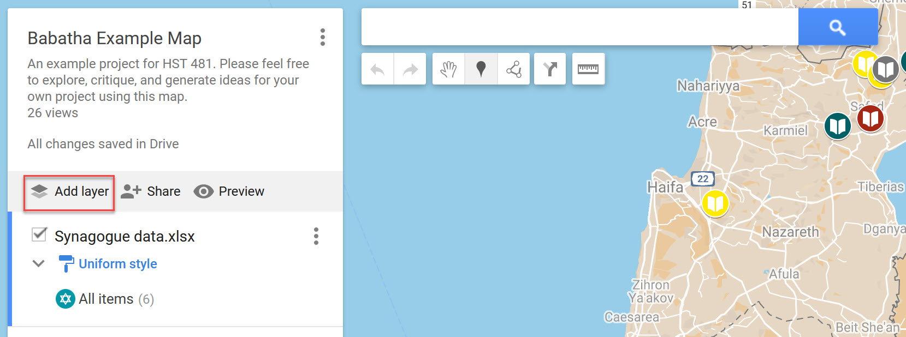
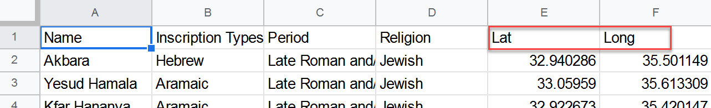
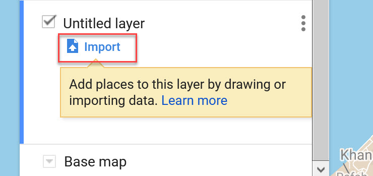
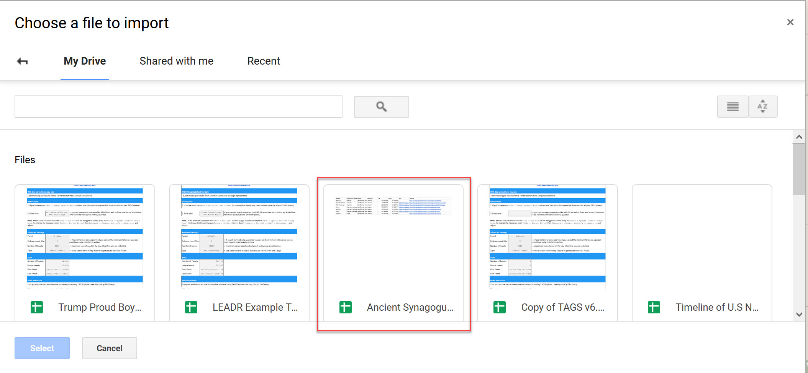
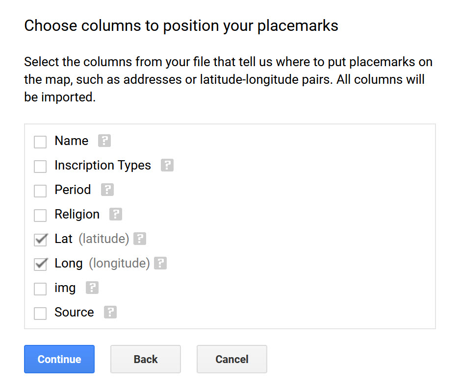
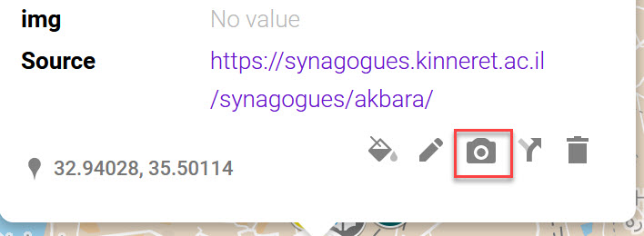
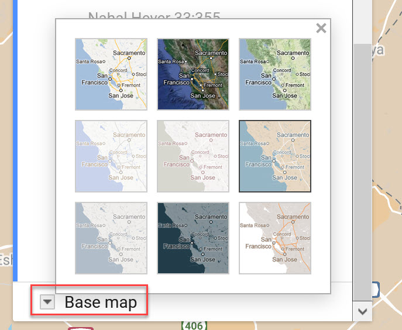
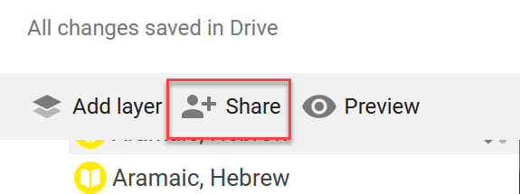
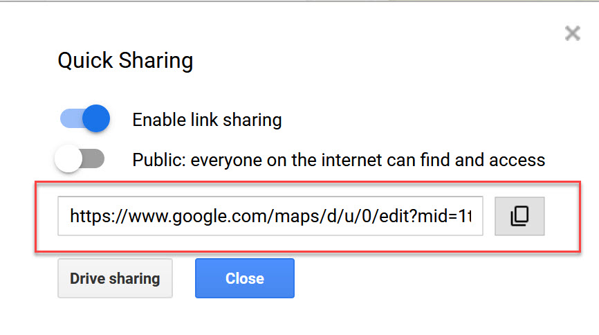

# Google My Maps

Created by [Zach Francis](https://redfeather.dev/)

*Last Updated: 12/04/2020*

## Overview
[Google MY Maps](https://www.google.com/maps/about/mymaps/) is a tool for creating and sharing custom maps using Google mapping software. Using your own dataset, you may style and edit your own map with different layers of data. In this handout we will go over the basics of starting a map, uploading data, creating your own points and shapes, and sharing your map with others.

## Signing into Google My Maps
All you need to start using Google My Maps is a google account. However, you will likely need a non-MSU Gmail account, since MSU Google accounts are finicky as an organization account.
1. Log into your  go to your non-MSU google account
2. Go to [https://www.google.com/mymaps](https://www.google.com/mymaps)
  - *Troubleshooting*: if Google refuses to let you into My Maps because of your MSU account, you may need to sign out of your MSU Account altogether.

## Using Google My Maps
The first thing you will want to do when you get into Google My Maps is select the **Create New Map** Button. Then you will want to click “*Untitled map*” at the top-left of the map in order to add your own title and description. You can now begin creating your map.

#### *Creating and Editing Layers*
Map layers give you the ability to organize and categorize your spatial data into different layers. Here are some tips for working with layers in Google My Maps
- You’ll see your layers in the box on the left

- You can Add, Delete or Hide Layers.
  - **Add a layer**: Click Add layer. Then click the title and add a name.
  - **Delete a layer**: Next to the layer title, click **More** (three vertical dots) and select Delete this layer.
  - **Hide or show everything on a layer**: Uncheck or check the layer.
- You can move map features, pick their colors and icons, or change their info.
  - **Moving map features**: Drag lines, shapes or places to a new spot in a layer’s list of features or between layers.
  - **Changing Colors and Icons**: Select the paint bucket icon next to the icon(s) that you want to edit.
- **Editing layer info**: Click **More** (3 vertical dots) and select **Open data table**.
    - **Edit line, shape or place info**: Edit cells.
    - **Add or delete info fields**: Add or delete columns.
    - **Change column formats**: Duplicate the column and delete the original.
    - *Hint*: it may be easier in some cases, to simply edit your datafile before uploading. Make sure you have clean data!

#### *Importing Data*
You may import geospatial data to your layers from existing datasets. Google My Maps is able to accept data sets from multiple file types including: Google Sheet, .csv, .kml, and Excel files. **Make sure that your data file has latitude and longitude coordinates in addition to the relevant data that you want to import beforehand**. Some file types (like .kml) will automatically have coordinate data included, but you will have to put the coordinates in yourself for file types utilizing spreadsheets. It is also a good idea to “[clean](https://en.wikipedia.org/wiki/Data_cleansing)” your data thoroughly before uploading it.

To import your data to a Google My Maps layer, follow these steps:
1. Click the **Import** button in the layer you want to add data to. This will bring up a pop-up for uploading your data. 
2. Either upload your file from your computer, or select it from your Google Drive
3. Click **Select** at the bottom-left 
4. You will then have to confirm which columns give location data by checking the appropriate data (latitude and longitude)
5. Press **Continue** 
6. Then select a column to be used as the title for each of your placemarks
7. Press **Finish**
8. Your points should then appear on the map
  - *Troubleshooting*: If your points did not appear where you expected, check to see if you mixed up the latitude and longitude columns.

#### *Creating Points*
In some cases, you may want to add individual points to your map. To do so, follow these steps:
1. Select the layer that you would like to add the point to by clicking on the layer name.
2. Determine where to add your point. You may do this in two different ways:
    1. You may use the **search bar** to Google the location on your map
    2. You may manually add a point by clicking on the marker button under the search bar, and clicking where you want the point to be on the map (you can fine-tune where the point is by editing the latitude and longitude data).
3. Once your point is on the map, you add the relevant data and images.

#### *Drawing Lines and Shapes*
Drawing lines and shapes onto your map can outline important areas and provides a way to emphasize the argument or story of your map. To add a line or shape follow these steps:
1. Click on the **Draw a line** option under the search box
2. Select **Add line or shape**
3. Draw your line or shape
    1. Click once where you want points on the line or shape to be (be careful not to rush yourself - Google My Maps is unforgiving, and will make you start over if you make a mistake.)
    2. Connect your first and last points if you want to make a shape for your map
    3. Double click to stop drawing
4. Once you have finished drawing, you may add a title, description, and picture.

*Tips*:
- Your shapes move very easily, so be careful where you click and drag on your map.

#### *Incorporating Media*
Media can make your map more interesting and informative. To add media to a point or shape on your map:
1. Click on the **Camera Icon** for your marker/shape
2. Upload your media (an image or YouTube Video)
3. Click **Select** at the bottom
4. Then make sure to **Save** your changes to the point.

#### *Changing Base Map*
At the bottom of the legend on the left, you have the option to change your map to one of 9 different options. Pick one that you think looks best!

#### Saving and Sharing your Map
As long as you have an internet connection, your map should automatically save into your Google Drive as you edit it.

To share a link, click on the share icon located at the top of your legend. This will bring up a pop-up where you can copy a shareable link for others to view your map.

## Additional Resources
Google My Maps Documentation:
- [Google Documentation](https://support.google.com/mymaps/)
- [Google Earth Documentation](https://www.google.com/earth/outreach/learn/visualize-your-data-on-a-custom-map-using-google-my-maps/)
Map Examples:
- [HST481 LEADR Classroom run through](https://www.google.com/maps/d/u/0/edit?mid=1tJ415173iGxLr_oYGK8vXw4kaztx0f9B&usp=sharing ) (12/03/2020)

## Assessment
By the end of this handout, you should be able to create and edit a map using Google My Maps. You should be able to create layers, data points, lines and shapes in your map. You should also be able upload your own data into your map. Once you have completed your map, you can share it with other people by either embedding it in a website, or by sharing a link for others to view your map.

-----
### Return to [LEADR's Resources list](https://leadr-msu.github.io/)
