# iMovie Tutorial: Adding Images and Videos to Green Screen Footage:
Created by Alyssa Lopez
 *Maintained by [LEADR](http://leadr.msu.edu/) under the direction of Alice Lynn McMichael*

*Last Updated: 12/17/2017*

## What You'll Need:
* Some video footage in front of a green or blue screen
* Additional images or video to be edited into the background
* iMovie editing software
* USB/external hard drive

## Adding Images and Editing:

When you open iMovie you'll see a screen that looks like the image below.

You're going to select "create new" and then, for our purposes, "movie."

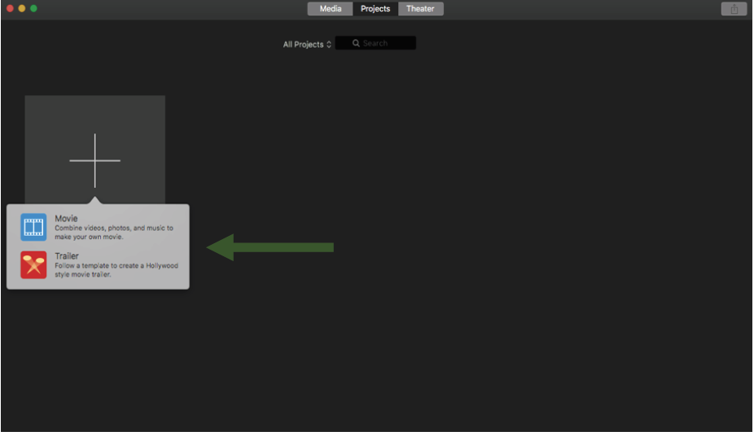

Next, you'll need to "import media." This will be your video and images you plan on editing into your green screen footage.

You can select all of the files at one time and just have them all imorted at once. Once that's done, they are all going to show up in this box (1). You'll need to drag each media individually into the editing pane (2)

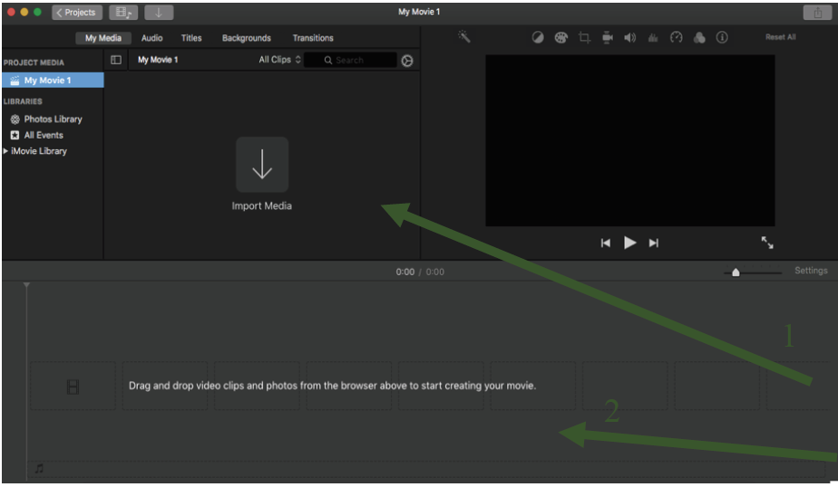

When that is complete, your screen should look like this:

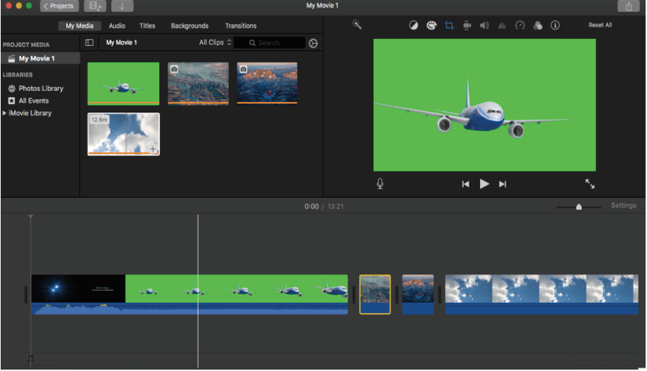

The box in the right hand corner gives you a preview of what your video is going to look like. Right now, as this arrangement of media stands, these videos/images will play in this sequence. However, this is not what we want.

In order to have the images fill in the green screen behind the airplane, you'll need to drag the first video (of the airplane) above the rest of the media.

Your editing pane should now look like this:

In order to cut out extra footage from your video, hold down the mouse and press the "R" key while dragging to select the range of material you want to delete. When it is selected, hit the "delete" key. After taking some material out, it's possible that you'll need to move the video/image over a little bit within the editing pane. You can only do this by selecting the entire video and dragging it to where you need it to be.

After some editing, your screen may look like this:

In order to view the images and videos you've added on the actual green screen, you'll need to change some settings. Click the overlay icon (1) which looks like two squares overlapping, and select the "green/blue screen" option (2) now the box in the right hand corner should look something like this:

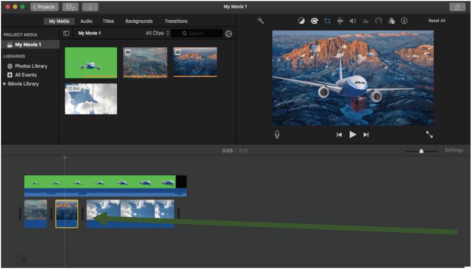

In order to change it so certain images last on the screen behind the plane for longer or shorter periods of time, you simply click the image, move your cursor until there is a two-sided arrow ( <----> ). When this appears, drag either left or right, depending on whether you want it shorter or longer.

Filters can be added to your video and images. This is done on an individual basis, meaning only one clip/video at a time can be changed.

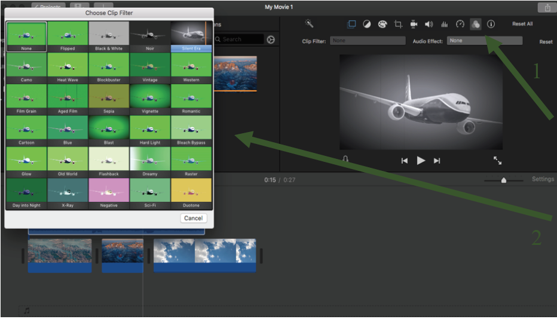

To get to this menu, you click on the icon that has three overlapping circles. (1) Once there, you can see all the options on the left-hand side of your screen. (2) When chosen, these filters will only apply to the airplane media.

Your edited video will now look like this:

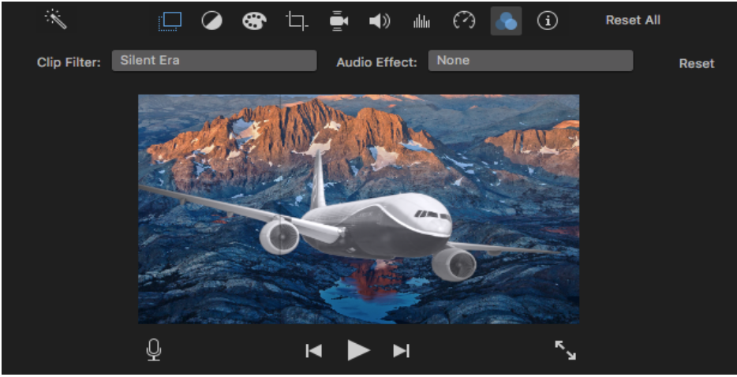

Notice the airplane is now black and white and there are some lines through the screen that make it appear like an old-school movie.

The image itself can also be edited depending on how you would like it to fit into the background.

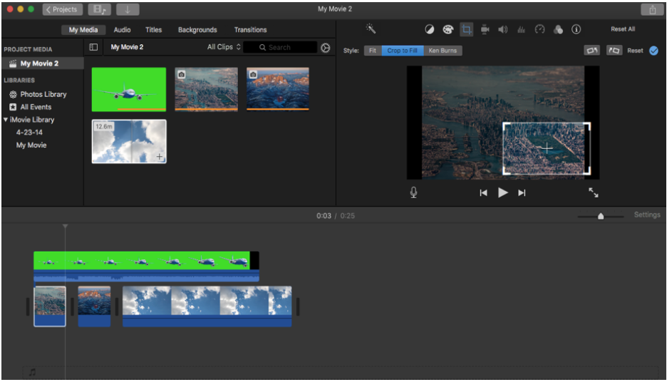

For example, say you only want a piece of the picture to be showing behind the airplane. To do this, you'll need to select the desired image in the editing pane. Then select the crop icon in the top right hand box. You want to press "crop to fill" and then move the box around to fit what image you want to show behind the plane. To finalize the change, click anywhere on the editing pane.

Instead of a full city landscape, now your plane should be flying over just one small segment. See below:

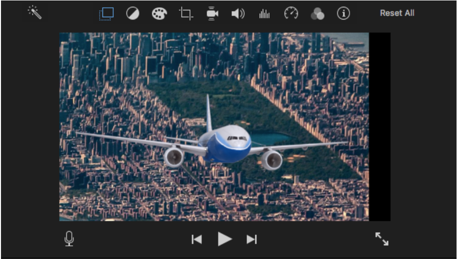

## Audio

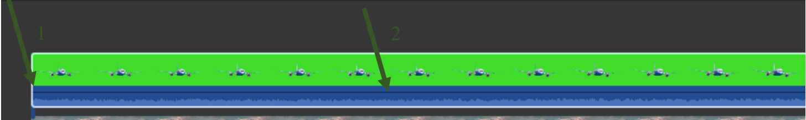

While audio alone cannot be edited with iMovie, there are certain functions still available. A fade-in can be added by hovering over the blue part of any video added to iMovie (1). When a cursor is placed over a white dot appears in the top left corner that can be dragged to the right to extend the length of a fade-in. The actual volume can also be adjusted by selecting the thin black line in the blue audio section of any video (2). Once it is clicked, it can be moved up or down to change the volume according to your needs.  

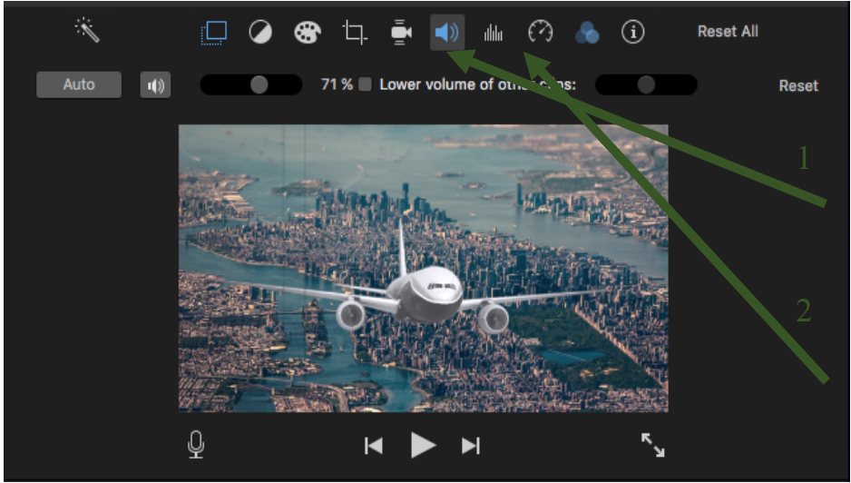

Audio can also be edited in the
box in the upper right hand
corner of your screen.
If you want to preference one
video’s audio over another, you
can use this speaker icon to do so
(1). You’ll need to check the box
“lower volume of other clips.” If
you find that your audio for a
particular video didn’t pick up
sound properly, you can filter out
background noise with the icon
that looks like noise levels (2).

## Saving Your Work

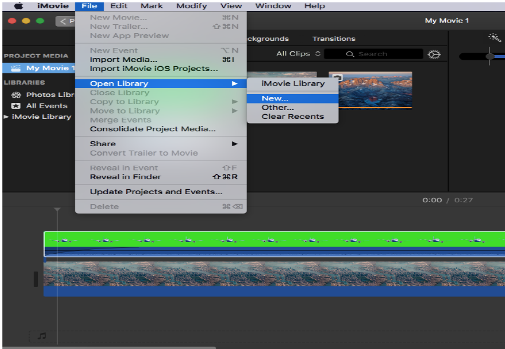

If your project is still a work in
progress, please make sure that you
are saving it to an external hard drive
or a USB. For those who want to continue
using their USB on Windows machines,
format the drive as "exFAT." Materials
left on the LEADR computers are not
guaranteed to be there at all times.

There are a few steps to this to save
something that you would like to
come back and edit to a USB.

_*First*_,
go to File -> Open Library -> New.

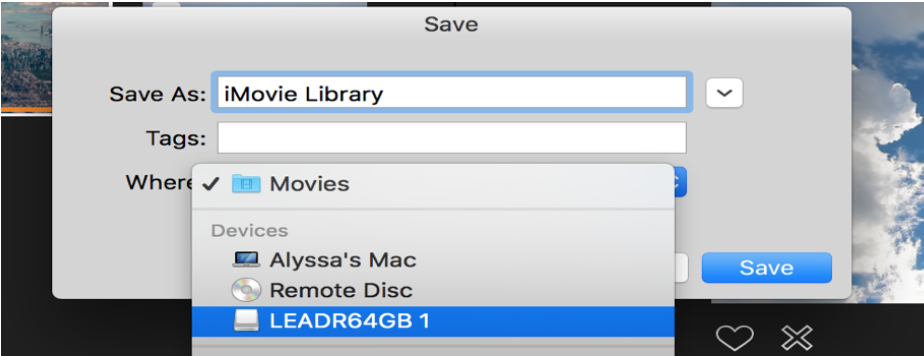

_*Second*_, under “Save As” chose a
file name for your library and a
location to place the file (this
should be your USB), press
“Save.”

_*Third*_, return to the “Projects” menu (the button is in the top left corner). In this window, look for your project and this icon: . Click this icon, and choose “Move to Library.” Select the library that you just saved to your USB.

To open this project on another Mac, start by plugging in your USB and opening iMovie. Go to
File -> Open Library -> Other. Chose your library from the list. If your USB does not appear, click “Locate” in the bottom left corner and then select your USB on the next screen. Any changes made to your project are saved automatically to your USB.

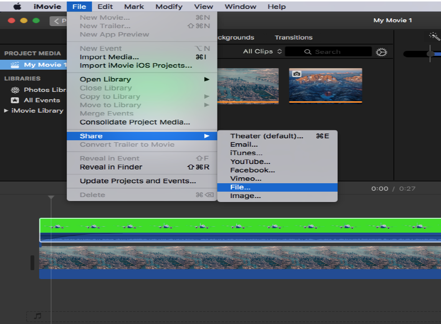

If your work is complete and you
do not plan on editing the file any
further, you can export your work.
While this does not necessarily
have to be on a USB, it is highly
suggested that you do so. To export
your final project, go to File ->
Share -> File. Press “next” once
you’ve named your file and given it
a description. Then, press save.

## Other Key Points:

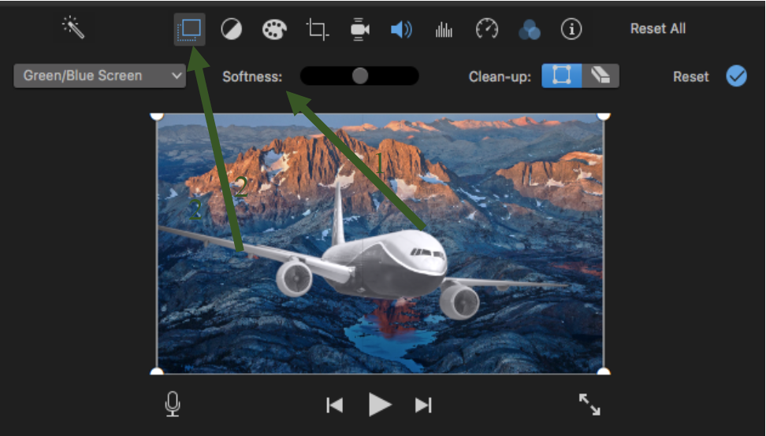

There is no difference between
using a blue or green screen, they
both have the same effect when
used while recording. However,
you may want to be sure to not
wear anything blue or green on
the chosen recording day as the
editing process might pick up on
certain colors. Additionally, keep
in mind that the blue and green
lights will change certain colors
while you are recording. This is
especially true when changing
the “softness” of the background.

Occasionally, there will be issues with the green screen that will make the editing process a little bit more difficult, such as wrinkles on the green screen. Images can be “smoothed” over when the green screen has wrinkles in it by changing the softness. This slider (1) is found in the right hand box of your screen after you press the overlay button (2). Adjusting this feature will also dim any blue or green (such as on your clothes) in the video.

-----
### Return to [LEADR's Resources list](https://leadr-msu.github.io/)
