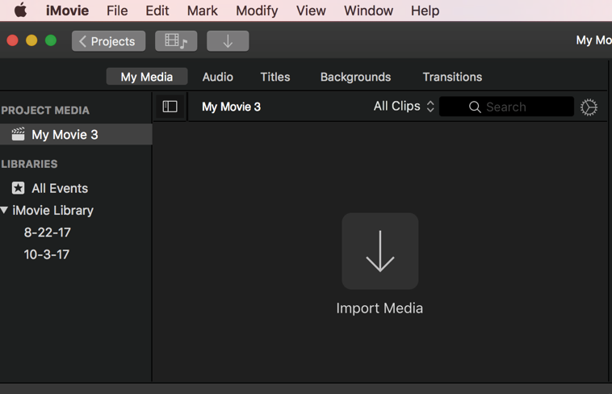
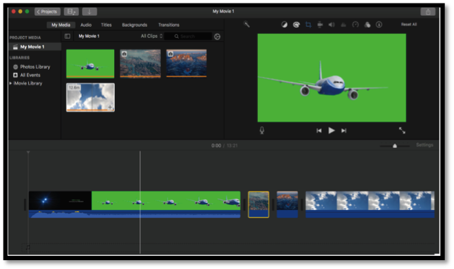
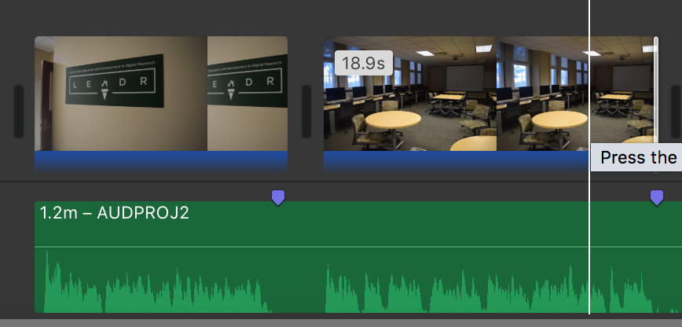
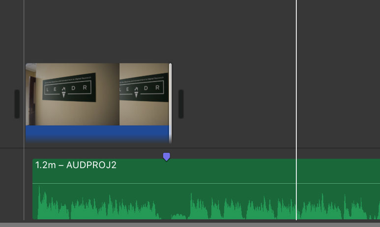

# iMovieTutorial

Created by Dawson McCall and updated by Daniel Fandino

*Last Updated 12/16/2017*

- To begin, select Create New >> Movie.

- Import the files you will be using to iMovie by selecting the grey down arrow.
- You can always add more later with the smaller grey down arrow in the top bar.

-	The media in the bottom box is where you are going to edit your work.
 - Top = Overlay imagery/video.
 - Middle = Baseline imagery/video.
 - Bottom = Audio

- To begin we recommend starting by draging the audio track down to the timeline. For easier viewing, you can resize the track.
Drag your first image to the timeline. Click and drag the end of the still image image until it fills the time you have allotted for it. >>do not do this with video!<<
-Continue to add images, dragging them to the desired mark. iMovie will insert some space between your images in the workspace but it will be seamless during playback.

## Cutting video/audio.
 - You can mark points on the audio track where you will be changing images to help you in editing. Go to Mark > Add Marker or press M on the point you wish to mark.

 - In order to cut out extra footage from your video/audio, hold down the mouse and press the "R" key while dragging to select the range of material you want to delete. When it is selected, hit the "delete" key.
 - After taking some material out, it's possible that you'll need to move the video/image over a little bit within the editing pane. You can only do this by selecting the entire video and dragging it to where you need it to be.

## Fading in Audio & Video
 - A fade-in can be added to both audio and video files by hovering over the sound portion of a video/audio clip in the editing pane (video = blue; audio = green).
 - When your cursor is placed over the file a white dot appears in the top left corner that can be dragged to the right to extend the length of a fade-in.
 - The actual volume can also be adjusted by selecting the thin black line in the audio section of any file. Once it is clicked, it can be moved up or down to change the volume according to your needs.

## Saving Your Work
 - If you are working on a LEADR computer, and if your project is still a work in progress, please make sure that you are saving it to an external hard drive or a USB.
 - Materials left on the LEADR computers are not guaranteed to be there at all times.
 - NOTE: Any USB you choose to use must be correctly formatted. If you regularly use your USB only with a Mac, it is more than likely already formatted properly. If you use your USB with a PC without issue, then it is most likely not correctly formatted for this task.
    Formatting will delete all of the data on the USB, so please backup any important files before proceeding. Please reformat the drive to one of two types:
      1. For those who do not need the USB for use on a Windows machine, you can format the drive as "Mac OS Extended (journaled)."
      2. For those who want to continue using their USB on Windows machines, format the drive as "exFAT."

 - Here are [instructions on how to format a USB while on a Mac](https://www.howtogeek.com/255251/how-to-erase-and-format-a-usb-drive-on-your-mac/), and here are [instructions on how to format a USB while on a PC](http://lifehacker.com/5927185/use-the-exfat-file-system-and-never-format-your-external-drive-again).

## There are a few steps to this to save something that you would like to come back and edit to a USB.
1)	Go to File -> Open Library -> New.

2)	Under “Save As” chose a file name for your library and a location to place the file (this should be your properly-formatted USB - see above), press “Save.”

3)	Return to the “Projects” menu (the button is in the top left corner). In this window, look for your project and this icon:   . Click this icon, and choose “Move to Library.” Select the library that you just saved to your USB.

## To open this project on another Mac, start by plugging in your USB and opening iMovie.
 - Go to File -> Open Library -> Other.
 - Choose your library from the list.
 - If your USB does not appear, click “Locate” in the bottom left corner and then select your USB on the next screen.
 - Any changes made to your project are saved automatically to your USB.
-	If your work is complete and you do not plan on editing the file any further, you can export your work. While this does not necessarily have to be on a USB, it is highly suggested that you do so.

## To export:
1)	Go to File -> Share -> File

2)	Press “next” once you’ve named your file and given it a description.

3)	Press “save”

-----
### Return to [LEADR's Resources list](https://leadr-msu.github.io/)
