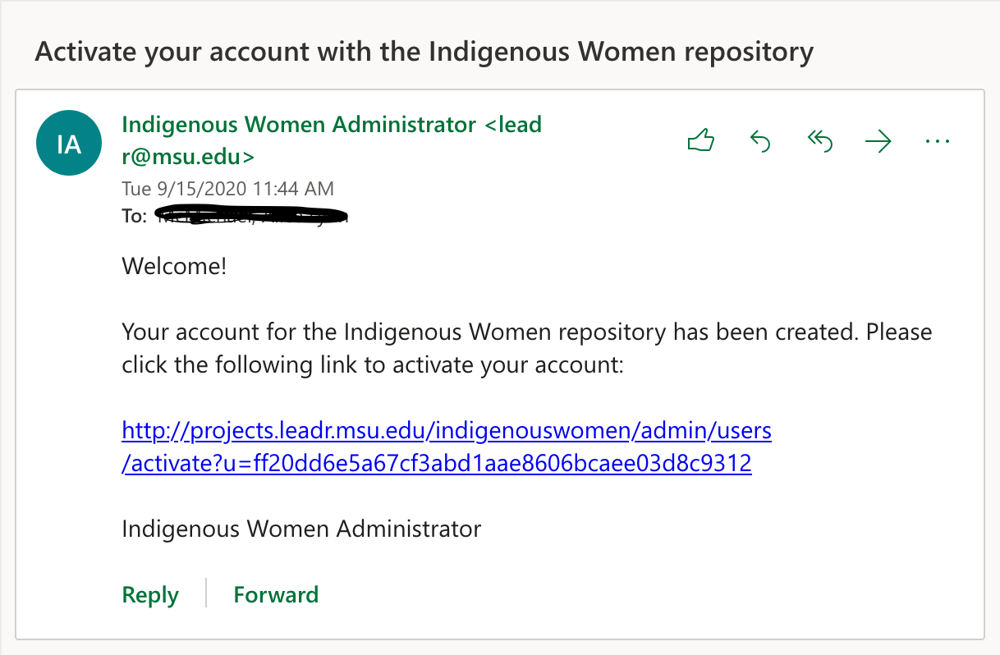
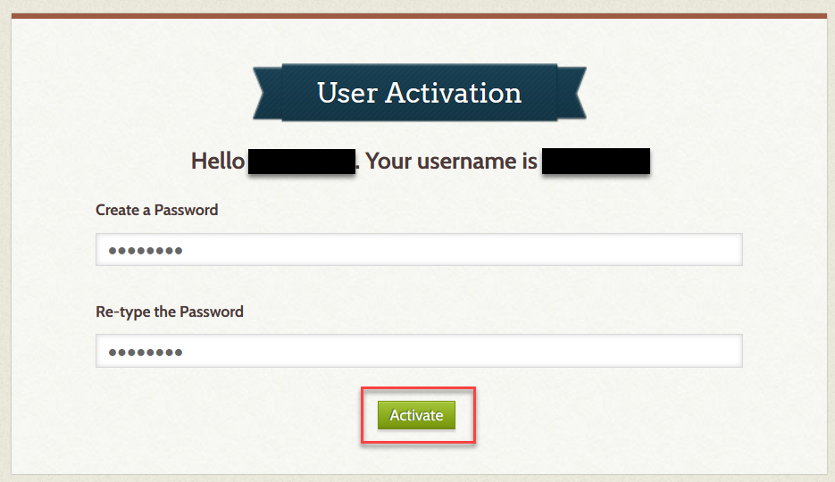
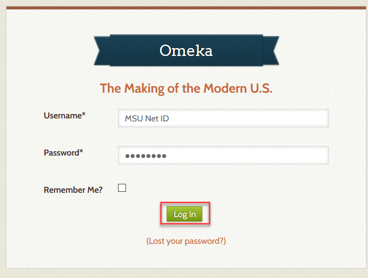
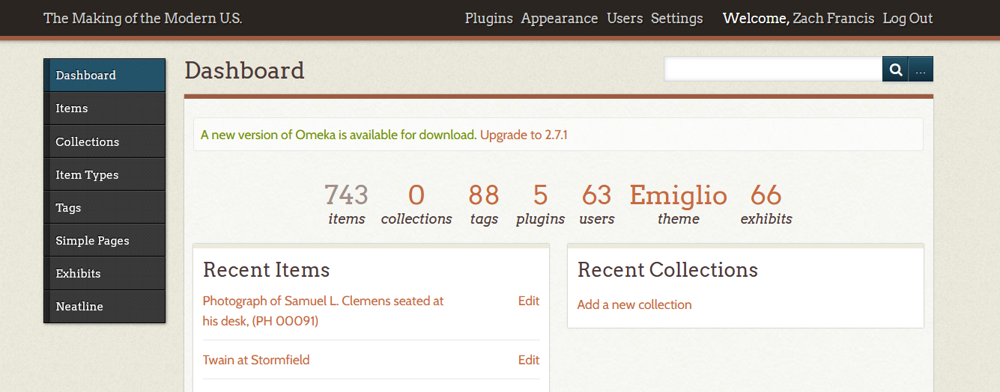

# Logging into Omeka for the First Time
Created by Zach Francis and Dan Fandino
 *Maintained by [LEADR](http://leadr.msu.edu/) under the direction of Alice Lynn McMichael*

*Last Updated: 3/28/2021*

## Overview
This handout will provide you with the initial information you need in order to log into your class’s Omeka website as a contributor of content.

## Logging in for the first time
Your instructor will provide a class register to LEADR from which we will send you an invitation to join the class website. If you do not receive an invitation, contact your LEADR GA.
* Check your MSU email for an automatically generated email from Omeka.
  * Be sure to check your spam filter where Omeka emails often end up.
  * Some phone apps filter out Omeka emails; check on a laptop or desktop computer instead of a mobile device if possible.   
* Click on the link provided in the email
  * *Note*: this link may expire after a few days. Accept your invitation as soon as possible, and contact your GA if you need a new invitation.
* This will bring you to the User Activation page where you can enter in a secure password for your account. After entering in your password click Activate to create your account.
  * *Note*: make sure your password is something secure that you will remember. It is possible to reset a password, but it can be stressful when deadlines are due.   
* You will now be able to log into Omeka using your MSU net ID and the password you just created. Click the Log in button after entering your information.
  * **Important Note**: if you need to find your website's login page, type in “/admin” at the end of your site’s url.   
* Logging in should bring you to the Omeka Dashboard shown below.   

## Subsequent Logins
* To avoid losing track of your site, it is recommended that you bookmark your Project’s URL into your web browser. Alternatively, you may always come back to this handout.
* *Remember*: you can access the dashboard for your website, add “/admin” to the class project’s URL: https://hominidfossils.21s.leadr.msu.domains/admin (replace this url with your class's URL)

-----
### Return to [LEADR's Resources list](https://leadr-msu.github.io/)
