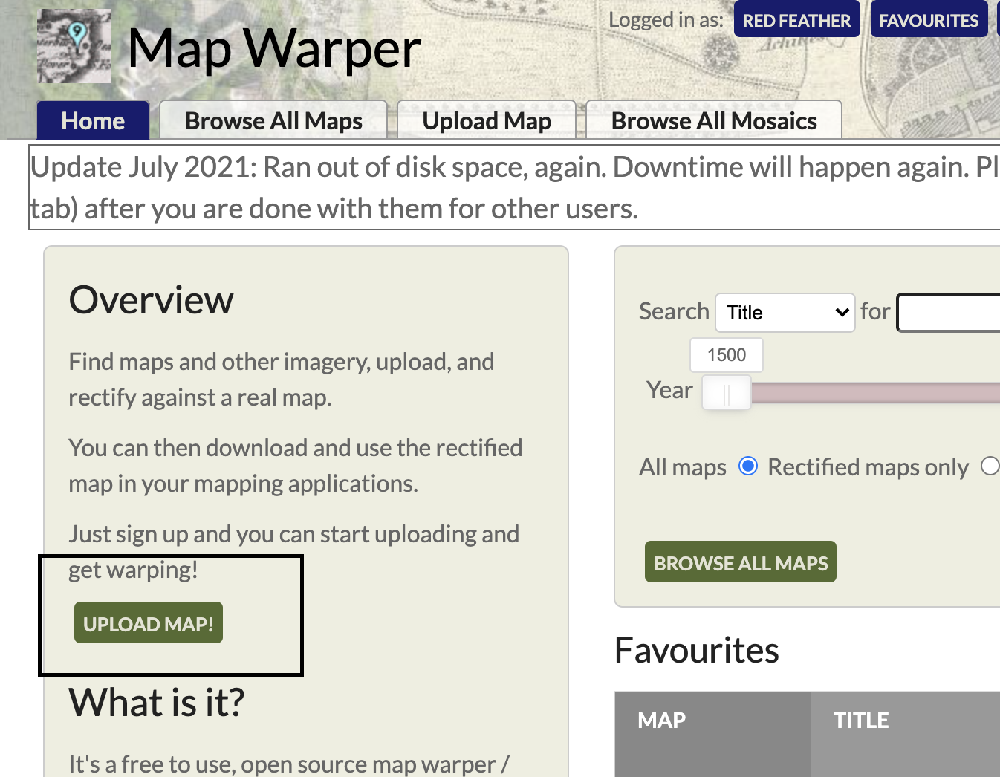
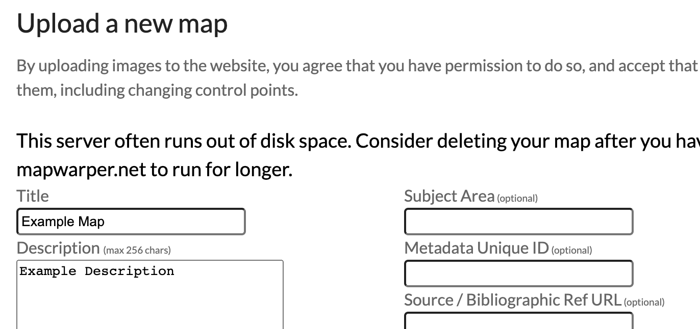
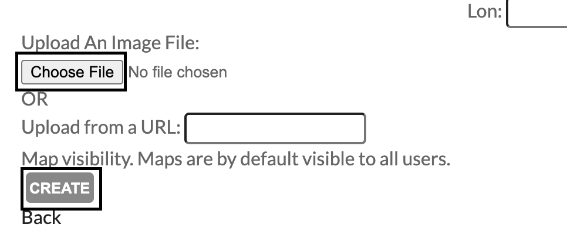
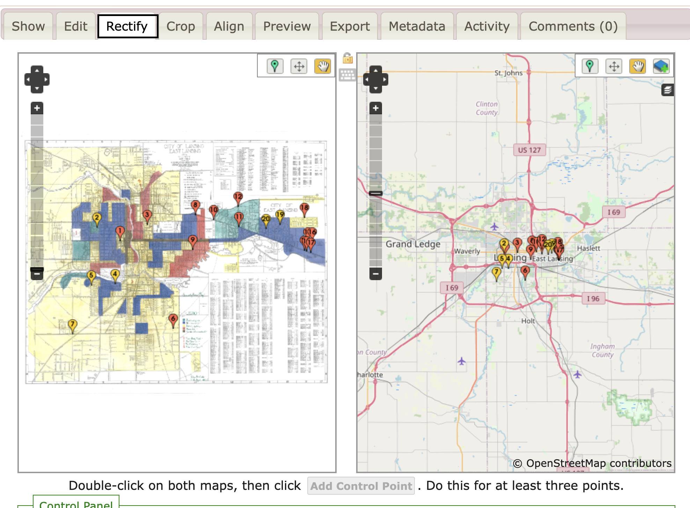
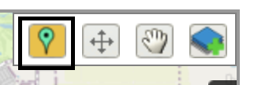
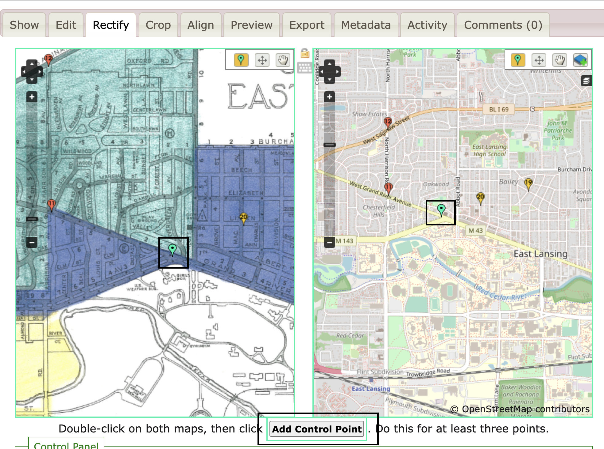
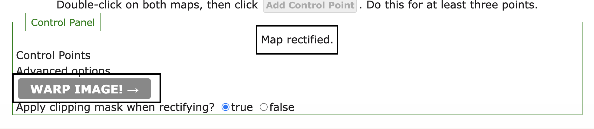

# How to Georectify a Map using Mapwarper

Created by [Zach Francis](https://redfeather.dev/)

*Last Updated: 11/02/2021*

## Overview
This guide will provide steps on how to georectify an image of a map so that the coordinates on the image of the map will line up with their real life coordinates using a web mapping service called [Map Warper](https://mapwarper.net/). You can then use your georectified map in many different types of applications. For this guide, we will then show you how to display this map in the Omeka mapping plugin: Neatline. If you are new to Omeka and Neatline, check out our other guides on [Omeka](https://leadr-msu.github.io/omeka/) and [Neatline](https://leadr-msu.github.io/neatline/) to learn more about those tools.

## Georectifying a Map
Georectifying a map image means taking points on the image of a map and lining them up with coordinates using some kind of mapping software. There are multiple ways to georectify a map, including using GIS, but we will be using a straightforward online mapping service at https://mapwarper.net/. Map Warper is a private project created by Tim Waters. **Please consider deleting old maps that you are no longer planning on using to save server space for all of the individuals using this excellent tool**.

### Putting a Map into mapwarper.net
To start using mapwarper.net, you will need an account and an image of a map. Once you have your image, follow these instructions:
1. Create a mapwarper.net account by clicking the Create an Account button at the top-right of the page or by going to this link: https://mapwarper.net/u/sign_up
  * Or sign into your account if you already have one
2. Once you have an account, go to your homepage, and click the **Upload Map** button to upload your map image into mapwarper.net.     
3. Fill out a Title, description, and any other available metadata for your map
4. Upload the image that you want to georectify by clicking the **Choose File** button or by referring to the images url if it is on the web.     
5. Click the **Create button** to combine your map image and metadata into Map Warper.     
6. This will create a page for your map where you can use Map Warper features to edit your map. You can click the **Rectify** tab at the top of the map’s page to begin rectifying your map with OpenStreetMap.     

### Rectify your Map
In the **Rectify** tab of your map, you will notice your map alongside an openstreet map. Georectifying your map is as simple as telling map warper that a point on the map image that you provided corresponds to a point in OpenStreetMaps.at the top of the map’s page to begin rectifying your map with OpenStreetMap. You have to add at least 3, but feel free to add as many points as you want to make sure your maps line up properly. To rectify, you can follow these steps:
1. You can begin georectifying your map by selecting the **Add Control Point** button in the top-right corner of either map. Your selected button will highlight in both maps. The other buttons allow you to move control points you have placed and to move the map around without adding control points.     
2. Once you have clicked the **Add Control Points**, right-click on both a point in your map image and a corresponding point in OpenStreetMap.    
3. Once you have two matching points, click the **Add Control Point** below the two maps. This will create a numbered control point to let you know which points are associated with each other. You will need to add two more points, but add as many as you need to get a good warp on your map (you can always come back and add more points).
4. Once you are satisfied with your control points, scroll to the *Control Panel* at the bottom of the page and click on the **Warp Image** button (the standard *Advanced Options* settings are fine).     
5. You will get a notification that the "*Rectifier is Working...*" and then some text saying  "*Map Rectified*"
6. You now have a rectified map that can be exported in a number of ways for a number of purposes. Check out the next section to see one way of using a rectified map in Neatline.
  * *Note*: you can also map a fictional map to OpenStreetMaps, which will allow you to overlay a fantasy map onto your Neatline Exhibit. In this case, it does not matter too much where you georectify your fictional map to, as long as you know where to find it.

## Neatline

## Additional Resources
Here are some additional resources for Video Editing:
- [Windows Video Editor Guide](https://support.microsoft.com/en-us/windows/create-films-with-video-editor-94e651f8-a5be-ae03-3c50-e49f013d47f6)
- Other LEADR Guides
  - [Editing with Audacity](https://leadr-msu.github.io/guides/audacity.html)
  - [Editing with iMovie](https://leadr-msu.github.io/imovietutorial/)

-----
### Return to [LEADR's Resources list](https://leadr-msu.github.io/)
