# MediaSpace Introductory Resources
Created by [Daniel Fandino](http://wiredhistory.com/) with contributions by Brian Geyer and [Zach Francis](https://redfeather.dev/)
 *Maintained by [LEADR](http://leadr.msu.edu/) under the direction of Gillian Macdonald*

*Last Updated: 1/24/2022*

# Introduction
[Kultura MediaSpace](https://mediaspace.msu.edu/) at MSU is a video hosting platform for students. MSU student, and faculty can upload videos for their classes. Follow this guide to learn the basics of using MediaSpace.

## Uploading Files to MediaSpace
To start uploading files to MediaSpace, go to [mediaspace.msu.edu](https://mediaspace.msu.edu) and log in using your MSU NetID. Login is located by selecting the Guest button.

 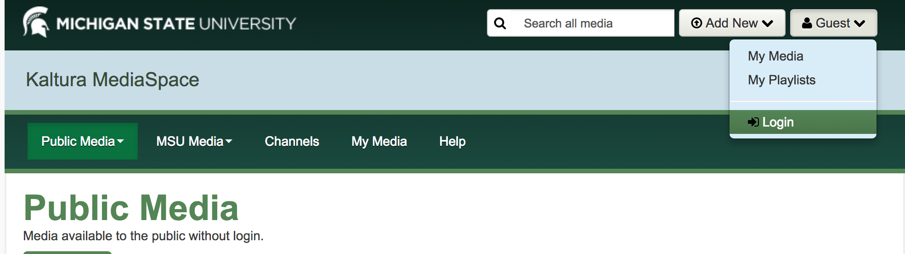 

Once you are logged into MediaSpace, select **Add New** and then Media Upload.

 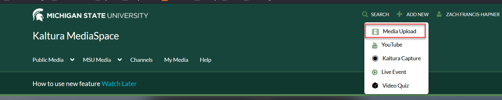 

Select the file to upload.

 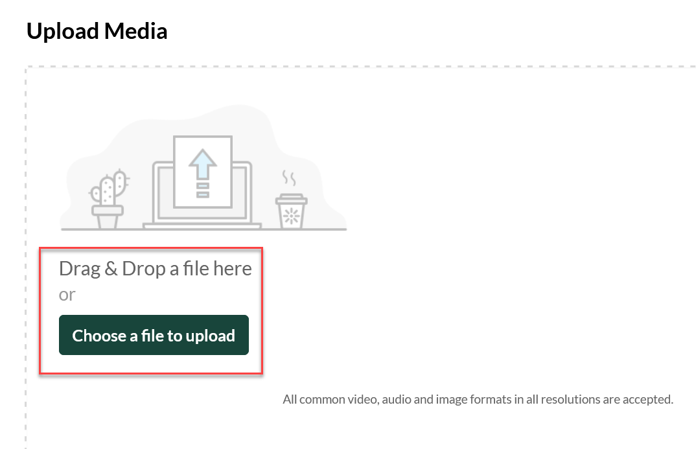 

The file will display a progress bar until it is complete. Until then, the project name, description and other information can be filled in.

 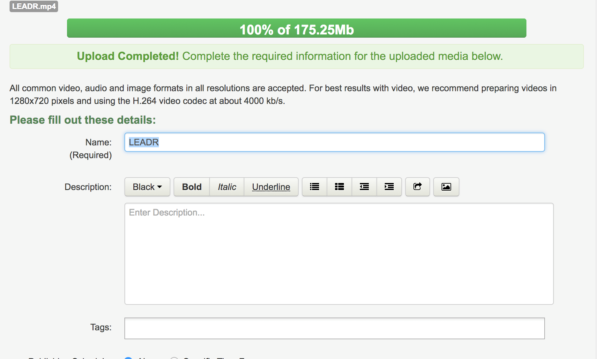 

The media can be Private, Unlisted or Published. Once the media has finished uploading press Save. The details can be edited later. Once the Save is complete, select Go to Media.

 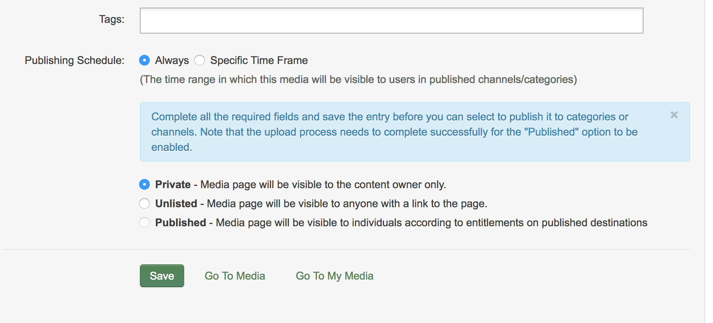 

## Changing Access Control
You can edit your videos by going to your My Media page (accessible from the navigation bar), and selecting the edit icon next to the video that you want to edit the settings for.

 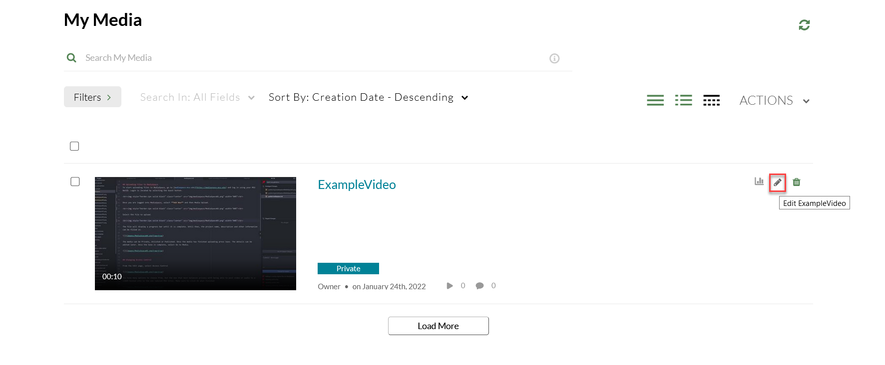 

One setting you can change is where your video can appear. Scroll down the Edit page, select Access Control

 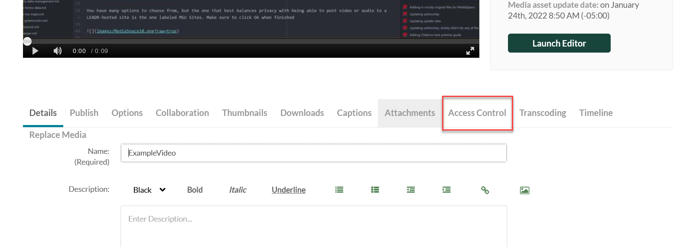 

You have many options to choose from, but the one that best balances privacy with being able to post video or audio to a LEADR-hosted site is the one labeled MSU Sites. Make sure to click Ok when finished

 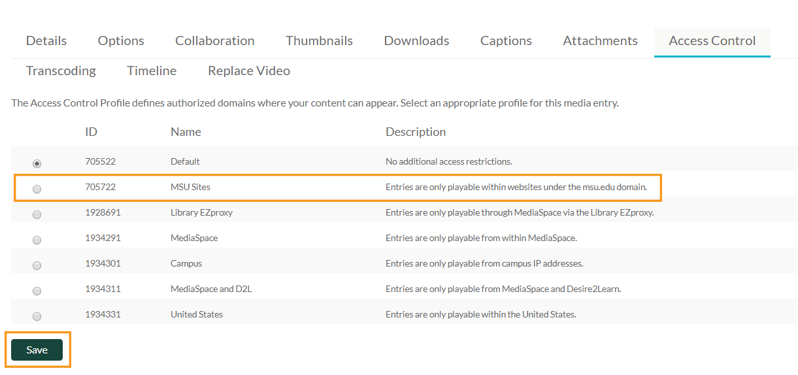 

## Posting a MediaSpace Video or Audio Clip on a website

To use your clip on a website, first navigate back to your MyMedia page and select the title of the video.

 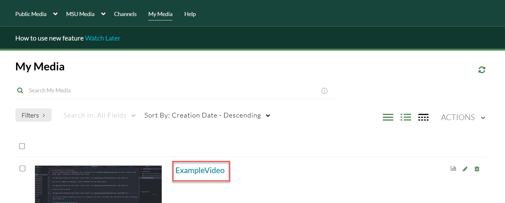 

When looking at its main page, click on the Share tab, then the Embed option.

 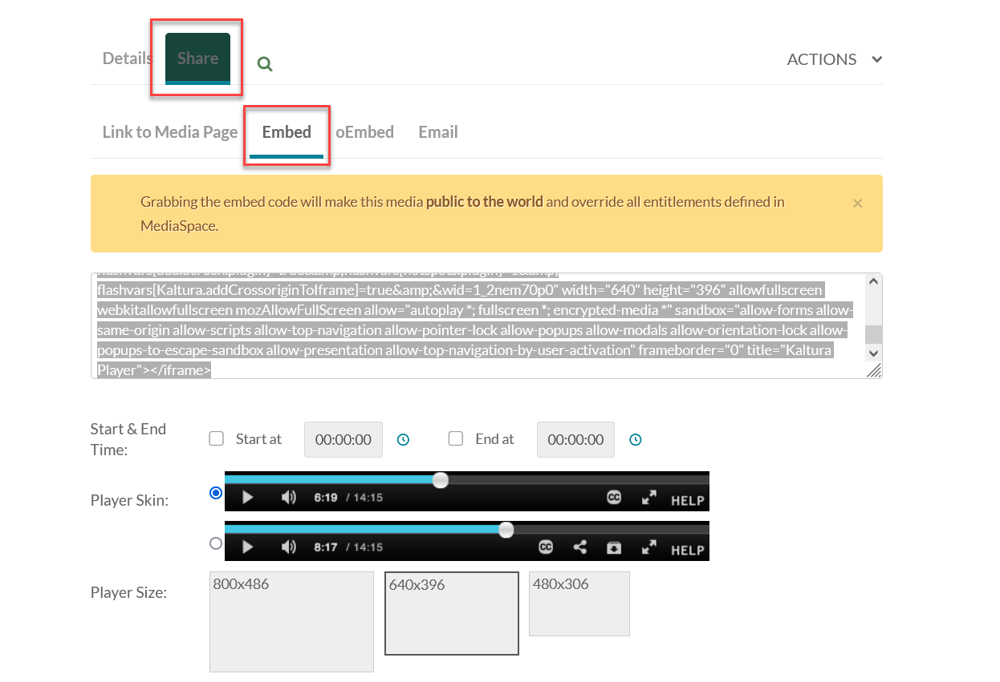 

If there is a warning message, this is to alert you that, by putting this code on another webpage, the video will no longer be protected by MediaSpace's login requirements.

Copy all the code in the box. Before copying the code, you can change any of the options related to the video player, auto-sizing, etc.

Finally, paste the code into the webpage code on your own website and you're done!

## Changing Ownership

From the media page, select Edit.

  

From the Edit page, go to the *Collaboration* tab and select **Change Media Owner**.

 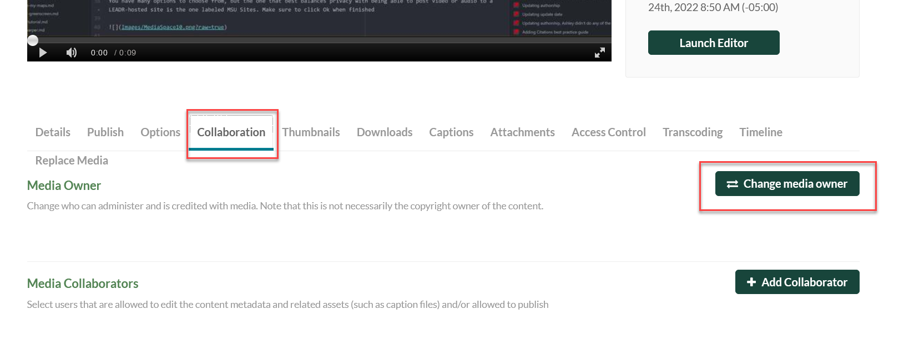 

Enter the NetID of the new owner of the media. In many cases, this is the netID of your professor (which, like yours, is their email address without the "@msu.edu" part)

WARNING: Once the ownership has been changed you will be locked out of most functions, even if you are listed as a co-editor.

 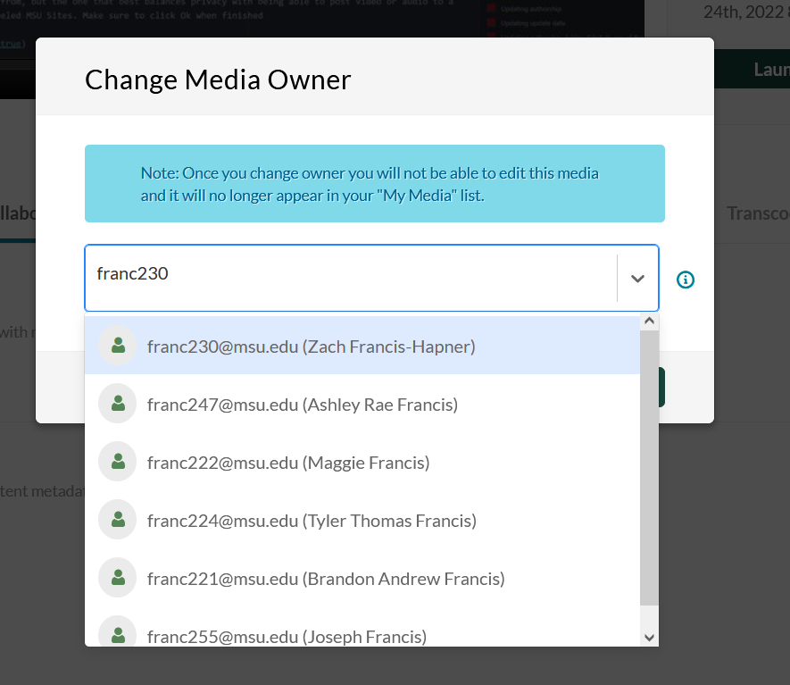 

-----
### Return to [LEADR's Resources list](https://leadr-msu.github.io/)
