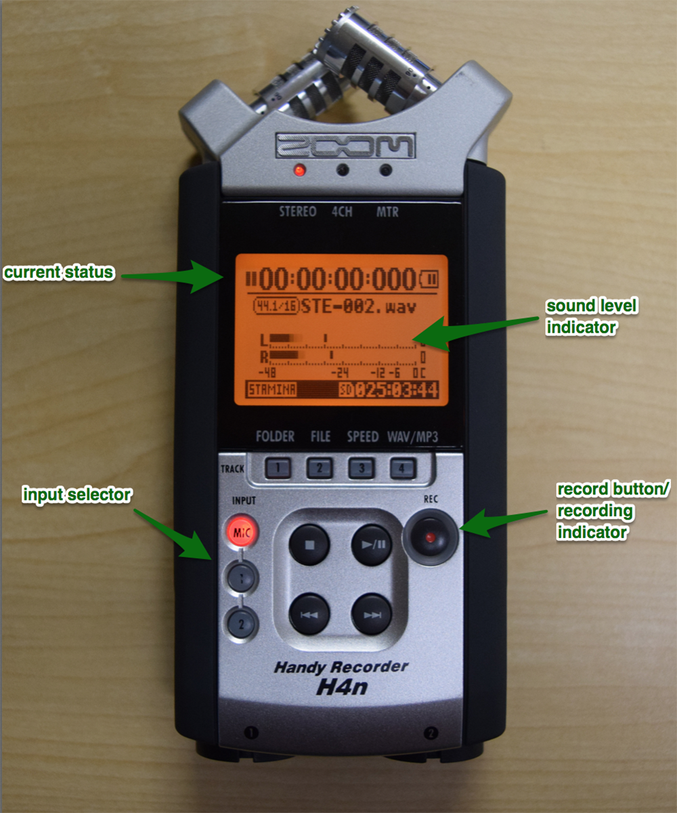
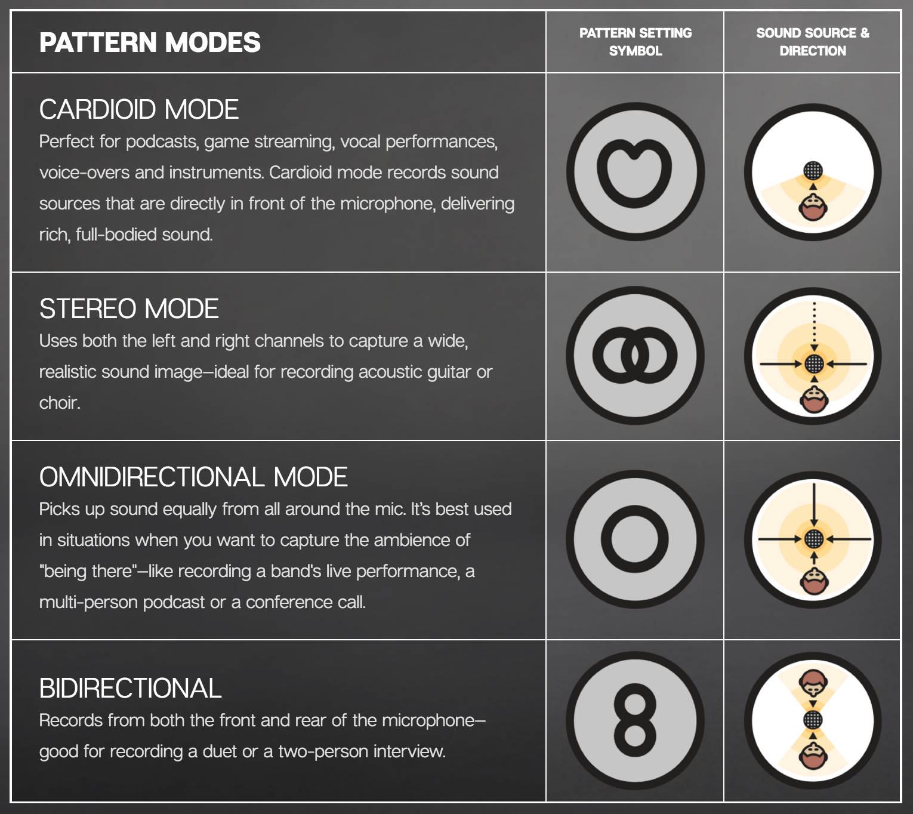
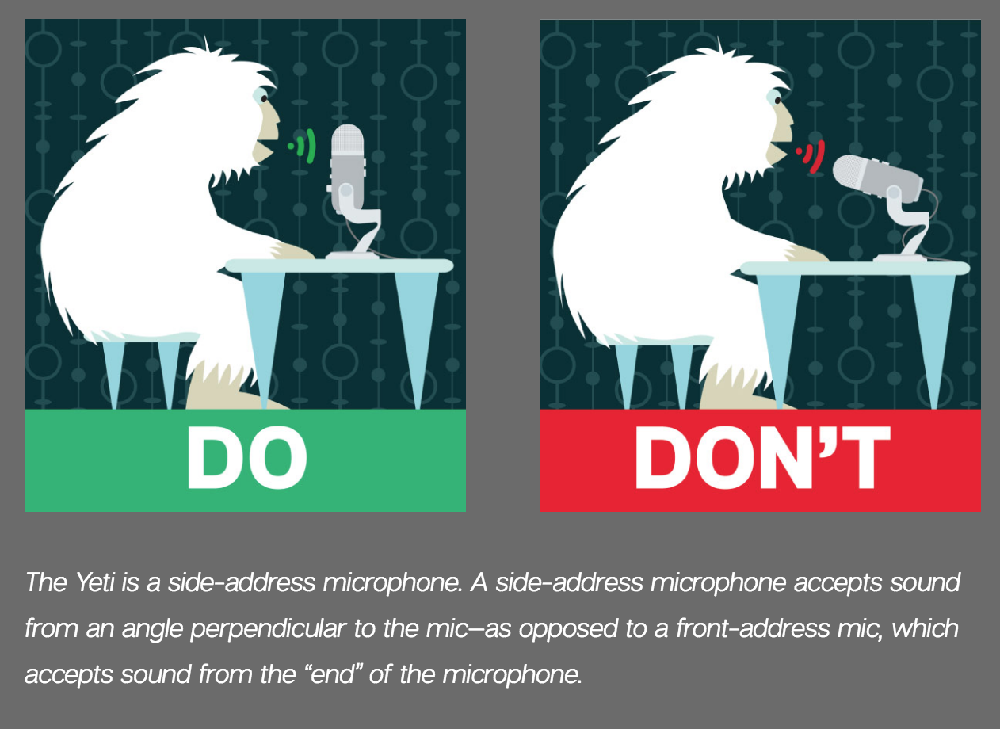

# Using LEADR Microphones to Record Audio
Created by Sara Bijani and Alyssa Lopez
 *Maintained by [LEADR](http://leadr.msu.edu/) under the direction of Alice Lynn McMichael*

*Last Updated: 10/19/2021*

## Overview
LEADR has all the necessary equipment for recording audio for the purposes of recording ethnography or oral histories. If you are a history or anthropology student at Michigan University, then you can check out this equipment in person or by contacting [LEADR staff](http://leadr.msu.edu/). This guide will walk you through the use of two useful pieces of audio recording equipment: the Zoom Handy Mic, and the Yeti Mic.

## Hn4 Zoom Handy Mic
The H4n Zoom Handy Recorder is a versatile and easy to use recorder for interviews, oral histories, or monologues. If you are interested in features or functions not mentioned in this brief introduction, please see the [H4n Operation Manual.](https://www.zoom-na.com/sites/default/files/products/downloads/pdfs/Zoom_H4nPro_English.pdf)

 
 
 

### Optional Accessories
* Windscreen
* Table stand
* Power cord
* Lapel mic (plugs into bottom of recorder)

### Setup
1. Confirm there is an SD memory card inserted on the right side of the recorder
2. Turn the mic on by sliding the power button (left side of the recorder) down and holding for a second.
3. It will likely take a moment to load. If it says “NO DATA,” try removing the card and putting it back in.
4. Press the record button (REC / ⚫) once to check the status. The recording indicator around the button will start flashing.
5. Speak as you will during your recording and watch the sound level. Adjust the recording level using buttons on the right side to set the level to the middle of the range.

### Recording
1. Press the (REC/⚫) button again to start recording. The indicator ring around the button should be red, and the time indicator on the screen should be counting up.
2. When you’re done, press ‘◼’. You can record as many clips as are necessary.

### Exporting Files
1. When you’re done recording, press in on the SD card to eject it, and put the card into a computer.
2. The SD card will have three folders on it: 4CH, MTR, STEREO. Your files will be in the folder that corresponds to the recording setting you used. STEREO is the default.
3. Each of these folders will have ‘FOLDER01-FOLDER10’ in them. Your files should be in ‘FOLDER01.’
4. Drag the files to your computer to save a copy of them. You can import these into the editing software you prefer.

## Yeti Mic
Before you begin recording, plug in the Yeti Mic’s USB cable to a USB port on your computer.
**Note that if you open Audacity before plugging in the microphone, you will not be able to select the Yeti Mic as your audio source.**

  

Be sure to choose the right microphone pattern for the type of audio you will be recording. The “Cardioid” mode is best for almost all applications where only one person is speaking, while the “bidirectional” mode is best for a situation where you wish to record two speakers in conversation with one another. The “stereo” mode should never be used to record voice audio, but is the best choice for recording music. The “omnidirectional” mode is a good choice for ambient room sound, but similarly is not ideal for recording voice tracks.

  

Be sure that your microphone is positioned correctly. It should be about one foot away from the person speaking, and oriented so that the person is speaking toward the side rather than the top of the microphone as shown in the image to the left.

  

After your microphone is plugged into your USB port and you’ve selected the correct microphone pattern, open Audacity and change the audio source from the “Built-In Microphone” to the “Yeti Stereo Microphone.”   **Be sure that the microphone isn’t muted. When the microphone is muted, the button will flash red. When the microphone is not muted, the button will glow solid red.**

## Resources
* [LEADR guide on recording and editing audio with Audacity](https://leadr-msu.github.io/guides/audacity.html).

-----
### Return to [LEADR's Resources list](https://leadr-msu.github.io/)
