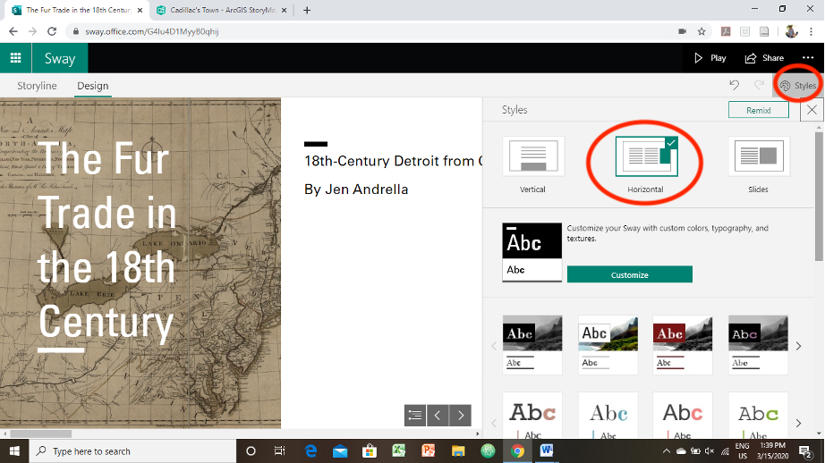
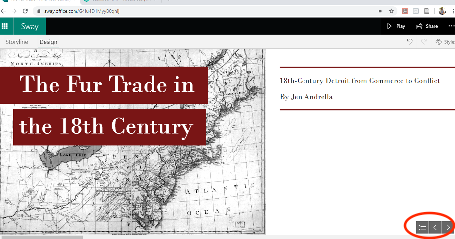
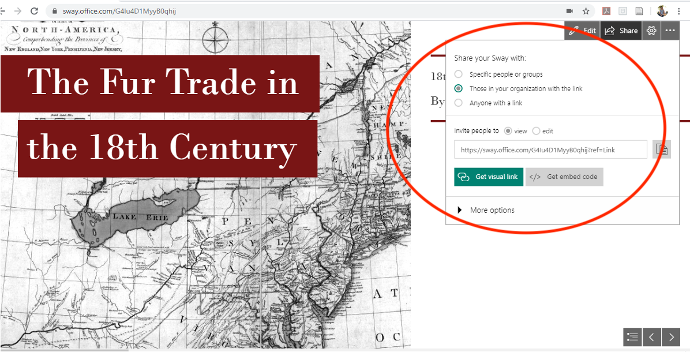

# LEADR Microsoft Sway Guide
Created by [Jen Andrella](https://jenniferandrella.com/) and updated by Gillian Macdonald
 *Maintained by [LEADR](http://leadr.msu.edu/) under the direction of Gillian Macdonald*

*Last Updated: 10/22/2024*

## Overview
Microsoft Sway is a presentation software for creating and sharing interactive presentations, newsletters, posters, and more. Transform your data and content into an immersive experience for your viewers. Sway presentations can be created by individuals or groups with a variety of sharing and embed capabilities.

## Getting Started
1. Go to [sway.office.com](sway.office.com) and click on **Get Started** at the top of the homepage.
2. Microsoft Sway is part of the Spartan 365 package. You will be able to login using your *MSU net ID and password*.

## Creating a New Sway Presentation
1. After logging in, you will be redirected to the dashboard for creating/editing Sway presentations.
2. Start from a template, or select **+ Create New** to begin a new project.
    * The builder has two interfaces that you can toggle between in the upper left corner: **Storyline** and **Design**. For now, use the “Storyline” builder to create a storyboard of your content and narrative.
    * Begin by giving your project a title in the **title content block**, and then click on the “+” in the green circle to add more content blocks     

## Adding Content
1. **Content block options**: There are several options for building your content in Sway. A block (essentially a page or a “slide”) can be comprised of a heading (larger font), paragraph text, images, “stack” (photo/file collage), or file upload (PDF, audio, video, etc.). Note the menu options under “suggested”, “text”, “media”, and “group” can offer you more choices for the types of content you wish to create.
    * **Text**: Choose between “Heading 1” and “Text”, which alters the size of the font. Options at the top of the text block include bold, italics, bullet-pointed lists, numbered lists, and hyperlinks (to link text to an external website). You can set the “emphasis” of text to be larger, in other words, increasing the font size of the text. You can also add an image to be paired with the text directly (the size may appear differently than having a separate image content block).
    * **Images**: Add an image from either a saved file on your computer or use the Bing search in the right panel to find a stock photo. When you select an image, be sure to add a caption describing the image and its source in the content block. Note that having a separate image block may make the image appear larger than if it was paired directly with text; for this reason, use a higher resolution jpg or png image file if possible. In the upper right corner of the content block, there is an option to “Focus” and select a focal point for your image OR select the box that says “the entire image is important”. Selecting a focal point will have the public-facing viewer zoom in and out on the image automatically.
    * **Embed content**: Embed a video, image, map or audio in these steps:
     * a. Copy the content’s embed code, which you can find by selecting the Share option or its equivalent. The code should look similar to this: <iframe width="560" height="315"… </iframe>.
     * b. Click the + icon at the bottom of any existing card.
     * c. Click Media, and then select Embed.
     * d. Paste your embed code to the new Embed Card that appears in the Storyline.
    * If you are pasting in a URL it **must** contain the secure prefix "https://". Be sure to add a caption describing the embed, its source, and/or a transcription in the content block.
    * **Group**: This content block option enables you to create a collage, stack, or slider-enabled comparison of photos.
2. When adding your content into the storyboard, think about the narrative that you are trying to build. What is your chronology? Major points? Arrangement of evidence? All of these elements will contribute to strong storytelling.
    * **Editing/removing content blocks**: Every content block has an option to delete it by clicking the trash icon in the upper right corner. If you wish to change the order of your blocks, you can drag them by hovering your cursor over the border of the block and moving it to another space. You can also drag a content block onto another content block and combine them.
    * **New title/headline cards** in your storyboard will create a new section or “chapter” for your narrative. All other content blocks added to a section will appear together.
3. Switch from the “**Storyline**” setting to “**Design**” in the upper left corner of the editor. This will switch to the public-facing view of your project. You can make minor edits in the “Design” view, but to make major changes switch back to “Storyline”. See image below for the “Design” view.     
4. **Styles**: In the upper right corner of the Design view, selecting “styles” allows you to quickly change the appearance and function of your project. **For a project that reads more like a traditional book**, select the center option, “Horizontal.”     
5. **Table of contents**: In the bottom right corner, you can change pages using the directional arrows, or additionally, view and navigate all of the sections at once using the bulleted list icon.     

## Saving and Sharing your Sway Presentation
1. Your progress will **save automatically**. Every time you exit and login again, you will see the dashboard with your saved projects.
    * In the upper right corner, there is an option to “play” your story. This will take you to the public view of your presentation. All animated elements in your presentation will be interactive for the viewer.
2. To **share and export** your work, select the **share option** in the upper right corner to see export options. Sway will automatically generate a text and visual link to your presentation that can be shared with **specific people or groups, those in your organization with the link** (MSU level), and **anyone with a link**.
    * This link is view only, unless you select the bubble to allow editors to your Sway presentation.
3. If you would like to embed your presentation within another website, generate an iframe Embed code and paste it into the HTML of your webpage.     

## Assessment
By the end of this guide, you should be able to log into Microsoft Sway, create a new presentation, add text and media content, and share your presentation.
-----
### Return to [LEADR's Resources list](https://leadr-msu.github.io/)
