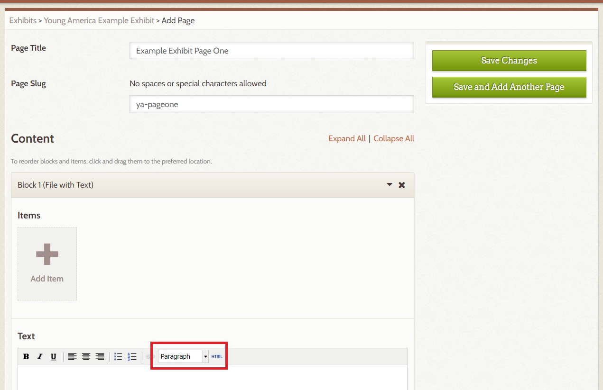
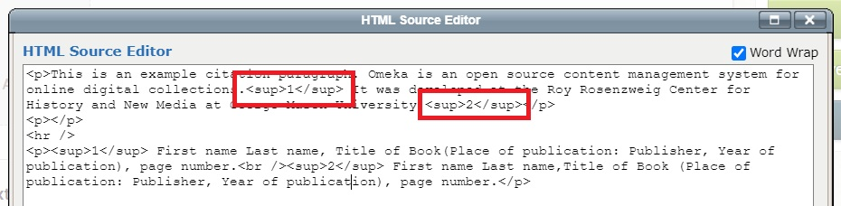
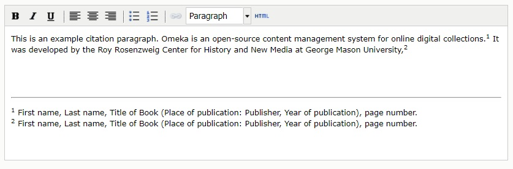

# Putting Footnotes into your Omeka Content using HTML

Created by [Dan Fandino](http://wiredhistory.com/)

*Last Updated: 10/15/2021*

## Overview
This handout will guide you through the basics of formatting footnote citations in Omeka. Omeka allows for the limited use of [HTML](https://en.wikipedia.org/wiki/HTML) (Hypertext Markup Language) to add annotations and additional typographic elements to plain text. Adding HTML markup to numbers in text will allow students to properly document their work with superscript citations that emulate traditional print citations.

## HTML Superscripts
HTML is a way of writing language in a way that computers can understand how you want it displayed. Orders (or tags) contained within “<>” are carried out on any text or characters that follow it. For example, HTML can tell a webpage to begin a new paragraph, italicize some words or add superscripts. To edit HTML in your Omeka exhibits, follow these steps:
1. Navigate to your exhibit page. You will see under the Content section one or more Blocks, depending on how you set up the page. In each Block you will find a section to add Items and a section to add Text (a Text Box).
  * If you have cut and pasted your work from Word or another word processor, Omeka may not properly carry over citations and will render them in plain text.   
2. Examine the text within your Text Box for places where you will want to add superscript citations.
3. In the Content section next to the text size dropbox on the right side of the toolbar there is a button labeled HTML in small print. Click this button.
4. A new window will appear showing your previously added text in HTML format. Hidden HTML codes that control typographic elements such as italics and page breaks will also be visible.
  * **Do not alter any of the existing HTML or you may cause unintended problems with the look of your work.**   
5. Navigate to the end of the word that you wish to add the superscript citation. Normally this will be immediately after the sentence where you used an external source. **Add the following HTML code, replacing CITATION with the correct citation number**. Do not add the quotation marks, only the code between the quotation marks.
  * "<code>CITATION</code>"
  * For example, the first citation on a page will look like this: “<code>1</code>” while the second will look like “<code>2</code>”
  * In this case, “sup” is short for superscript.
  * “sup” is an HTML element called a tag.
6. Omeka will not automatically update citation numbers, so if you make a change you will have to manually check and change your citation numbers to ensure they are correct.
7. Note that Omeka may add additional HTML to your code. This will usually not impair your code or impede your ability to make changes.

## Formatting Citations in html

* At the end of your essay you may add a horizontal line to separate the main body of your text from your citations. In the HTML window add “
” to the point in the page where you want the line to appear. This will often be after the last paragraph of your content   
* To add a citation, type or copy a proper citation to the end of your text. Please consult your syllabus or ask your instructor for the citation style you should use. This example will use Chicago style, also called Turabian. Be aware that different forms of media use different forms of citations.
* At the beginning of the citation, add “CITATION” with replacing CITATION with the number that corresponds to the citation.
* Omeka cannot create links between the superscript citations in-text and the citations at the end of your page.
* Hold SHIFT when you hit RETURN to reduce the spacing between sentences. This will help keep your citations compact and close to how they would appear in a print document.

## Materials & Resources
1. [Omeka Documentation](https://omeka.org/classic/docs/)
  * [Items](https://omeka.org/classic/docs/Content/Items/)
  * [Exhibits](https://omeka.org/classic/docs/Plugins/ExhibitBuilder/)
2. [HTML References and Guides](https://www.w3schools.com/html/)
  * [Introduction to HTML](https://www.w3schools.com/html/html_intro.asp)
  * [HTML Tutorials](https://www.w3schools.com/html/)
  * [HTML Superscripts](https://www.w3schools.com/tags/tag_sup.asp)
3. Citations
  * [Purdue Online Writing Lab](https://owl.purdue.edu/owl/purdue_owl.html)

-----
### Return to [LEADR's Resources list](https://leadr-msu.github.io/)
