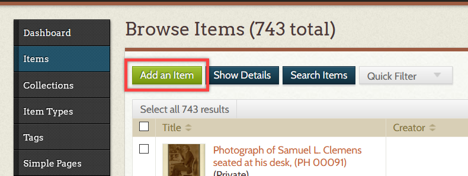
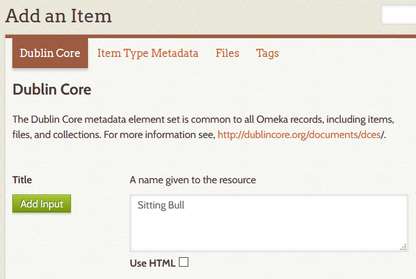
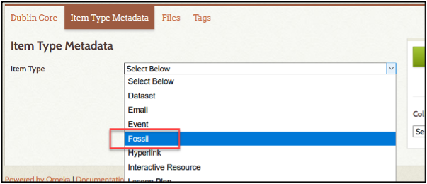
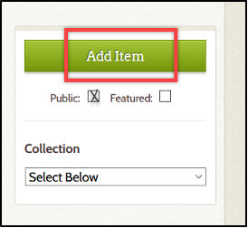
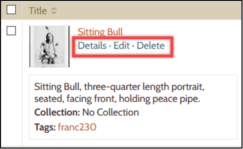
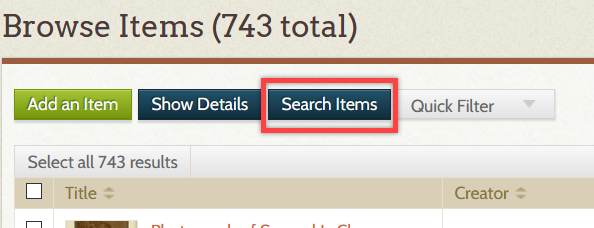
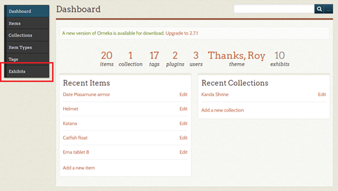
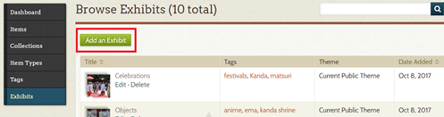
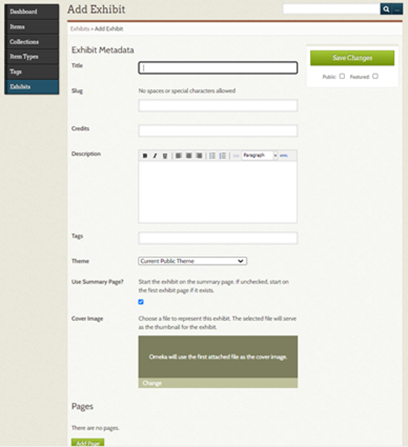
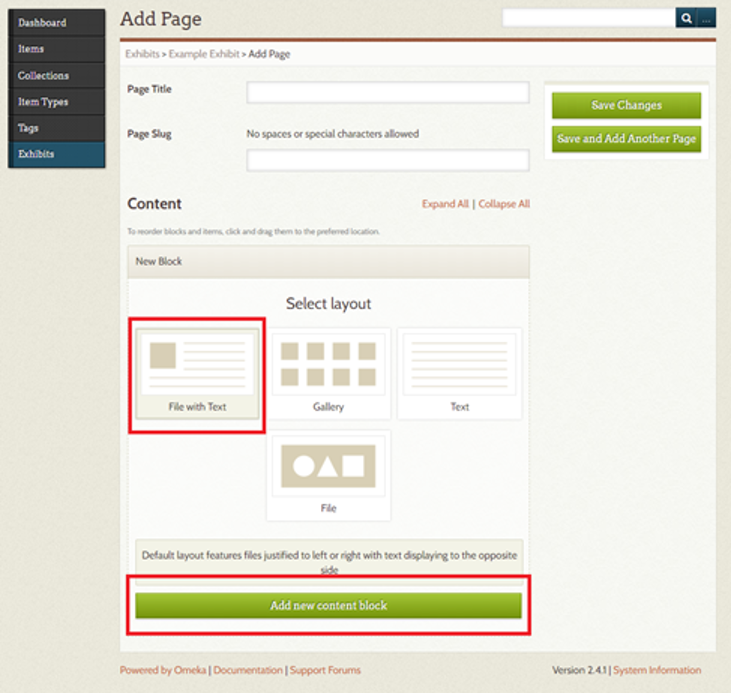

# Items and Exhibits in Omeka

Created by [Zach Francis](https://redfeather.dev/), [Dan Fandino](http://wiredhistory.com/), Ashley Highland

*Last Updated: 9/30/2020*

## Overview
This handout will guide you through the basics of creating Items and Exhibits in Omeka. Omeka Items are composed of digital resources and their associated metadata. Exhibits embed these Items within their Pages to create the content projects.

## Items
**Watch our tutorial on MediaSpace**: [LEADR introduction to Items](https://mediaspace.msu.edu/media/LEADR_Tutorial_Omeka-Items/1_rip7ls0b).

In Omeka, an Item largely consists of any digital resource(s) and its associated metadata. A digital resource typically refers to any audio, image, or video file(s) which is historically or culturally significant to your project. A digital resource on its own, however, is not incredibly useful without some context. In the case of a photograph, we would want to know things like what the title is, the background description, and who the photographer is. This type of data is referred to as metadata. You can dive deeper into our [Omeka metadata resource page](https://leadr-msu.github.io/guides/omeka-metadata-guide.html) later, but for now just think about metadata as the necessary context behind your digital content. The following sections will show you the basics of creating, editing and searching for Items in Omeka.

### *Creating Items*
1. Select the **Items** tab from the admin dashboard to access the *Browsing Items* page. From the Browse Items page, you may browse, add and search for Items.   
2. Click on the **Add an Item** button from the *Browse Items* page   
3. This will initially bring you to the **Dublin Core** tab where you will fill out fields describing your Item. This tab usually provides the bulk of what makes up an Item. You will want to fill out as much of the Dublin Core tab as possible, especially: **Title**, **Subject**, **Description**, **Source**, and **Publisher**. There is no problem, however, with leaving a field empty when metadata is simply not available.
  - **Note**: *this tab is called “Dublin Core” because that is the [metadata standard](https://dublincore.org/) that Omeka uses. A metadata standard refers to the use of the same “entities” for the description of data (digital resources in our case). The “Title” field is an example of an “entity”. Use of the same, standardized entities across multiple collections of data makes it easier to search and compare data (digital resources) across multiple collections. Sometimes the websites that you obtain your content from will have options to specifically format the metadata into the metadata standard we are using.*
  - **Hint**: *sometimes the websites that you obtain your content from will have options to specifically format the metadata into the metadata standard we are using.*   
4. Once you have added the metadata, click on the **Item Type Metadata** tab. This tab typically describes the type of digital content that you are uploading.

  - Select the appropriate Item Type. Many times this will be a *Still Image*.
  - Fill out as much of the metadata as you can.  
5. After you finish entering the **Item Type Metadata**, select the **Files** tab to add a digital resource(s) for your Item.
  - Click on the **Browse…** button to select and download the digital resource(s) into your Omeka Item.
6. The final data-entry step is the application of tags to your Omeka Item. You may add in any relevant subject tags you would like, though they are not necessary. Simply enter in the text for your tags (separated by commas) and press the **Add Tags** button.
7. Now you can add your Item. Before adding your Item, <u>make sure your item is public</u> (viewable on the actual website) by checking the **Public** check box under the Add Item button. Finally, Press the **Add Item** button.   

8. This will bring you back to the *Browse Items* page where you will receive a message saying that your Item was successfully added.

### *Viewing, Editing, and Deleting your Item*
1. You may view the details of, edit, or delete an Item at any time by browsing or searching (see next section) for an Item that you have created.
2. Once you have found the location of your Item click on the button for the corresponding action you want to take.
  - The “**Details**”, “**Edit**” and “**Delete**” buttons will be located under your Item’s title.   

#### *Searching for Items*
1. Navigate to the Browse Items page and click the search button.   
2. You may search for an Item using any number of categories, but it will probably be most useful to search by user, using the username you provided.
3. Once you have entered your search criteria, press the **Search for Items** button.
4. Results should appear with any Items matching your search criteria.

## Exhibits
**Watch our tutorial on MediaSpace**: [LEADR introduction to Exhibits](https://mediaspace.msu.edu/media/LEADR+Omeka+Exhibits+Video+Tutorial/1_9cdxrdim)

In Omeka, Exhibits combine Items and your textual analysis to create a public, online exhibit. Exhibits are composed of pages, typically with a page that serves as the introduction to a project and additional pages which highlight the Items and component text. An Omeka exhibit may be one or more pages in total, depending on the project. The following sections will show you the basics of creating and editing exhibits in Omeka.

#### *Creating Exhibits*
1. On your dashboard, select **Exhibits** on the left hand menu.   
2.	Click the green tab **Add an Exhibit**. This will take you to a page where you will enter the information that will appear on the landing page of the Exhibit. The landing page is the first page of your exhibit and should contain an introduction to your work.
  
3. At the **Add Exhibit** page you will see several options.   
  * Title - The title of your exhibit.
  * Slug - this is the URL for your exhibit. Select something short and related to your project.
  * Credits - As you are the sole author of your project, your name can go here
  * Description - A short description of your project
  * Tags - one word tags that apply to your project, such as canals, war, newspapers, etc.
  * Theme -You can select a theme from the installed themes on your Omeka website.
  g.	Use Summary Page - this uses a landing page for your project, If you do not select this option, your first page becomes your project’s landing page.
  h.	Cover Image - adds an image to represent your project
4. **IMPORTANT:** Set your exhibit to **Public**. If it is not set to Public it will not be viewable by others.
5.	Click **Save Changes** to save your work. <u>Omeka will not autosave your work</u>.
6.	Click the **Add Page** box at the bottom to continue to set up your exhibit.
7. The Add Page has several options.
  * Page title – the title of this page
  * Page slug – this is the URL for this page. Select something short and related to the page contents.
8.	To create the page, select the layout you wish to use and click **Add New Content Block.**
9. You will not see the option to **Add New Content Block** until you select a layout by clicking and highlighting the layout you want to use.   
10.	From the content block you may add items and your text.
11.	**IMPORTANT:** Omeka will NOT autosave your work. You must click **Save Changes** or **Save and Add Another Page** for your work to be saved.
12.	When you add an Item to have the option to add a caption.
13.	You may create multiple pages depending on your project.
14.	 At any time, you can go to the Items or Exhibits tab on the left menu bar of the dashboard and “edit” all previous Items, Exhibits, or exhibit Pages.

## Resources
* Tutorial Videos
  * [Items Video Tutorial](https://mediaspace.msu.edu/media/LEADR_Tutorial_Omeka-Items/1_rip7ls0b)
  * [Exhibits Video Tutorial](https://mediaspace.msu.edu/media/LEADR+Omeka+Exhibits+Video+Tutorial/1_9cdxrdim)
* Omeka Documentation
  - Items: https://omeka.org/classic/docs/Content/Items/
  - exhibits: https://omeka.org/classic/docs/Plugins/ExhibitBuilder/
-----
### Return to [LEADR's Resources list](https://leadr-msu.github.io/)
