# Omeka Pages
Created by [Zach Francis](https://redfeather.dev/) and [Dan Fandino](http://wiredhistory.com/)
 *Maintained by [LEADR](http://leadr.msu.edu/) under the direction of Alice Lynn McMichael*

*Last Updated: 9/30/2021*

## Overview
Other LEADR resources have gone over the basics of Omeka, such as how to create [Items and Exhibits](https://leadr-msu.github.io/guides/omeka-items-and-exhibits.html). A small part of those resources was dedicated to creating pages in Omeka. This guide will go into more detail on how to create and design those Pages. And because it is so important, we emphasize here that you must save your work anytime you make changes to your Exhibits or Pages. Omeka will not automatically save your work for you, and any unsaved work will be lost.

## Navigating to Pages
In order to begin creating and editing Pages, you will have to navigate to your Exhibit. Follow these steps:
1. Press the *Exhibits* tab from your Omeka website's dashboard.
 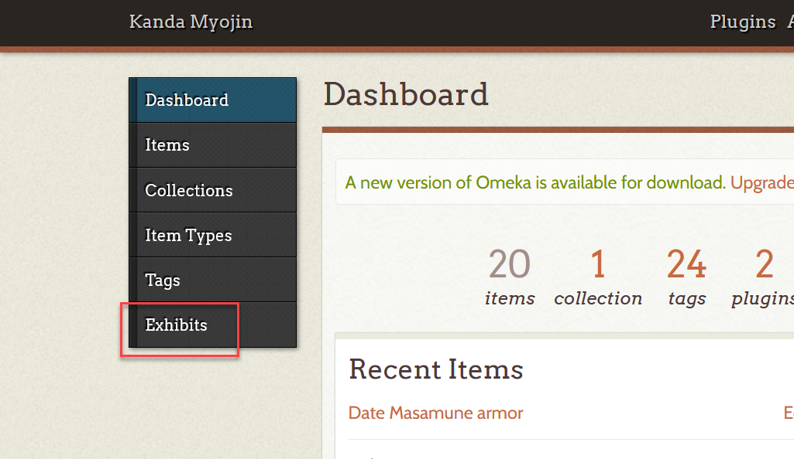 
2. Find your Exhibit on the *Browse Exhibits* page and select the **Edit** button
 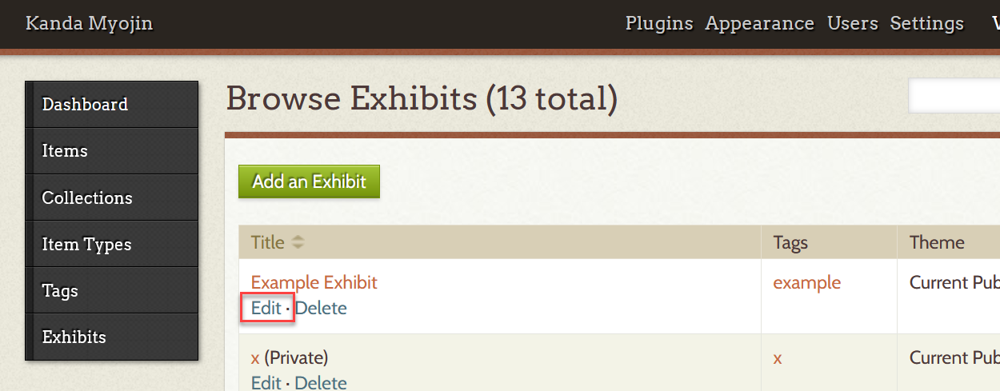 
3. This will take you to your Exhibit’s *Exhibit Metadata* page which provides the data for your cover page. <u>At the bottom of this page</u>, you will find the *Pages* section where you will see any Pages you have created as well as the **Add Page** button. You can get to any Page by pressing on that Page’s title.
 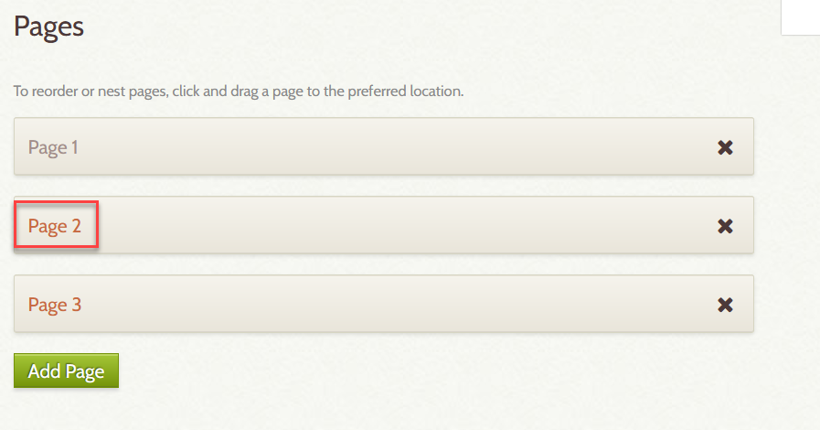 

## Adding, Deleting, and Moving Pages

#### *Adding*
* From the *Exhibit Metadata* page, you may add an additional Page to your exhibit by pressing the **Add Page** button.
* Alternatively, you may add a Page from the Page you are currently working on by pressing the **Save and Add Page** button. This will save the work for the current Page, and bring you to a new blank Page.
 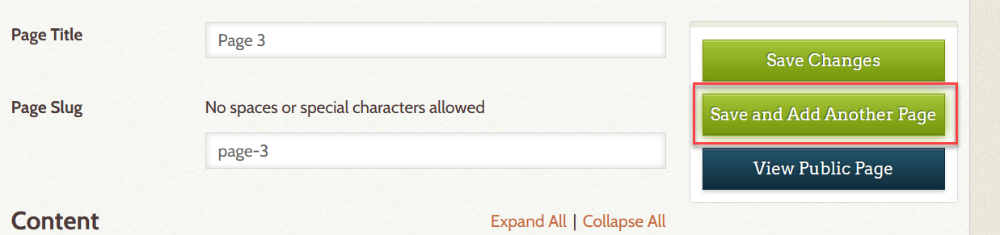 

#### *Deleting*
1. From the Pages section of the *Exhibit Metadata* Page, press the **x** next to the Page that you want to delete.
 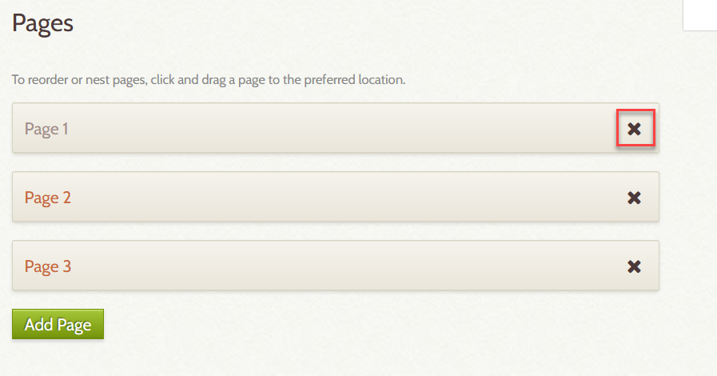 
2. Once you press the **x** button, you will have to press the **Save Changes** button at the top right of the page to successfully delete your page. You may mark multiple pages for deletion, then press the **Save Changes** button.   

#### *Moving*
* You may shift and move your pages around by selecting and holding the Page you want to move, and dragging it to the location you want

## Editing Pages
Once you’ve begun adding pages to your exhibit, you can begin building and editing. There are three main components to making a Page: the title, content blocks, and saving.

#### *Page Titles*
* In the Page Title field, you can enter the title you would like for your page. Users will be able to see your page’s title from your Exhibit’s main page, so you’ll want a title that clearly describes what this page is about.
* You may also enter a custom slug in the next Page Slug field. This will be what shows up at the end of your website’s url when you navigate to this page. If left blank, the url for the example page title below would end in /example-page-title.
 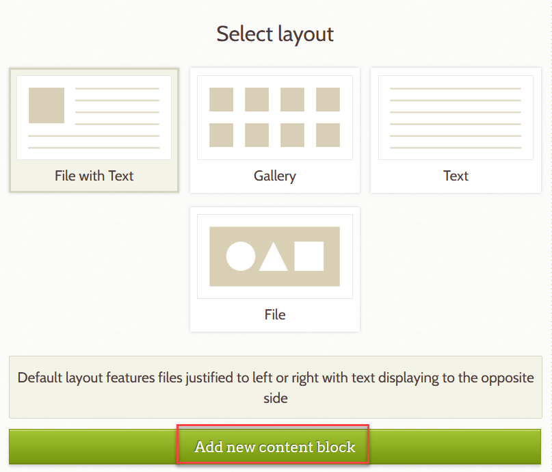 

#### *Content Blocks*
Content Blocks are how you will upload items to your exhibit, provide textual analysis and organize your page. There are multiple types of blocks that allow you a lot of creative freedom when developing your pages. Remember to save your progress as you work!

##### *Block Types*
There are 4 Block types you can add to your Page
* **File with Text**: Allows you to add an Item or multiple Items and text. Your Item will be justified to the left or right side of the Page with your text wrapped around it.
* **Gallery**: Allows you to display your Items in a gallery of rows and columns.
* **Text**: Embeds any text you enter into your Page.
* **File**: Allows you to embed Items directly into your Page without any text wrapping to the left or right.

##### *Adding and Organizing Blocks*
* You may add any content block by __selecting the type of Content Block you want__ to add from the *Select Layout* Section and pressing the **Add new Content** button.
 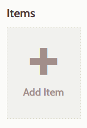 
* The order of the Content Blocks will be the same order on the public website. You may reorganize and move content blocks around by clicking the header of the content block you want to move, and dragging it to the place you want it.

##### *Adding Content to your Block*
There are 4 types of Blocks you can embed into a page, but there are only two types of data that Blocks can use: Items and text.
* **Items**: *File with Text*, *Gallery*, and *File* Content Blocks all allow you to add items as content.
  * click the large **Add Item** button
   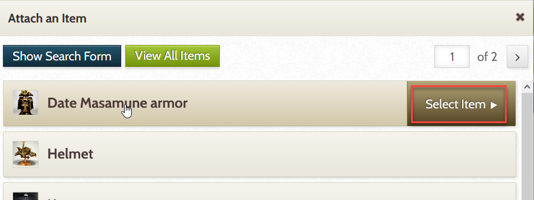 
  * This will bring you to the Attach an Item pop-up where you can search for and select the item you wish to attach. Clicking on the **Show Search Form** button will allow you to search for an item by user and other categories.
  * Once you have found your Item, click on it and press the Select Item button.  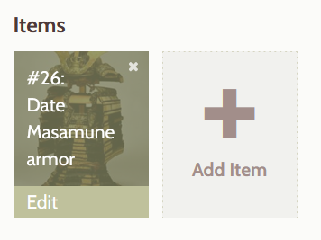 
  * This will bring you to a captioning page where you can provide a caption to help describe the item or explain why you are using it here. Once you have finished, press the **Apply** button at the bottom-right corner of the pop-up.
  * Your Item should appear inside of your Content Block. You may add more Items.
* **Text**: *File with Text*, *Gallery*, and *Text* Content Blocks all allow you to add text as content. Keep in mind that Adding text into the File with Text and Gallery blocks will change how your items are displayed within the page. So it is always a good idea to check out how your page looks to the public by pressing the View Public Page button. To add text to a block follow this steps:
  * Enter your text into the text block within your Content Block.  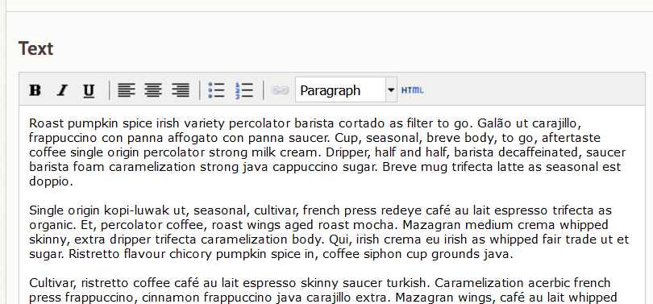 
  * Save your work by pressing the **Save Changes** button.

### *Saving*
When editing your pages, it is vital that you save your work. Any data or changes entered into Omeka will not save or take place unless you press one of the **Save Changes** buttons at the top-right corner of the page.  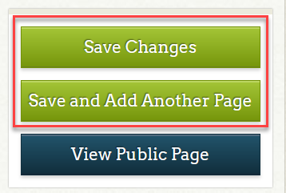 

## Page Design

### *Viewing your Public Page*
It is a good idea to frequently visit the public website for your page by clicking the **View Public Page** button at the top-right of the page. This will let you see how things are coming together as you build your Exhibit.

### *Layout Options*
You’ll notice that different Content Block types and the order in which they are put will affect the layout and flow of your webpage. Another factor which will greatly affect how your page looks are the Layout Options located at the bottom of each Content Block. These options vary with each Block type and provide a substantial amount of creative freedom for designing your pages.  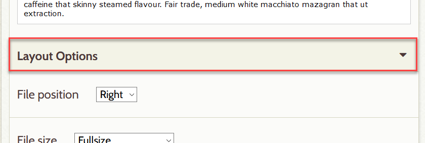 

## Materials & Resources
* Insructional Materials:
  * [Pages Video Tutorial](https://mediaspace.msu.edu/media/LEADR+Omeka+Pages+Video+Tutorial/1_vzufn492)
* Resources
  * [Omeka Documentation](https://omeka.org/classic/docs/Plugins/ExhibitBuilder/)

## Assessment
After using this resource, you should have a more advanced knowledge of how to create, edit and design pages for your digital exhibit. You should know how to upload Items and provide context using text in your pages.

-----
### Return to [LEADR's Resources list](https://leadr-msu.github.io/)
