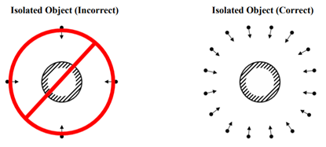
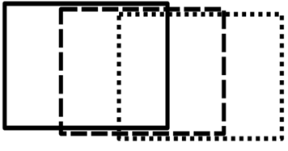
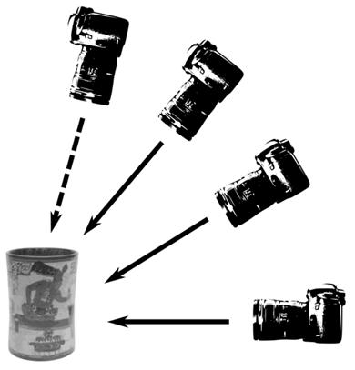
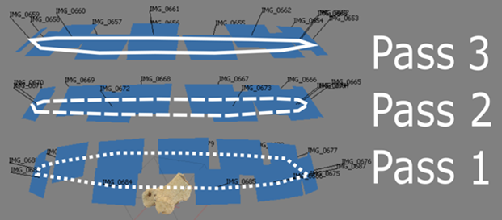
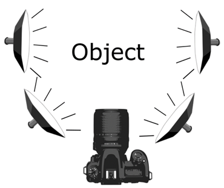
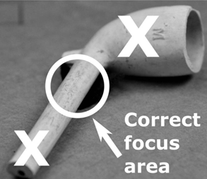

# Photogrammetry - Data Collection Tutorial
Created by Jack A. Biggs
 *Maintained by [LEADR](http://leadr.msu.edu/) under the direction of Gillian Macdonald*

*Last Updated: 4/9/2019*

## What is photogrammetry?
* At its simplest, photogrammetry is the creation of a 3D model in digital space from multiple photographs of an object, interior or exterior space, or person
* Photogrammetric software takes these images and stitches them together to create a model that replicates the subject’s shape, color, and texture

## Why use or implement photogrammetry into academic research?
* Data capture is relatively easy and cheap given the right circumstances
  * Processing software is not usually free but is readily available in the DHI Lab for any Anthropology Dept. faculty, graduate student, or undergrad
* Digital preservation/curation of fragile materials that may disappear or break down over time
* Scaled photogrammetric models can be exported in a number of file types and loaded into different modeling or statistical software for quantitative analyses
  * Ability to have data easily available without having the object right in front of you
* Creates a more interactive and tangible experience with an object compared to just an image
  * Easily share models and embed them into presentations

## What are the data used in photogrammetry?
* Contrary to what you might think, the 3D models are not the actual data, but the visualizations of the data
* The images you capture are the true data in photogrammetry and must be treated as such
  * Models are likely to be less accurate if the lighting and background setup and camera settings are not considered
  * The images are analogous to the rows, columns, or even individual cells in a spreadsheet of data – missing or miscalculated values can result in an inaccurate or skewed representation or analysis of those data

## Collecting the data (taking the photos)
Photos used in photogrammetry must be taken in a specific way and must meet a certain set of criteria:

**The number of photos** – there is no set number of photos required to create an accurate 3D model
* The number of photos will change depending on the size, shape, scale, and type of object you’ll be shooting
  * More than required is better than not enough – you can always disable or not use some images in the model-making process

**Camera positioning and framing the object** – not all models will be of isolated objects, but can be of entire buildings, facades, or interior spaces (solitary objects are the focus for this series)
* This ties back in to the number of photos – having a portion of the object in only one image does not mean that it will get built into the model
  * Multiple shots of the object from multiple angles will increase the likelihood of getting a better model
  * When in doubt, take more photos than you think you should – you can always remove or disable unneeded photos during the model-building process

**Photograph overlap** - photos taken in sequence should overlap by at least 60% - if there is insufficient overlap, the model will not build correctly or at all (see both the above and below illustrations)
* Photo overlap is needed since photogrammetry software builds models based on points that if finds in multiple photos
  * This ensures that the software can identify those points in common and align them

Frame 1 - solid line (assume all are at same height)

Frame 2 - dashed line

Frame 3 - dotted line

**Passes or rotations of photos** – to get the best models more than one rotation or pass of photos around the object is required
* Rotations/passes allow for modeling software to interpret parts of an object that might be obscured in one rotation but not in another
* Separate rotations should be taken at different angles in relation to the object
  * Usually three is enough: one pass at or near eye-level with the object, one pass near 45°, and one pass at a steep angle (60°-70°)
  * A fourth pass is sometimes required – most useful when photographing objects with a visible interior that might not be adequately captured with three rotations/passes
    * This rotation should be taken almost at a top-down view

    

    

**Adequate and appropriate lighting** – for the best photo and model results, lighting is extremely important
* If the object is too dark, the software may not be able to differentiate separate images and fail to build the model
* Lighting setups with diffusers are ideal for most situations
  * Diffusers spread the light out so that the beams are neither too focused nor too harsh – larger areas are hit with softer light
* Depending on the setup available, 4-point lighting is usually ideal
  * 2 lights on either side of the object and 2 on either side of the camera

  

**Minimize shadows** – shadows on the object can create permanent dark spots on the model if they are most of the photos
* If using a turntable to rotate the object, failing to remove shadows can ‘confuse’ the software
  * i.e. since the lights are stationary but the object is rotating, shifting shadows between photos create areas of uncertainty in the model-building process leading to areas of darkness or blurriness on the model, inadequately aligned photos, or complete failure to use a particular image
  * A few shadows won’t ruin the entire model or batch of photos so don’t worry if a few are unavoidable!

**Monopods vs tripods** – deciding to use a monopod vs a tripod for photo capture depends partly on personal preference and partly on what and how you’re shooting – these also slightly affect how the model is processed in the Agisoft program

Monopods
* Good for well-lit areas with lots of space to move around
  * Good lighting = a shorter shutter speed – this means that slight movements will have less or no effect on the photograph
* Keeps the camera steady when not using a turntable or are taking pictures of architectural features such as facades or interior spaces

Tripods
* Best when the object is placed on a turntable and rotated for each photograph
* Better for when backgrounds are darker (black backdrops) and the camera requires a slower shutter speed in order to take in more light with the amount of dark background
  * Prevents blurriness

**Using a turntable** – turntables can create stability when taking pictures and are especially useful when a backdrop is present
* If the object does not fit on a turntable then a turntable may not be the best option
* Place the object in the center of the turntable – makes it easier to take pictures and requires less time to readjust the camera between each photo
* For a 12-inch diameter turntable, 20 photos create enough overlap between photos to create an accurate model that usually builds
  * Placing tick-marks along the sides of the turntable allows you to have very consistent rotations and space between images

## Camera Settings
**Focusing the camera**
* Do not use the automatic focus setting! – as tempting as it is, using automatic focus creates greater inaccuracy in the images
  * You cannot control exactly what area of the frame the camera uses to auto focus – it chooses the most convenient area for the camera
  * Manual focus may take a little longer, but you have complete control over the settings
* Another option is to use the Aperture Priority setting – this makes the aperture the most important factor and forces the camera to configure the other settings around this
* A higher aperture value (also called f-stop), such as f/16, reduces the depth of field
  * This results in more of the frame being in focus rather than certain areas
  * i.e. a larger f-stop value will result in more, if not all of the object being in focus at the same time which leads to more accurate and crisper models
* If an entire object cannot be in focus at once, manually focus on an area that is equidistant from the front and back of the object in that frame
  * i.e. do not focus on the area of the object that is closest to the camera as this will make the farthest portion of the object be much more out of focus

  

**Use a fixed lens** – avoid using a lens that has a zooming function
* Lenses that zoom can create images that photogrammetry software cannot interpret
  * Photogrammetry software needs all the photos to be taken at a consistent scale
  * Changing the zoom level between photos or having the different passes set to different zoom levels messes with the scale across the full set of pictures that the software needs

**Shoot images in both RAW and JPEG (or PNG)** – RAW files can be thought of as “digital negatives” – they cannot be used directly as an image, but they hold all the data to make an image
* RAW files do not degrade over time since they are the original data for an image
* JPEGs degrade over time if they are opened, edited, and then saved – every edit further degrades the photos (similar to making a copy of a copy)
  * If you forget to take RAW files, be sure to convert save a copy of the JPEGs to TIFF – these are better for archival purposes and for online images and publications
* Photogrammetry software uses JPEGs, but taking the raw images as well will ensure that you have the pure files to convert to the JPEG or PNG format and manipulate without worrying about decreasing the quality of the image or making edits that you cannot undo

**Use a remote** – using a wireless or wired remote to take the photos is easier and it reduces the amount of shaking caused by pressing the capture button
* This is especially important when using a dark background which requires a much slower shutter speed

**Avoid the built-in camera flash** – make sure to turn off this feature and only rely on the lighting setup you constructed
* Light from the built-in flash is very bright and harsh
  * It overpowers most of the lights in a lighting setup and can result in the object being over-lit on areas closest to the camera and darkened areas farthest away from the camera
  * Shifting shadows both on or around the object can also appear due to the built-in flash
    * These shifting shadows will cause build or alignment failures in the photogrammetry software

-----
### Return to [LEADR's Resources list](https://leadr-msu.github.io/)
