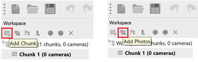
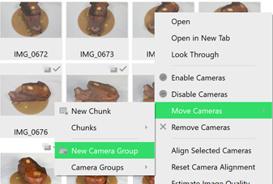
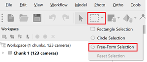
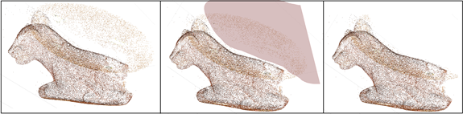
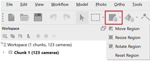
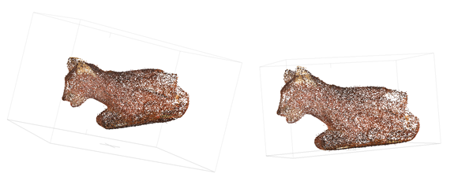
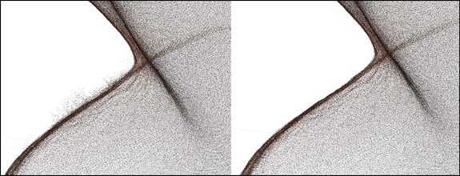
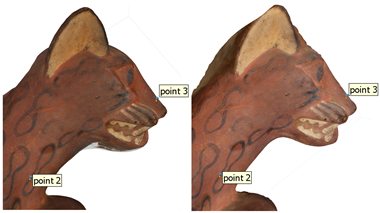

# Photogrammetry - Data Processing Tutorial
Created by Jack A. Biggs
 *Maintained by [LEADR](http://leadr.msu.edu/) under the direction of Gillian Macdonald*

*Last Updated: 4/9/2019*

* Numerous programs available for photogrammetric model building
    * Agisoft
    * 3DF Zephyr
    * RealityCapture
    * Meshroom
    * ColMap
    * Autodesk ReCap
* Agisoft Metashape (née Photoscan) is used by many in the humanities field
    * This is what is available in the DHI Lab
        * As of 2-26-19, the MSU Digital Scholarship Lab in the Library has not updated from Agisoft Photoscan
    * If you create models using Photoscan, they can be opened in Metashape but projects started in Metashape cannot be opened in Photoscan

## **Metashape Workflow**
* Create a mask before opening Metashape – see other handout on how to do this

### I. Open Metashape
* **Tools --> Preferences --> GPU** – select the listed graphics card and make sure that the option to “use CPU when performing GPU accelerated processing” is selected (at the bottom of the window)
    * This accelerates the processing time for model-building

### II. Create a new project
* **File --> Save As** – name the project

### III. Add Photos
* Click Add Chunk icon then Add Photos icon or **File --> Add Photos**
    * Terminology: ‘camera’ = an individual photo in Agisoft
    * Highlight/select all the photos you want to include then click **Open**
* In photo pane, highlight all the photos from one rotation/pass
    * **Right click --> Move Cameras --> New Camera Group**
        * Do this for all three rotations of your photos
        * This tells the Agisoft that all photos in this folder are from the same pass to help it align the photos

         

      

### IV. Apply Mask
* **File --> Import --> Import Masks**
* Presets that should be selected:
   * **Method: From Background**
   * **Operation: Replacement**
   * **Filename template:** likely this will just be mask.jpg
   * **Tolerance: 25** (can be changed depending on how the mask performs)
   * **Apply to: All cameras**
* You will be prompted to choose the folder where the mask is housed – it needs to create a path to that image
   * Navigate to where the mask is located – the actual maskimage will not be shown in the folder
      * Click **Okay**
* Once the mask has loaded (should take a few minutes), click on a few photos to make sure the mask was applied correctly
   * If not, you can toggle the tolerance and rerun the mask
      * Higher tolerance = more aggressive masking

### V. Align Photos
* Aligning the photos creates a sparse cloud model of the object – a few points that give you the general model but is not filled in
* If using two chunks, go to the toolbar, click **Workflow --> Batch Process**
   * In the window that pops up, click **Add --> Align Photos**
   * **General** presets:
      * **Accuracy: Medium** or **High**
         * Start with medium and then rerun on high if there are noticeable problems
      * **Pair preselection: Disabled** (default)
   * **Advanced** presets:
      * **Key point limit: 40,000**
      * **Tie point limit: 10,000**
      * **Apply masks to: key points**
      * **Adaptive camera model fitting** (leave unchecked)
   * Click **Okay**
* Click **Add** again, select **Optimize Alignment** (all presets fine) **--> Okay --> Okay** (again) – this should begin rendering
* If completed correctly, you should see a rough model of the object

### VI. Edit the sparse cloud (the rough model)
* Rotate the model by left-clicking and dragging, pan the model by right-clicking and dragging, zoom in and out with the click wheel
* There will likely be free floating data points around the model
* Use the **Free-Form Selection** tool

   * Left click and drag to highlight the floating points that are not part of the object – they should turn pink
      * Click **Delete** on the keyboard to delete the points

 

   * Repeat this step until you have a mostly clean model
      * Hit the spacebar to toggle between panning/rotating with the mouse and the free-form selection tool
* Change the bounding region – the bounding region is the box around the model
   * On the toolbar, select the bounding region icon

   

     * Rotate the region so that the object is lined up with the edges and walls of the box
     * Resize the region by clicking and dragging the corners so that the box closely encompasses the object
     * This process tells Agisoft to ignore everything outside of the bounding region and to only build what is within it – this decreases rendering time as well as editing time in the next step

 

### VII. Build the Dense Cloud
* On the toolbar, click **Workflow --> Batch Process --> Add --> Build Dense Cloud** (if Align Photos and Optimize Photos are still within the window/queue, highlight and Remove them
* **General** presets:
   * **Quality: Medium** (redo on High if there are errors – Medium is usually fine and is smaller data-wise than High)
* **Advanced** presets – all should be correct
   * **Depth filtering: Aggressive**
   * **Reuse depth maps** – unchecked
      * **Calculate point colors** – checked
* Click **Okay**
   * This step will take longer than aligning the photos

### VIII. Editing the Dense Cloud
* Once the model is finished building, you will need to click on the dense cloud icon to reveal it
* Edit the dense cloud with the **Free-Form Selection** tool like with the sparse cloud – click, drag, and delete
   * Also, delete all the points that are not part of the model – any scale bars, supports, etc.
   * If bad points are left around the borders, edges, or surface of the object in the dense cloud, they are likely to be included in the final model so be meticulous in this step

### IX. Build the Mesh and Texture
* Building the mesh and texture closes the gaps between the points in the dense clouds by creating a mesh using polygons then adds the textures interpreted from the photos onto that mesh, creating a life-like 3D model
* Once you are satisfied with the dense cloud, click **Workflow --> Batch Process**
   * **Add --> Build Mesh**
      * **General** presets:
         * **Surface type: Arbitrary**
         * **Source data: Dense Cloud**
         * **Face count: High**
         * **Custom face count: leave as is**
      * **Advanced** presets (defaults should be fine):
         * **Interpolation: Enabled**
         * **Point classes: All**
   * **Add --> Build Texture**
      * General presets – default should be fine
   * Click **Okay** (be sure to **Remove** the **Build Dense Cloud** option if it is still in the queue)

### X. Checking the model
* Once the mesh and texture have fully rendered, click on the textured model icon
   * This is the pyramid icon just to the left of the dense cloud icon
      * A drop-down menu will appear – click on the last option
* If your model is only using one chunk, rotate and check the model to see that it accurately represents the object
   * If areas exist that are inaccurate (blobs or weird spots, misshapen areas, etc.) toggle back to the dense cloud and edit as needed
      * Do this until you are satisfied that you have deleted all the bad points
      * Rerun the mesh and texture – check model again
      * If you have one chunk, you’re almost finished – proceed to step XI
      * If you have two chunks, proceed to step XII

### XI. Exporting the model
* You can export your model into a number of different file types
* **File --> Export --> Export Model**
   * Name you model and save your model in the file type you need
   * Most programs read Wavefront OBJ (.obj) and/or STL models (.stl)
      * Can go back and export in any of the types at any time

### XII. Merging two textured models/chunks
* If your final model will be made up of two chunks, you must merge the chunks
   * As a quick test, click on **Workflow --> Batch Process**
      * **Add: Align chunks**
         * **General** presets:
            * **Method: Point based**
         * **Image Matching:**
            * **Accuracy: Medium**
            * **Key point limit: 40,000**
            * **Apply masks to: Tie points**
      * **Add: Merge chunks**
         * Make sure only ‘Merge dense clouds’ is selected
      * Click **Okay**
      * This will create a new chunk made up of the two merged chunks
         * Click on the dense cloud for this chunk – if object is correct, begin editing the dense cloud again; if not, skip to step **XII b**
         * Rebuild the mesh and texture of the new merged chunk: **Workflow --> Batch Process**
            * **Add: Build mesh** – same presets as before EXCEPT:
               * **Apply to: SELECTION** – then make sure only the merged chunk is selected
            * **Add: Build texture** – same presets as before _EXCEPT_:
               * **Apply to – SELECTION** – again only the merge chunk should be selected
         * Once this is finished, you should have a complete model – go back to steps **X** and **XI**
* Once both of your chunks have been meshed and textured, find points of commonality/overlap between the two models
   * These can be stains on the objects, little spots, anything that stands out
* Zoom in very close to the spot on the chunk 1 model and right click on the precise location **--> Add marker**
   * This will add a marker/pin to the model in that location – be sure the marker icon (the flag on the right side) is selected
* Now go to the chunk two model, zoom in to the exact location where the marker is on **chunk 1**, right click **--> Add marker**
   * Both models should now have a ‘Marker 1’
* Repeat these steps until you have at least 4 markers per chunk – more is better and will give you a more accurate merged model
   * Make sure that all markers are in the exact same place per chunk and in the exact same order
      * i.e. the placement of Marker 3 is in the exact same location for both chunks

      

* Once you have all your markers placed on both chunks, click on **Workflow --> Batch Process**
   * **Add: Align chunks** (make sure both chunks are selected in the dialogue box)
      * **General** presets:
         * **Method: _Marker based_** (all other presets are grayed out at this point – cannot toggle)
   * **Add: Merge chunks** (make sure both are selected)
      * Only **merge dense clouds** and **merge markers --> Okay**
* The new merged chunk should resemble the object but the dense cloud will have a lot of bad/floating data points
   * Repeat steps **VIII** and **IX** to clean up the dense cloud and build the mesh and the texture
   * When building the mesh and texture, be sure to apply these to the merged chunk, not all three chunks
   * Go to back to step X and XI, then you’re finished!

-----
### Return to [LEADR's Resources list](https://leadr-msu.github.io/)
