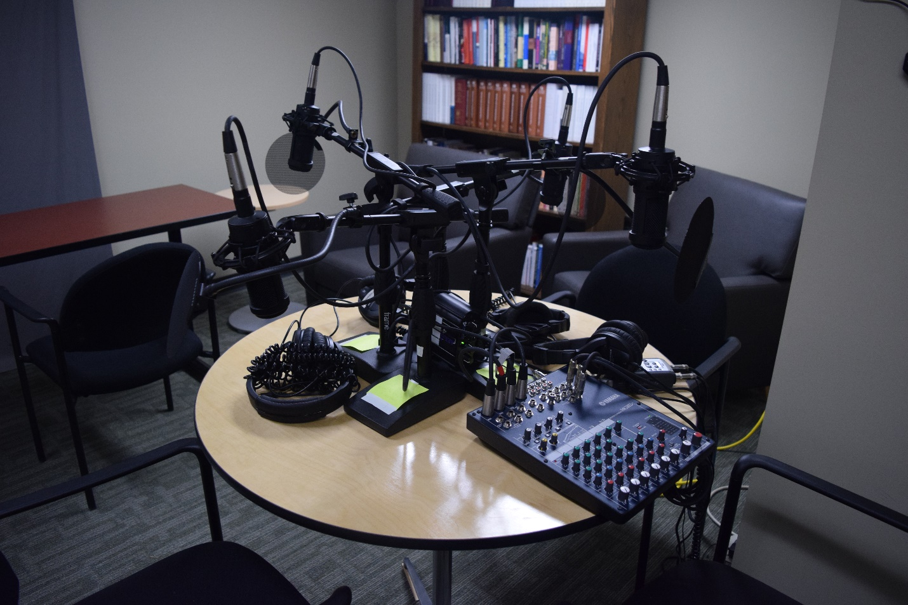
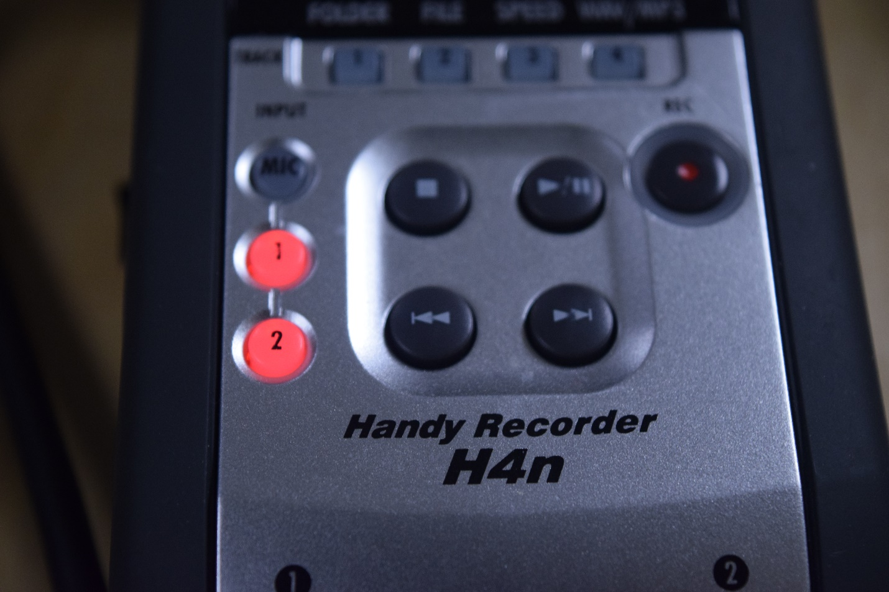
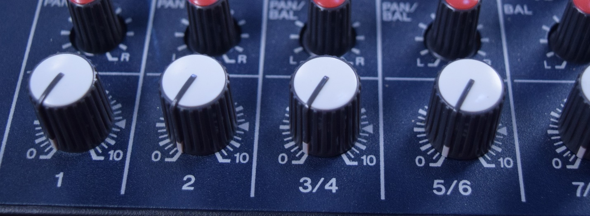
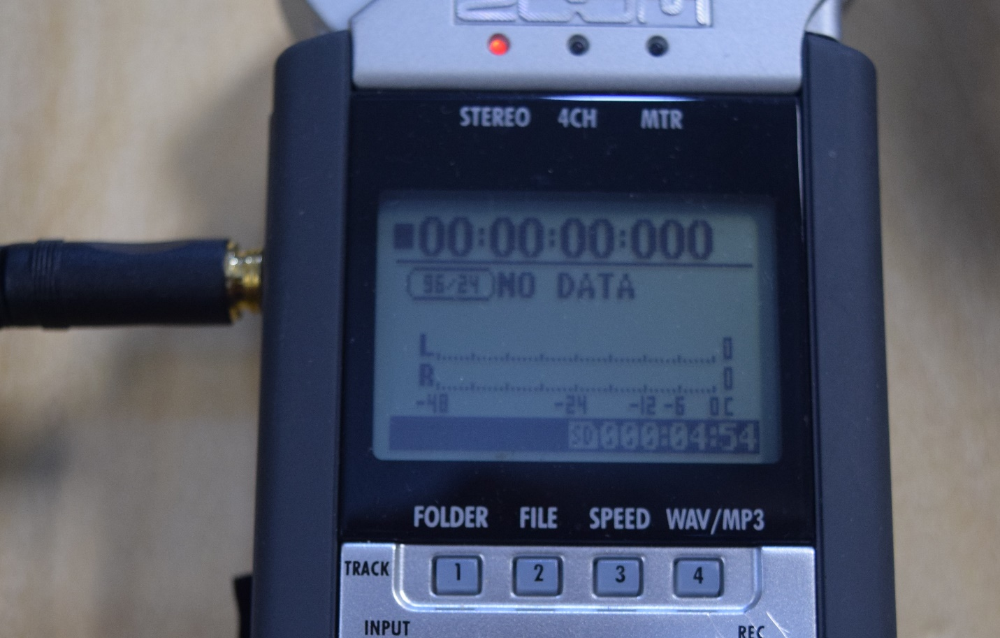
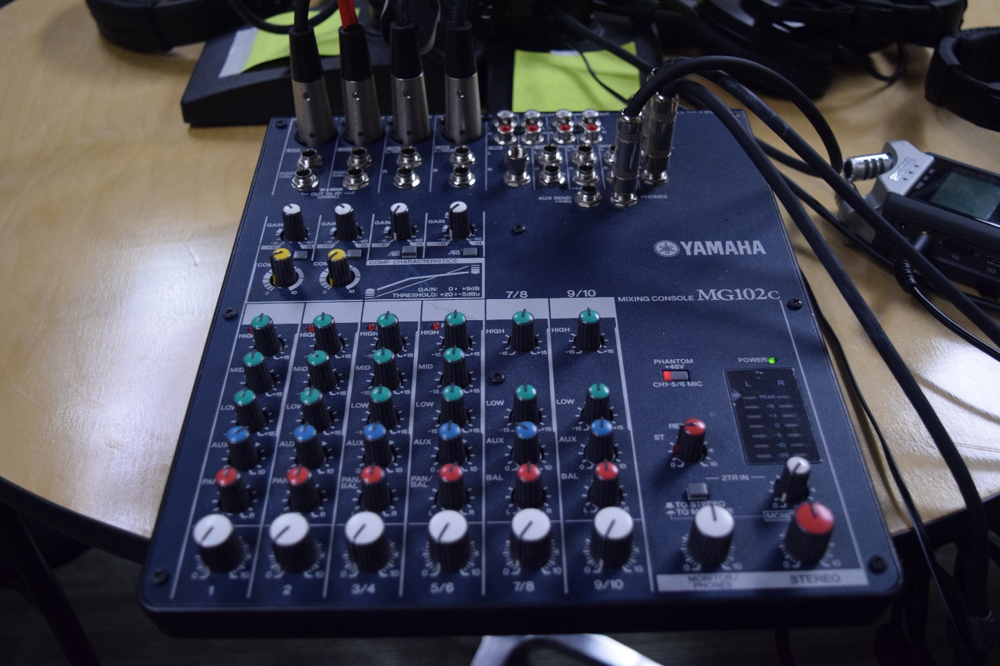
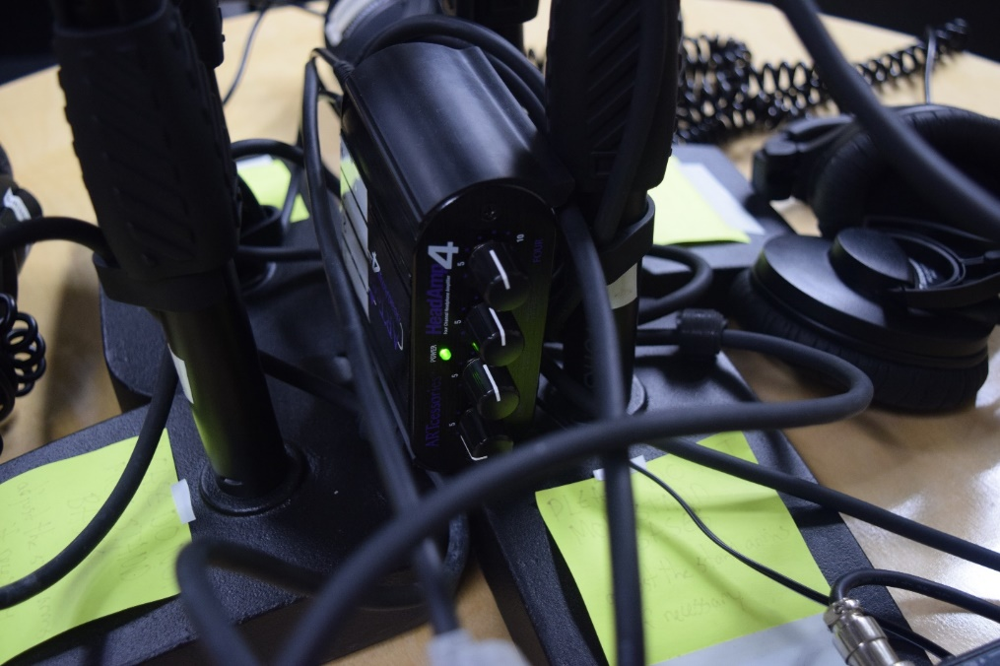
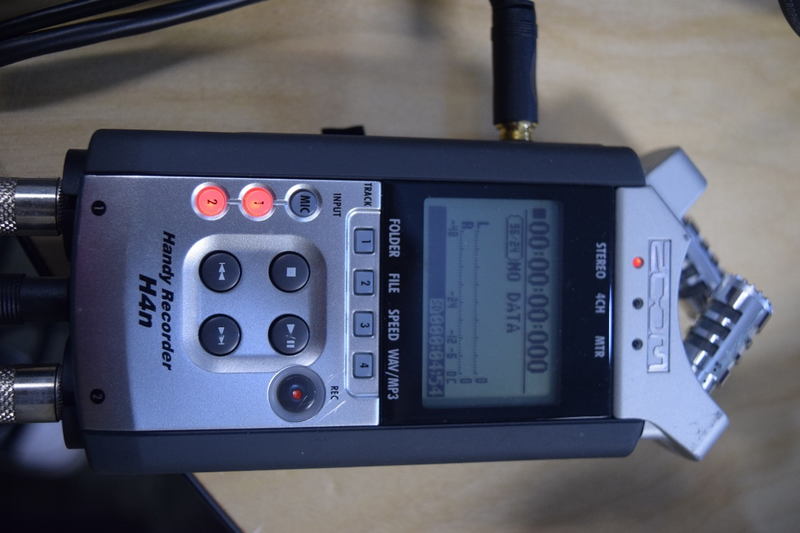
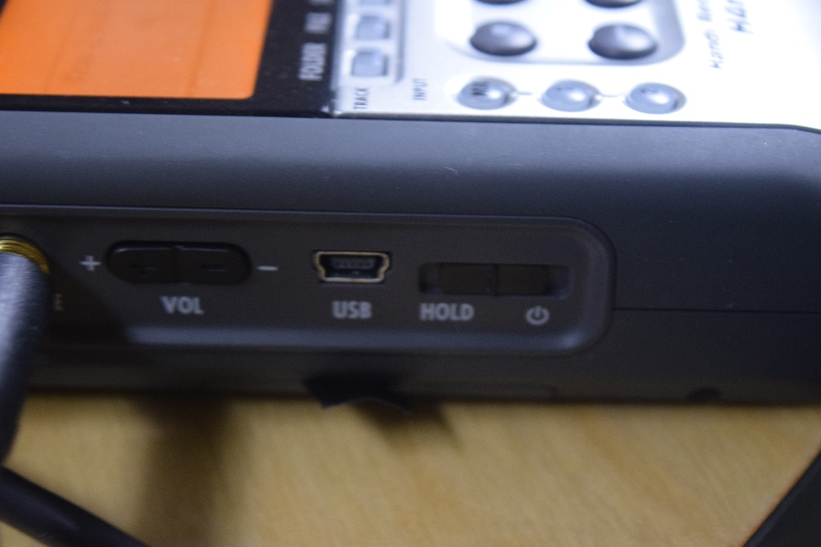

# Podcasting in the LEADR Audiovisual Studio
Created by [Dan Fandino](https://wiredhistory.com/)
 *Maintained by [LEADR](http://leadr.msu.edu/) under the direction of Gillian Macdonald*

*Last Updated: 10/15/2021*

  

The LEADR Audiovisual(A/V) Studio is located in Old Horticulture, room 230. Any history or anthropology majors or minors are welcome to reserve the room by contacting [LEADR Staff](http://leadr.msu.edu/). The podcast station is comprised of the audio mixing board, four microphones, four headphones, and a connected Zoom Handy Mic. Recording of audio sessions is done through the Handy Mic while the audio board controls the recording volume levels, headphone volume, and which microphones are active. A memory card for the Handy Mic is required to record. Ensure the memory card is blank for best results.

**CAUTION**: As the podcasting table packs in a lot of equipment in a small space, please be careful to not trip or pull on any wires which can damage the equipment or cause injury. .When you have completed a session, ensure all cables and wires are neatly put away.

Images of all equipment are at the end of this document for reference.

Follow these steps to begin recording:
1. Ensure the audio board and headphone amplifier are powered on. The headphone amplifier is a small black box nestled in the center of the microphone stands. The power switch for the audio board is are located on the back of the console. Green power indicator lights are on both pieces of equipment. The power may already be on so take care not to turn off the system accidentally.
2. Recording is done through the attached Handy Mic. Insert a memory card into the Handy Mic via the slot on the right side. Turn the Handy Mic on with the switch on the left side. The switch needs to be held in the on position until the display lights up. Test to ensure all connections to the audio board are tight.
3. The Handy Mic can be set to record WAV or MP3. This is toggled by button 4 on the Handy Mic.   
4. The Handymike should be automatically set to receive input from the audio board. This is indicated by the 1 and 2 lights being on. If the MIC light is on instead, press 1 to change the input. The Handymike may take a few moments to access the memory card and be ready for recording.
5. The audio board is set to normal levels for standard recording. <u>**Please do not adjust the settings**</u>.  
6. To begin recording, turn the microphones gain up from zero using the lowermost white knobs on the audio board labeled 1, 2, 3/4 and 5/6. Each knob corresponds to one microphone. Depending on your voices and proximity to the microphone, the levels for proper recording may vary. Begin at level 5 for a test recording. Enable only the microphones in use, so if you are using microphones 1 and 2, leave 3/4 and 5/6 at zero. Wearing the audio board headphones will allow monitoring of sound levels. Headphone volume can be controlled from the monitor/headphone knob on the lower right side of the board. NOTE: Please be aware that the audio recording volume is independent from the headphone volume. Be careful not to record too quietly or loudly by confusing microphone gain and headphone volume. Microphone gain can be turned down from the audio board to in cases when only one speaker is talking to cut down on background noise. It is recommended all participants wear headphones to hear the way the conversation is being recorded and to ensure no anomalous sounds are being picked up that may interfere with the quality of the podcast.  
7. To start recording press REC TWICE on the Handy Mic. The display should show a timer starting showing recording time elapsed and sound levels. To stop recording, press the stop button. The sound levels will also displayed as moving bars next to L and R on the digital display.
8. We recommend recording a short test and playing it back to ensure the equipment is working properly and that sound levels are to your satisfaction. The headphones at the audio board station are connected to the Handy Mic and can be used for this purpose. If voices sound too quiet or too loud, adjust your distance to the microphone or adjust the gain settings.
9. Once recording is complete, turn off the Handy Mic and remove the memory card. Do not turn off the audio board or amplifier. Return mics, headphones and chairs to their original positions. Take care to keep wires and cables on the table and tucked away so others will not accidentally pull on them. Make certain to copy the recorded audio files to a computer or other medium as a backup, even if you are using your own memory card. LEADR cards are wiped on a regular basis and your data may be lost after a memory device is returned.

### Podcasting Tips
The round metal attachments on the microphone are pop filters, which cut down on hissing and popping recorded from normal speaking, as the microphones are sensitive and will pick up the exhalation of breath. Speak directly towards the microphone for best audio pickup.

As a completely audio medium, visual communication can be used to convey instructions without stopping the recording or having unwanted conversations. Having a white board or other means of visual communication can allow for real time interaction and a reduction of editing time.

Maintain a consistent distance from the microphone. Having different participants at different distances from the microphones can result in a loss of uniformity in sound. Maintaining a distance of a few inches from the pop filter is recommended.

### Reference Images

  
**Image 1.** The audio mixing board. The four lower leftmost white knobs control the microphones gain. The white monitor/phones knob on the lower right hand side next to the red stereo knob controls the headphone volume.

  
**Image 2.** Microphone amplifier with power indicator light.

  
**Image 3.** Handy Mic.

  
**Image 4.** Handy Mic power switch location

-----
### Return to [LEADR's Resources list](https://leadr-msu.github.io/)
