# Visualizing Data with Voyant

Created by [Zach Francis](https://redfeather.dev/), Ashley Highland

*Last Updated: 2/26/2020*

## Overview
Text analysis is a high-level skill used by many humanities scholars to systematically analyze large amounts of textual data. Voyant is an open-source tool that attempts to make this skill more accessible. Upload your files to Voyant, and it will create a variety of data visualizations based on all the terms within your Corpus. These visualizations are nothing without your interpretation, however. Use them to explore your data and construct your own compelling interpretations.

This guide provides only the basics of using Voyant, and it assumes that you will be using TAGS data. For a more in-depth look at Voyant and its other uses, check out its [documentation](https://voyant-tools.org/docs/#!/guide/start) (see resources section below).

## Getting your Data into Voyant
Anybody can upload data into Voyant, but there is an art to making sure that your data is useful for analysis and interpretation. As stated earlier, this handout assumes you will be using TAGS data but you may use any digital, textual data (including Google Forms).

#### *Cleaning your TAGS Data*
After running TAGS, you should have a lot of data (tweets) in an Excel or .csv file. There will be a lot of useful information in the form of text in this file, but not all of it needs to be analyzed. For example, does knowing Twitter user IDs answer any of the questions for your research? Instead of having Voyant analyze background noise like this, it is easier to extract and format data beforehand. Here are some tips for cleaning your data:
  - **Keep a master of your original data** and put altered datasets into new Excel/.csv files.
  - **Create separate Excel or .csv files** for the different datasets you want to look at.
    - You are encouraged to upload multiple files to Voyant.
    - Voyant visualizes data based on individual files. So all of the terms within one file will be compared to terms in other files.
      - or example, if you want to look at the content of Tweets over a number of days, copy paste those tweets into different excel sheets for each day. The same principle holds for users, locations, etc.
    - Make sure you label files in a way that is readable and useful (Voyant will use your file names to separate data).
  - **Copy only the content that interests you** to paste into a new Excel or .csv file.
    - For example, if you are only interested in the content of tweets on a certain date:
      - Create separate excel sheet (with a readable/recognizable name)
      - Copy the tweets in your master dataset from those dates
      - Paste those tweets into your new Excel sheet containing only the tweets from that date.   

#### *Creating a Corpus*
Once your data is cleaned and put into new files, you may create a “Corpus” by uploading your files into Voyant. A Corpus is the collection of files that Voyant data visualizations are based on.
1. Go to the [Voyant website](https://voyant-tools.org/).
2. Upload your files into Voyant
  - You may either copy and paste your text into voyant or upload files with text.
  - To upload your TAGS data press the Upload button and select your file(s)
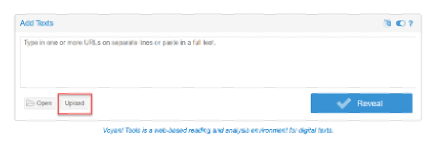
  - c.	Once your file(s) have been uploaded, click the Reveal button. Voyant will produce multiple “Panels” with each containing a data visualization of your Corpus.

### Visualizing Data
An example TAGS dataset was made to serve as an example for how you might start analyzing your own data. This dataset looks at tweets sent to Donald Trump using the phrase “proud boys”. The content of tweets was separated into 8 hour increments from October 1st  to October 4th (2020). This generated  11 excel files, each corresponding  8 hour increments of tweets, which were then [uploaded to Voyant.](https://voyant-tools.org/?corpus=d2115550b1a56e94d0e57935fd2b0315&stopList=keywords-37298d94081ca64af65d9bffb1bb0ced&panels=cirrus,termsberry,trends,summary,contexts)

#### *Stopwords*
Despite cleaning the data beforehand so that our files only contained the user-entered content of tweets, there are still words that eclipse the text we are actually interested in. This Cirrus (a word cloud visualizing the frequency of words) pictured below gives us an idea of which words are doing the overshadowing in our dataset.

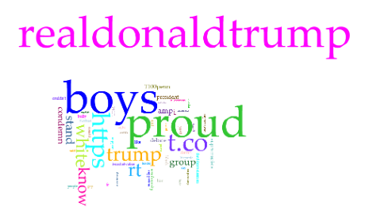

Using this visualization from Voyant, it was decided that the following words needed to be removed: **“realdonaldtrump”** (who the tweets were sent to); **“proud”** (one of the search terms); **“boys”** (the other search term); **“https”** (part of a link); **“rt”**; **“trump”**; **“t.co”**; **“don’t”**; and **“donald”**. To stop Voyant from analyzing unhelpful terms like this, you can use the **Stopwords list:**
  - At the top-right of each tool panel, options will appear when you hover over the **“?”**.
  - Select the Define Options for this Tool icon.
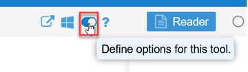
  - This will bring you to the *Options* panel.
    - The **Stopwords** list is a list of terms that Voyant will ignore. Voyant automatically generates a list that you can add your own terms to.
    - The **White List** overrides the **Stopwords list** to have Voyant look at its terms.
  - Click on the **Edit List** button next to the Stopwords list option.
    - Leaving the **apply globally** checkbox marked will apply this to all your panels.
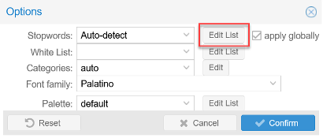
  - An *Edit Stoplist* pop-up will appear.
    - Enter one term per line at the end of the
    - Press **Save** when you have finished entering your terms.
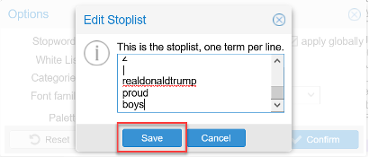
As you can see from the resulting Cirrus below, adding unimportant words to the Stopwords list makes room for more relevant terms. It is up to you to justify the reasons you ignore particular terms when interpreting your own data.

### *Visualizing Data*
This handout will not go into all the numerous types of data visualization and analysis tools that Voyant provides. Voyant provides its own [extensive documentation](https://voyant-tools.org/docs/#!/guide/tools) which we heavily encourage you to refer to when exploring specific tools. Instead we will go over the more general skills of selecting different tools (aka data visualizations) in panels and selecting terms to be analyzed.

#### Selecting a tool
  1. Go to the top-right corner of a panel that you want to select a new tool for and hover over the **“?”**. This will make some options appear.
  2. Select the icon for “Click to Choose another tool in this panel location (this will replace the current tool)”.
  3. A menu for potential tools will appear. Select any tool to begin exploring your data!
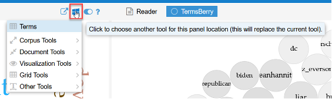

#### Selecting Terms
You will want to change the terms that are used in Voyant’s data visualization to explore the relationships between different terms in your data. To adjust what terms Voyant analyzes from moment to moment, there are a couple of options on a global and local scale:
  - **Global**: the first option is to use the Terms Corpus tool. This will affect multiple tools in Voyant at once.
    - The **Terms** tool will be located in the top-left panel at first.
    - Select your term from the menu by checking the box next to the term.
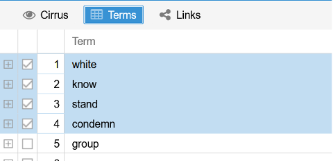
  - **Local**: If you are able to select terms for a particular tool, then often there will be a search box at the bottom left of the panel.
    - Enter the term you want the tool to use and select it
    - A star next to a term means that any term beginning with the term you have just entered will be included as part of that result (Tweet* = Tweets).
    - To remove a term from a tool, select the x next to the term you have entered.
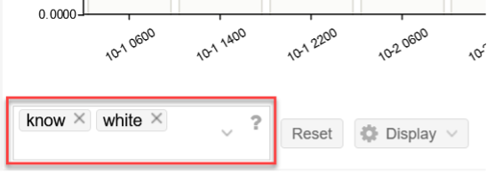

## **Exporting Data**
After doing all this work, you will undoubtedly want to save your work by exporting your results. You may either export your entire Corpus or a particular data visualization in a Panel.

### *Exporting a Corpus*
Exporting your Corpus will save the entire Voyant workspace for your dataset
  1. Hover over the **“?”** at the very top-right of the page in the blue bar.
  2. Select the export icon.
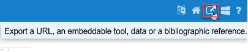
  3. c.	The option for “a URL for this view (tools and data)” will already be selected. Click Export to create a URL for your Voyant workspace. (Save this URL to come back to later).
  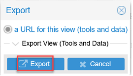

### *Exporting a Panel*
You may also export a particular data visualization as a PNG. This can then be incorporated into reports, presentations, etc.
  1. Hover over the **“?”** at the very top-right of the panel of the tool you want to export.
  2. Select the export icon and open up the Export pop-up.
    - There are a number of options for exporting a data visualisation, but the easiest option is probably exporting it as a PNG.
  3. Open up the **Export Visualization** option
  4. Check the circle for the “Export a PNG image of this Visualization”
  5. Click **Export**
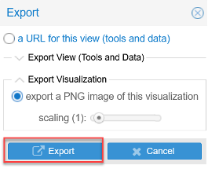
    - This will bring up the Export PNG pop-up, where you will have to right click the image and save it to your computer.
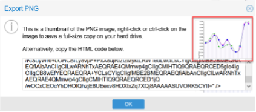

## Resources
- Voyant Documentation and Tutorial: https://voyant-tools.org/docs/#!/guide/tutorial

## Assessment
By the end of this tutorial, you should be able to create a Corpus from your TAGS dataset and be able to edit, explore and analyze your Voyant data visualizations. You should also be aware of the extensive documentation that Voyant has to offer. And lastly, you should be able to export your results for use outside of Voyant.

Voyant provides an amazing and versatile tool for creating data visualizations from textual data. It is important, however, not to think of these data visualizations as the end-all, be-all answers to your questions. It is more useful to think of Voyant as an exploration tool for constructing your own compelling interpretations.

-----
### Return to [LEADR's Resources list](https://leadr-msu.github.io/)
