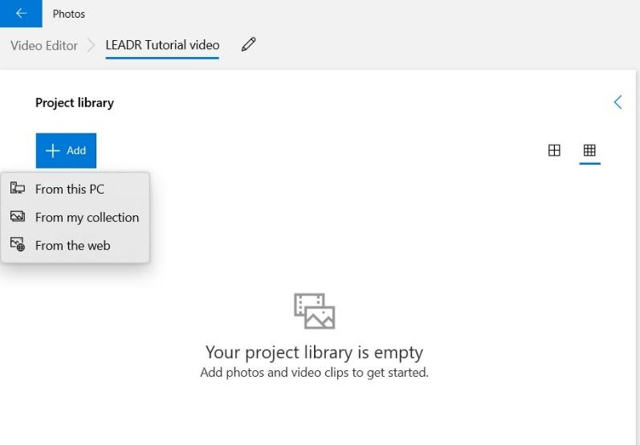
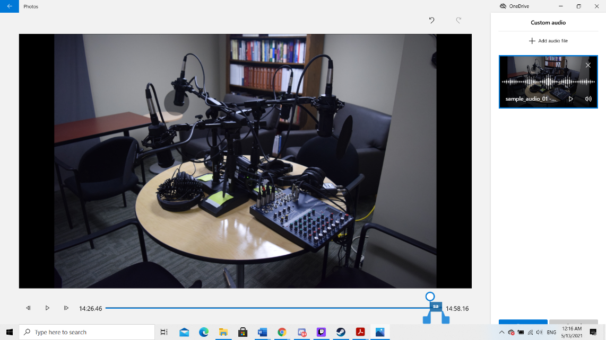
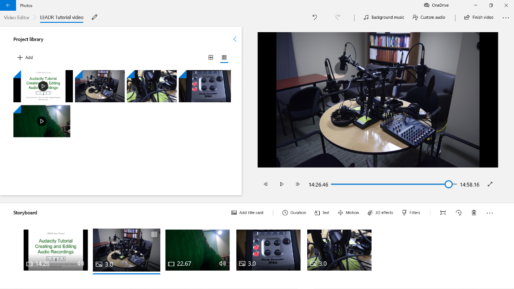

# Windows Video Editor

Created by [Daniel Fandino](https://wiredhistory.com/)

*Last Updated: 11/01/2021*

## Overview
Windows 10 Video Editor is a video editor that is automatically included on computers using the Windows 10 operating system. This handout provides a brief overview for using Windows 10 Video Editor to create video projects incorporating custom audio, on screen text, images, and video clips. Video Editor is standard on PCs running Windows 10. Use the search bar to find the Editor.

To begin, launch your Video editor from the **Start** menu. Open the Start menu, search for "Video Editor," and launch the Video Editor. This will open a list of "Video Projects" in the Photos app.

## Create your Video
1. Select **New video project**.
2. A popup will appear asking you to name your video.
3. Select the photos and videos you want to use in this project by clicking **Add**. You may add files from your computer, add previously uploaded items from another project, or search the internet for images.     
4. Drag the items to the Storyboard at the bottom of the screen in the order you want them to appear in the video. You may change the order at any time by dragging and dropping the items.     
5. The current video can be viewed using the controls at the bottom of the video screen.
6. An item can be removed from the Storyboard by dragging it to the **Trash**.
7. Windows Video Editor has some limited editing functionality.
8. **Trim** allows you to cut segments from the beginning and ending of a video clip.
9. **Split** cuts a video into two parts.
10. **Duration** changes the amount of time an image (not a video clip) is displayed in the video.
11. **Text** adds text to the video. Text style and positioning can be chosen from the left hand menu as well as the timing and placement in the video.
12. **Motion**, **Filters**, and **3D effects** are extra effects that can be used in your videos but are generally not useful for most class assignments.
13. Select **Custom audio** to add your custom music, narration, or sound effects. From the Custom audio screen, **Add** an audio file and use the sliders to select when it will play in your video as well as adjusting the duration of the audio file.     
14. Select **Finish video** to publish your project. At this point you may select the video quality.

## Additional Resources
Here are some additional resources for Video Editing:
- [Windows Video Editor Guide](https://support.microsoft.com/en-us/windows/create-films-with-video-editor-94e651f8-a5be-ae03-3c50-e49f013d47f6)
- Other LEADR Guides
  - [Editing with Audacity](https://leadr-msu.github.io/guides/audacity.html)
  - [Editing with iMovie](https://leadr-msu.github.io/imovietutorial/)

-----
### Return to [LEADR's Resources list](https://leadr-msu.github.io/)
