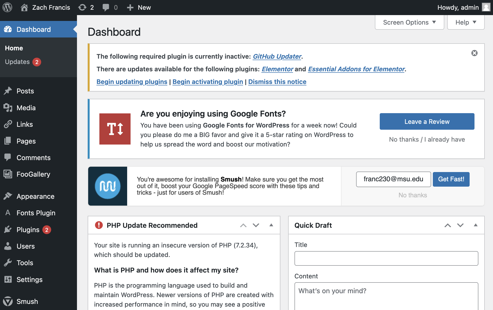
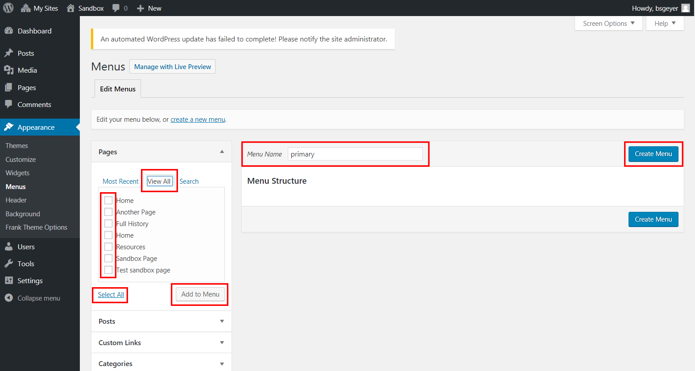
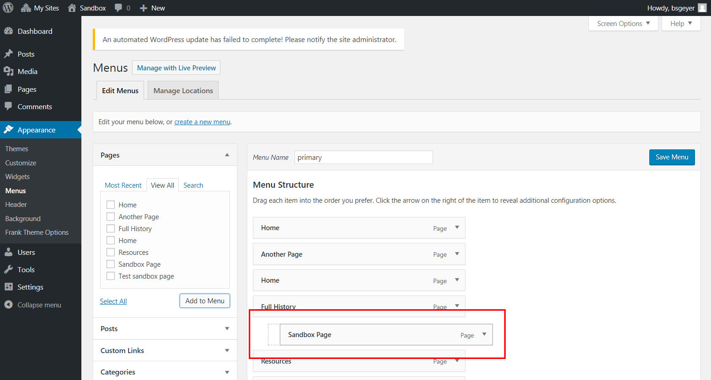
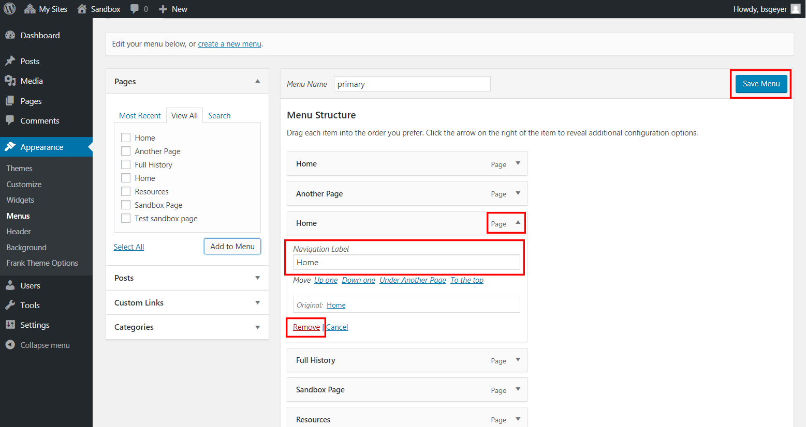
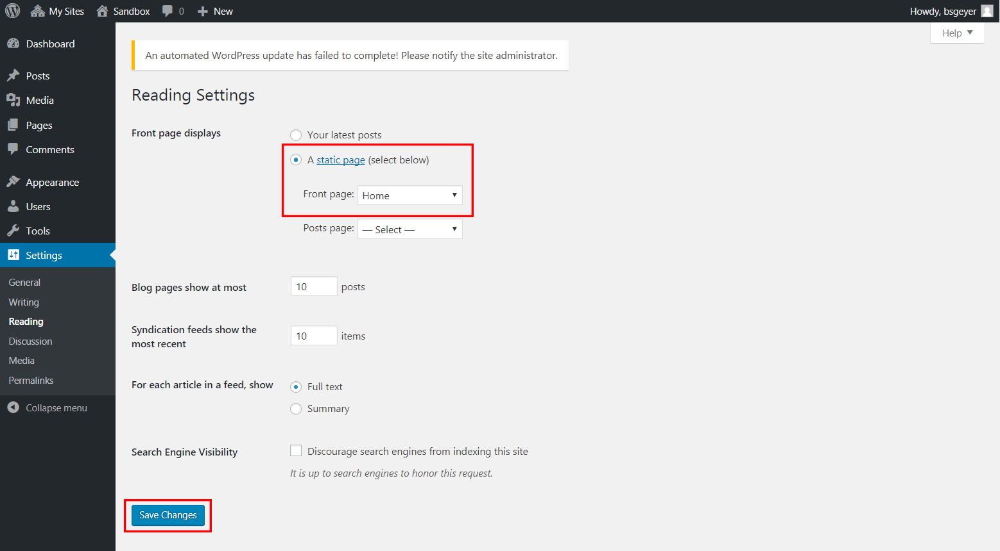
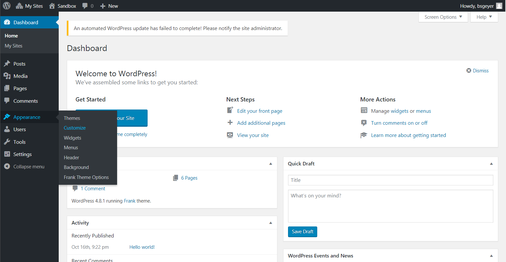
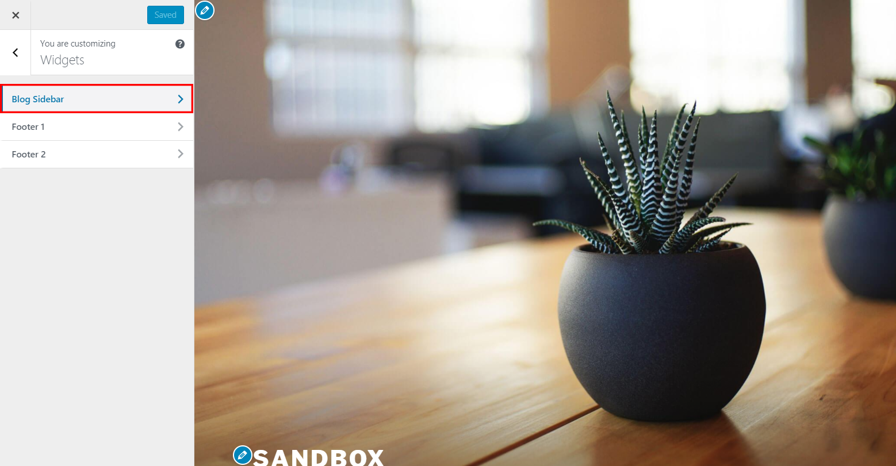
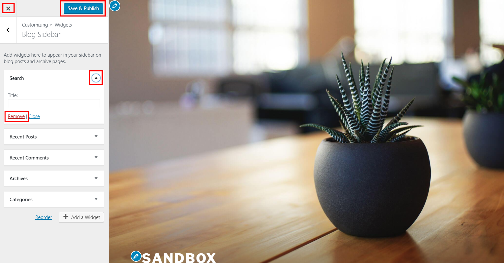
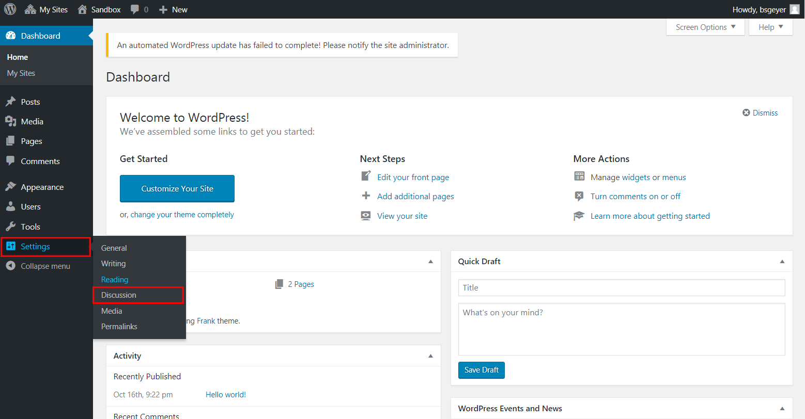
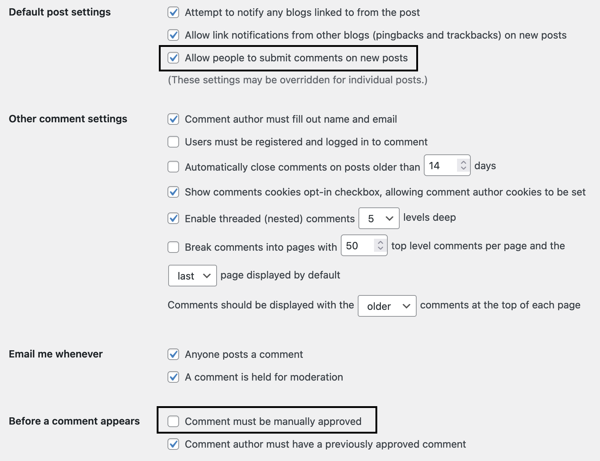

# WordPress Introductory Resources

Created by [Zach Francis](https://redfeather.dev/), Brian Geyer, and [Dan Fandino](https://wiredhistory.com/)

*Last Updated 12/7/2021*

WordPress is an incredibly popular content management system. What is a content management system? It is exactly what the name implies: it is a system that manages content. Instead of learning HTML, CSS, JavaScript and other coding languages, all you have to focus on is providing your content within WordPress's system. Because WordPress is so popular, there is no shortage of WordPress tutorials accessible online to help you with this goal (<a href="#resources">see additional resources below</a>). With this in mind, we will provide some basic guidance on some of the most common issues we run into at LEADR. And if you need further help, you can check out the end of this guide for <a href="#resources">a list of additional resources on WordPress.</a>

## How to install WordPress
WordPress needs to live somewhere in order for you to be able to use it. This means having a server, and a web address that people can access to get to your WordPress installation. In LEADR, we use services like [MSU Domains](https://domains.cal.msu.edu/) (which is part of a service related to Reclaim Hosting) and [Humanities Commons](https://hcommons.org/) to provide hosting services for WordPress. These services are geared towards college students, but there are a large number of web hosting services out there for everybody.

If you are looking for web hosting service for your own personal use, we recommend buying your own [Reclaim Hosting](https://reclaimhosting.com/) account. Reclaim Hosting has a bunch of tools for creating websites, one of which is the automatic installation of WordPress. There are many web hosting services out there, however, for you to look for. Alternatively, WordPress has a bunch of [documentation on different ways to install WordPress](https://wordpress.org/support/category/installation/).

## The Dashboard
Once you have a WordPress site, you can begin to make changes to that site through the dashboard. One way you can get to the dashboard by adding "/admin" to the end of your site's main URL. Here you will have to enter your administrative username and password.

Once you have logged in, you will see the dashboard. Here you can use all of the administrative tools WordPress has to offer to edit and create content for your site.

## Choosing a theme
As open source software, WordPress can be worked on by any developer. This has led to a large selection of custom themes, and plugins that you can use for your own WordPress site. A [theme](https://wordpress.org/support/article/using-themes/) is prebuilt way of designing and organizing your website. Some themes are colorful and good at displaying images, while others are more focused on blogging, and still many others provide their own advantages.

The best advice we can give you is to not focus on the theme too much. Developers will often fall into the trap of spending multiple hours looking through themes to find the perfect theme for their project. But, what often happens is you end of finding the theme is not as great for your project as you thought. Instead, we recommend finding a theme that you can live with, and see how building the website goes with that. You should focus on the content and organization for your website. And you can always change your theme later without changing your content or organization.

To find a theme you have a couple of options. Option number 1 is to do a google search. Many digital publishers out there will often create lists of the "best" themes for particular uses. For example, you could search for "best WordPress themes for video essays". The second option is to actually search for themes on your WordPress installation, which is also how you will activate your theme. Follow these steps:
1. Go to your dashboard
2. Go to the *Appearance* tab and select **Themes**
    * Here you will have a selection of themes that are already pre-installed from your institution or web hosting provider. We recommend choosing from these  themes (especially if you are new to WordPress) since they are often vetted beforehand.
    * If you want to add a new theme, click on the **Add New** button. From here you can browse or search for different themes that you may want for your website.
3. You can either live preview (see what your website looks like with this theme (the previews are better when you have added content)), or activate an installed theme by hovering over the theme and selecting either **Live Preview** or **Activate**.

*Note*: Another reason to pick pre-installed themes is that they are often updated regularly as WordPress is updated. It is not uncommon for WordPress to update or change its software, and for a theme developer to be behind resulting in broken functionality.

## Using the Customizer
Once you have your theme selected, you may want to begin customizing certain aspects of the theme such as colors, titles, menus, etc. Oftentimes, a theme will let you use the customizer to do this. One way to get to the customizer is with the following directions:
1. Go to your Dashboard
2. Go to the *Appearance* tab and select **Customize**

Here you can change many options of your theme, and see those options updated in real-time on your website. It is important, however, to recognize that this is not the place to add or change content for your website. For instance, you can change the color of the background for the page, but you can't add paragraphs to the pages content. For specific instructions on how to use the tools of the customizer, check out the [WordPress Documentation on the customizer](https://codex.wordpress.org/Appearance_Customize_Screen).

## Pages Versus Posts
In WordPress, you will be putting all of your content into either pages or posts. A common mistake students make is making content into posts rather than pages. Pages are for when you want to put content onto a website for others to see and then leave it. Posts are for when you want to chronologically update your website with content, and you want the latest updates to be displayed most prominently. Essentially, posts are for when you want a blog-like website. Pages are for static content you do not plan to update often.

## Content Blocks

## Creating a Menu
The organization of your site is one of the most important decisions to make when designing your website. You should think about what sort of content you want to put into your site and how to organize that content within your site. Do you want all of your content on just one page, or do you need to split your content into different section that can be reached from the menu? One way to start creating your menu is to go to Appearance > Menus in the Dashboard:

  

You should have a menu already available called "Main Nav". You can start editing this menu, or you can create a new menu by  Start by clicking "Create Menu". Multiple menus may be useful in instances like when you want a different menu for mobile users (for smaller screens). In either case, you can start adding stuff to your menu by opening the "View All" tab on the left to see a list of all the pages that you have created for your WordPress site. Check the boxes next to all the desired pages that you want to use as menu items (or choose **Select All** to check all the boxes) and click the **Add to Menu** button.

  

Once the pages have been loaded into the menu, one can reorder them by dragging-and-dropping them into the desired order. One can also create sub-menus - where a page's entry will appear in the menu as a dropdown option under another page's entry - by dragging the menu item to the right to off-set it from the top-level entry.

  

To change an entry's label, simply click on the dropdown icon to gain access to the label editing feature. This is also how to find the "Remove" option for any given entry. After making all the desired changes, be sure to click the "Save Menu" button.

  

## Setting a Static Homepage

Typically with sites in LEADR, you will be creating a WordPress website with a static homepage. This is because you will typically not have a ton of posts made for your new site to showcase on the front page of your website. This means that you will want to use a "static" page (a page that you do not update with posts regularly) as the first site that people see when they visit your site. A static page can be any page that you have created or edited in your pages tab (See the section on that above).

One way to make your homepage static is by going to Settings > Reading in the Dashboard to locate the options for setting a static homepage:

  

Change the setting for "Front page displays" from "Your latest posts" to "A static page (select below)" and then choose one's desired homepage from the dropdown list for "Front page." Then click the "Save Changes" button at the bottom of the page.

  

The desired page does not need to be wholly complete for this process to work, but it does need to be published. Additionally, one can change the name of the page later on and WordPress will appropriately update the static page setting on its own.

## Deleting Sidebar Widgets ("Search," "Recent Posts," "Archives," etc.)

Many themes come with preloaded widgets which are geared toward blog-centric WordPress websites. These widgets are quite distracting on a page-based website, so it would be best to remove them. But these should only be removed _after_ one has set their desired theme. (For help with this, please see the link "Selecting the Active Theme" in the "Additional Resources" list below.)

After setting one's theme, begin by navigating to Appearance > Customize from the Dashboard:

  

Each theme has a different Customizer look, but most preload the undesired tools in the "widgets" section. So click on "widgets" to bring up the list of widget areas.

  

Every theme has a different list of widget areas, so one will have to open each area to see if there are any undesired widgets preloaded. For this example theme, all the undesired widgets load in the "Blog Sidebar" area.

  

Once viewing the appropriate area, click on the dropdown icon to access the "Remove" option. Click that option and repeat for every other undesired widget in the area. To finish, click the "Save & Publish" button. Once saved, you can exit out of the Customize tool by clicking the large X in the top-left.

  

## Turning Off Comments

When using WordPress through MSU Domains, the ability for people to comment on your posts is automatically turned off. You may however want people to be able to comment on you pages and posts if you are creating more of a bloggy website. This section will show you how to enable comments, but be aware of some potential security vulnerabilities by allowing others to contribute content to your site. You will also likely be bombarded by automatically generated spam which can get out of hand if your settings and filters are secure enough. You will like get spam no matEnabling comments can create enormous security vulnerability, in addition to the inconvenience of having one's site constantly bombarded with automatically-generated spam.

To get to commenting options, go to Settings > Discussion in the Dashboard:

  

This page has a bunch of options available. "*Allow people to post comments on new articles*" under "*Default article settings*" will allow you to decide you want people to be able to comment. If you do allow comments on your posts, then we highly recommend that you check the option that "*Comment must be manually approved*" under "*Before a comment appears*". This will ensure that a comment cannot post to the website without your approval.

  

Once finished, be sure to click the "Save Changes" button at the bottom of the page.

<h2 id="resources">Additional Resources</h2>
- [WordPress Support](https://wordpress.org/support/) - provides support documentation and a search function for looking for answers to WordPress Questions.
  - [New to WordPress - Where to Start](https://wordpress.org/support/article/new-to-wordpress-where-to-start/)
  - [WordPress Lessons](https://wordpress.org/support/article/wordpress-lessons/)
  - [Creating a Static Front Page](https://wordpress.org/support/article/creating-a-static-front-page/)
  - [Appearance Customize Screen](https://codex.wordpress.org/Appearance_Customize_Screen) (The Customizer)
  - [Using Themes](https://wordpress.org/support/article/using-themes/)
  - [About Menus](https://wordpress.com/support/menus/)
  - [Writing Posts](https://wordpress.org/support/article/writing-posts/)
  - [Pages](https://wordpress.org/support/article/pages/)
  - [Working With Blocks](https://wordpress.com/support/wordpress-editor/blocks/)
  - [Plugins](https://wordpress.org/support/article/plugins/)
  - [Embeds](https://wordpress.org/support/article/embeds/) (for information about automatically embedding YouTube videos and other content)
  - [Using Permalinks](https://wordpress.org/support/article/using-permalinks/)
  - [User Profiles](https://wordpress.org/support/article/users-your-profile-screen/)
  - [Resetting Your Password](https://wordpress.org/support/article/resetting-your-password/) (instructions on how to change your password when either logged in already, or when login is impossible because of a forgotten password)
- The [Wordpress Codex](https://codex.wordpress.org/Main_Page) - WordPress's manual and living repository for WordPress information. They put a lot of this information into the WordPress Support section of their website, but you may enjoy this organization of their documentation better.
  - [Getting Started with WordPress](https://codex.wordpress.org/Getting_Started_with_WordPress)
  - [Frequently Asked Questions](https://codex.wordpress.org/FAQ)
  - [WordPress Menu User Guide](https://codex.wordpress.org/WordPress_Menu_User_Guide)
  - [Inserting Media into... Pages](https://codex.wordpress.org/Inserting_Media_into_Posts_and_Pages)
- [WordPress Developer Documentation](https://developer.wordpress.com/docs/) - For when you get a little too deep into WordPress, and want to start messing with stuff behind the scenes.
- Other Wordpress Resources :
  - [How to Disable Comments in WordPress (Step by Step)](https://themeisle.com/blog/disable-comments-in-wordpress/)

-----
### Return to [LEADR's Resources list](https://leadr-msu.github.io/)
