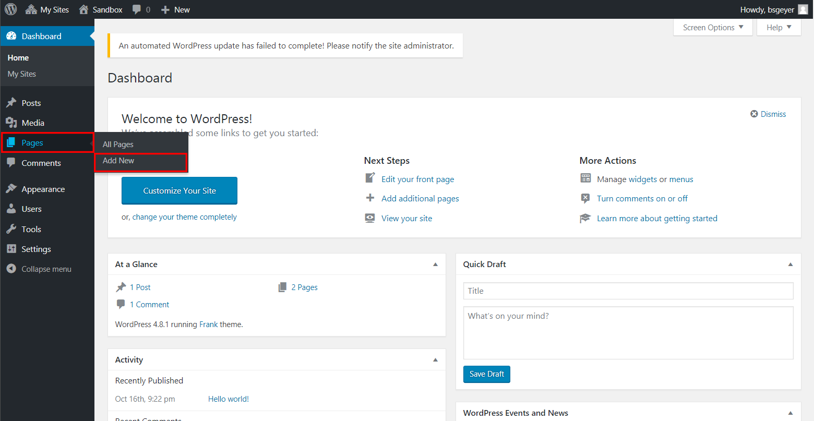

# WordPress Introductory Resources

Created by Brian Samuel Geyer

Updated by [Dan Fandino](https://wiredhistory.com/) and [Zach Francis](https://redfeather.dev/)

*Last Updated 10/4/2021*

WordPress is an incredibly popular content management system. What is a content management system? It is exactly what the name implies: it is a system that manages content. Instead of learning HTML, CSS, JavaScript and other coding languages, all you have to focus on is providing your content within WordPress's system. Because WordPress is so popular, there is no shortage of WordPress tutorials accessible online to help you with this goal. As such, this guide will provide you with links to some of those resources as well as some specific help on the most common questions we encounter when teaching WordPress in our LEADR Workshops.

These issues have their own sections below:

## Turning Off Comments

When using WordPress through MSU Domains, the ability for people to comment on your posts is automatically turned off. You may however want people to be able to comment on you pages and posts if you are creating more of a bloggy website. This section will show you how to enable comments, but be aware of some potential security vulnerabilities by allowing others to contribute content to your site. You will also likely be bombarded by automatically generated spam which can get out of hand if your settings and filters are secure enough. You will like get spam no matEnabling comments can create enormous security vulnerability, in addition to the inconvenience of having one's site constantly bombarded with automatically-generated spam.

To do this, go to Settings > Discussion in the Dashboard:

  

This page has a bunch of options available. It is important that the option "Allow people to post comments on new articles" under "Default article settings" is **_unchecked_** and "Comment must be manually approved" under "Before a comment appears" is **_checked_**. This will ensure that comments are turned off by default and that, if commenting ends up accidentally turned on at some point on any page, a comment cannot post to the website without one's approval.

  

Once finished, be sure to click the "Save Changes" button at the bottom of the page.

## Setting a Static Homepage

In order to set a static homepage, one must first have created the page that will be set. This is easily done under the Pages section of the Dashboard:

  

Once the page has been created and published, one will go to Settings > Reading in the Dashboard to locate the options for setting a static homepage:

  

Change the setting for "Front page displays" from "Your latest posts" to "A static page (select below)" and then choose one's desired homepage from the dropdown list for "Front page." Then click the "Save Changes" button at the bottom of the page.

  

The desired page does not need to be wholly complete for this process to work, but just needs to be published. Additionally, one can change the name of the page later on and WordPress will appropriately update the static page setting on its own.

## Creating a Menu

Once one has created their website's pages, they will likely need to manually create their site's primary menu. First, go to Appearance > Menus in the Dashboard:

  

Start by giving the new menu a name and then clicking "Create Menu." Then, choose the "View All" tab on the left to see a list of all one's pages. Check the boxes next to all the desired menu items (or choose "Select All" to check all the boxes) and click the "Add to Menu" button.

  

Once the pages have been loaded into the menu, one can reorder them by dragging-and-dropping them into the desired order. One can also create sub-menus - where a page's entry will appear in the menu as a dropdown option under another page's entry - by dragging the menu item to the right to off-set it from the top-level entry.

  

To change an entry's label, simply click on the dropdown icon to gain access to the label editing feature. This is also how to find the "Remove" option for any given entry. After making all the desired changes, be sure to click the "Save Menu" button.

  

## Deleting Sidebar Widgets ("Search," "Recent Posts," "Archives," etc.)

Many themes come with preloaded widgets which are geared toward blog-centric WordPress websites. These widgets are quite distracting on a page-based website, so it would be best to remove them. But these should only be removed _after_ one has set their desired theme. (For help with this, please see the link "Selecting the Active Theme" in the "Additional Resources" list below.)

After setting one's theme, begin by navigating to Appearance > Customize from the Dashboard:

  

Each theme has a different Customizer look, but most preload the undesired tools in the "widgets" section. So click on "widgets" to bring up the list of widget areas.

  

Every theme has a different list of widget areas, so one will have to open each area to see if there are any undesired widgets preloaded. For this example theme, all the undesired widgets load in the "Blog Sidebar" area.

  

Once viewing the appropriate area, click on the dropdown icon to access the "Remove" option. Click that option and repeat for every other undesired widget in the area. To finish, click the "Save & Publish" button. Once saved, you can exit out of the Customize tool by clicking the large X in the top-left.

  

## Additional Resources:

- [How to Disable Comments in WordPress (Step by Step)](https://themeisle.com/blog/disable-comments-in-wordpress/)
- [Creating a Static Front Page](https://codex.wordpress.org/Creating_a_Static_Front_Page)
- [WordPress Menu User Guide](https://codex.wordpress.org/WordPress_Menu_User_Guide)
- [Users Your Profile Screen](https://codex.wordpress.org/Users_Your_Profile_Screen) (scroll to "Account Management" to see information about changing one's password once logged in)
- [Resetting Your Password](https://codex.wordpress.org/Resetting_Your_Password) (instructions on how to change your password when either logged in already, or when login is impossible because of a forgotten password)
- [Selecting the Active Theme](https://codex.wordpress.org/Using_Themes#Selecting_the_Active_Theme)
- [Inserting Media into... Pages](https://codex.wordpress.org/Inserting_Media_into_Posts_and_Pages)
- [Embeds](https://codex.wordpress.org/Embeds) (for information about automatically embedding YouTube videos and other content)
- [Appearance Customize Screen](https://codex.wordpress.org/Appearance_Customize_Screen)

-----
### Return to [LEADR's Resources list](https://leadr-msu.github.io/)
